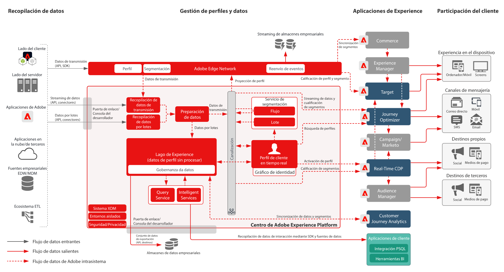

# Adobe Experience Platform y otras aplicaciones

## Diagrama de la arquitectura de Adobe Experience Platform y otras aplicaciones

Este diagrama de arquitectura muestra cómo Adobe Experience Platform se relaciona con las aplicaciones y los servicios de aplicaciones de Adobe Experience Cloud.

## Diagrama detallado de la arquitectura de Adobe Experience Platform y otras aplicaciones

>[!VIDEO](https://video.tv.adobe.com/v/32456/?quality=12&learn=on)

## Integración de aplicaciones de Experience Cloud y Adobe Experience Platform

<table class="relative-table wrapped" style="width: 100%;">
<colgroup>
<col style="width: 16.0202%;" />
<col style="width: 29.3423%;" />
<col style="width: 33.5582%;" />
<col style="width: 21.0793%;" />
</colgroup>
<tbody>
<tr>
<th>Aplicación</th>
<th>De Experience Platform a la aplicación</th>
<th>De la aplicación a Experience Platform</th>
<th>Modelos relacionados</th>
</tr>
<tr>
<td colspan="1">Ad Cloud</td>
<td colspan="1">
<ul>
<li>Las audiencias definidas en Real-time Customer Data Platform se pueden compartir con Ad Cloud para su consiguiente segmentación mediante Audience Manager.</li>
</ul>
</td>
<td colspan="1">
<ul>
<li>Actualmente, sin integración.</li>
</ul>
</td>
<td colspan="1">
<ul>
<li><a href="https://experienceleague.adobe.com/docs/blueprints-learn/architecture/audience-activation/anonymous.html?lang=es">Activación de audiencia anónima </a></li>
<li><a href="https://experienceleague.adobe.com/docs/blueprints-learn/architecture/audience-activation/known-customer-audience-activation/known.html?lang=es">Activación de cliente conocida</a></li>
<li><a href="https://experienceleague.adobe.com/docs/blueprints-learn/architecture/architecture-overview/platform-applications.html?lang=es">Activación con Experience Platform y otras aplicaciones</a></li>
</ul>
</td>
</tr>
<tr>
<td>Analytics</td>
<td>
<ul>
<li>Los datos recopilados mediante el SDK web/móvil se pueden reenviar a Adobe Analytics.</li>
</ul>
</td>
<td>
<ul>
<li>Los datos que recopila Analytics se pueden enviar al repositorio de datos de Experience Platform y al almacén de perfiles. <a href="https://experienceleague.adobe.com/docs/experience-platform/sources/connectors/adobe-applications/analytics.html?lang=es">Analytics Data Connector</a></li>
</ul>
</td>
<td>
<ul>
<li><a href="https://experienceleague.adobe.com/docs/blueprints-learn/architecture/architecture-overview/platform-data-flow.html?lang=es">Flujos de datos de Experience Platform</a></li>
</ul>
</td>
</tr>
<tr>
<td>Audience Manager</td>
<td>
<ul>
<li>Las audiencias definidas en Real-time Customer Data Platform se pueden compartir con Audience Manager para su consiguiente activación en destinos de cookies de terceros.</li>
</ul>
</td>
<td>
<ul>
<li>Los datos recopilados y evaluados junto con las pertenencias a audiencias de Audience Manager se pueden compartir con el almacén de perfiles y el repositorio de datos de Experience Platform. <a href="https://experienceleague.adobe.com/docs/experience-platform/sources/connectors/adobe-applications/audience-manager.html?lang=es">Conector de origen de Audience Manager</a></li>
</ul>
</td>
<td>
<ul>
<li><a href="https://experienceleague.adobe.com/docs/blueprints-learn/architecture/audience-activation/anonymous.html?lang=es">Activación de audiencia anónima </a></li>
<li><a href="https://experienceleague.adobe.com/docs/blueprints-learn/architecture/audience-activation/known-customer-audience-activation/known.html?lang=es">Activación de cliente conocida</a></li>
<li><a href="https://experienceleague.adobe.com/docs/blueprints-learn/architecture/audience-activation/platform-and-applications.html?lang=es">Activación con Experience Platform y otras aplicaciones</a></li>
</ul>
</td>
</tr>
<tr>
<td colspan="1">Campaign Classic</td>
<td colspan="1">
<ul>
<li>Las audiencias definidas en Real-time Customer Data Platform se pueden compartir con Campaign Classic como audiencias para iniciar campañas.</li>
</ul>
</td>
<td colspan="1">
<ul>
<li>Los datos de interacción y campaña que recopila Campaign se pueden ingerir en Experience Platform como fuente de datos para su uso posterior en la creación de audiencias mediante Real-time Customer Data Platform y en el análisis a través de Customer Journey Analytics y Experience Platform Query Service.</li>
</ul>
</td>
<td colspan="1">
<ul>
<li><a href="https://experienceleague.adobe.com/docs/blueprints-learn/architecture/customer-journeys/overview.html?lang=es">Recorridos del cliente</a></li>
</ul>
</td>
</tr>
<tr>
<td colspan="1">Campaign Standard</td>
<td colspan="1">
<ul>
<li>Las audiencias definidas en Real-time Customer Data Platform se pueden compartir con Campaign Standard como audiencias para iniciar campañas.</li>
</ul>
</td>
<td colspan="1">
<ul>
<li>Los datos de interacción y campaña que recopila Campaign se pueden ingerir en Experience Platform como fuente de datos para su uso posterior en la creación de audiencias mediante Real-time Customer Data Platform y en el análisis a través de Customer Journey Analytics y Experience Platform Query Service.</li>
</ul>
</td>
<td colspan="1">
<ul>
<li><a href="https://experienceleague.adobe.com/docs/blueprints-learn/architecture/customer-journeys/overview.html?lang=es">Recorridos del cliente</a></li>
</ul>
</td>
</tr>
<tr>
<td colspan="1">Customer Journey Analytics</td>
<td colspan="1">
<ul>
<li>Los datos recopilados e ingeridos en el repositorio de datos de Experience Platform quedan disponibles para ser procesados en Customer Journey Analytics. </li>
<li>Los datos de perfil y audiencias de Real-time Customer Data Platform se pueden introducir en CJA. <a href="https://experienceleague.adobe.com/docs/analytics-platform/using/cja-usecases/ingest-aep-segments.html?lang=es">Integración de RTCDP con CJA</a>.
</li>
</ul>
</ul>
</td>
<td colspan="1">
<ul>
<li>Cree audiencias en Customer Journey Analtyics y comparta los resultados de audiencia con Real-time Customer Data Platform. <a href="https://experienceleague.adobe.com/docs/analytics-platform/using/cja-components/audiences/publish.html?lang=es">Publicación de audiencias de CJA</a></li>
</ul>
</td>
<td colspan="1">
<ul>
<li><a href="https://experienceleague.adobe.com/docs/blueprints-learn/architecture/customer-journey-analytics/overview.html?lang=es">Customer Journey Analytics</a></li>
</ul>
</td>
</tr>
<tr>
<td colspan="1">Experience Manager</td>
<td colspan="1">
<ul>
<li>Se puede acceder directamente al perfil del Experience Platform en el servidor para potenciar las experiencias personalizadas ofrecidas mediante Experience Manager. Tenga en cuenta que las actividades de personalización generalmente se realizan en Experience Manager a través de la integración de Target. </li>
</ul>
</td>
<td colspan="1">
<ul>
<li>Ninguna integración actual, comportamientos ni interacciones realizadas en los sitios de Experience Manager se recopilan directamente mediante el SDK Web y Mobile de Experience Platform.</li>
</ul>
</td>
<td colspan="1">
<ul>
<li><a href="https://experienceleague.adobe.com/docs/blueprints-learn/architecture/audience-activation/known-customer-audience-activation/known.html?lang=es">Activación de cliente conocida</a></li>
</ul>
</td>
</tr>
<tr>
<td colspan="1">Journey Optimizer</td>
<td colspan="1">
<ul>
<li>Los eventos de datos y perfiles ingeridos en Experience Platform quedan disponibles para que Journey Optimizer inicie y active los recorridos en Journey Optimizer.</li>
</ul>
</td>
<td colspan="1">
<ul>
<li>Los datos de interacción y campaña que genera Journey Optimizer se recopilan en Experience Platform para su uso posterior en la creación de audiencias mediante Real-time Customer Data Platform y en el análisis a través de Customer Journey Analytics y Experience Platform Query Service.</li>
</ul>
</td>
<td colspan="1">
<ul>
<li><a href="https://experienceleague.adobe.com/docs/blueprints-learn/architecture/customer-journeys/journey-optimizer.html?lang=es">Journey Optimizer</a></li>
</ul>
</td>
</tr>
<tr>
<td colspan="1">Adobe Commerce</td>
<td colspan="1">
<ul>
<li>Los perfiles y las audiencias creados en Real-time Customer Data Platform pueden hacerse personalizables en Adobe Commerce. </li>
</ul>
</td>
<td colspan="1">
<ul>
<li>Los datos nativos de Adobe Commerce se pueden enviar a Experience Platform a través de un conector de origen de Adobe Commerce. </li>
</ul>
</td>
<td colspan="1">Actualmente, sin integración.</td>
</tr>
<tr>
<td colspan="1">Marketo</td>
<td colspan="1">
<ul>
<li>Las audiencias definidas en Real-time Customer Data Platform se pueden compartir con Marketo como audiencias para iniciar campañas y actualizar objetos en Marketo.</li>
</ul>
</td>
<td colspan="1">
<ul>
<li>Las cuentas, los contactos y los datos de oportunidad de Marketo, junto con los datos de interacción y campaña que genera Marketo, se ingieren en Experience Platform para su uso posterior en la creación de audiencias mediante B2B-CDP y en el análisis a través de Customer Journey Analytics y Experience Platform Query Service. <a href="https://experienceleague.adobe.com/docs/experience-platform/sources/connectors/adobe-applications/marketo/marketo.html?lang=es">Conector de Marketo Engage</a></li>
</ul>
</td>
<td colspan="1">
<ul>
<li><a href="https://experienceleague.adobe.com/docs/blueprints-learn/architecture/b2b-activation/b2bactivation.html?lang=es">Modelo de activación B2B</a></li>
</ul>
</td>
</tr>
<tr>
<td colspan="1">Real-time CDP</td>
<td colspan="1">
<ul>
<li>Los datos ingeridos y recopilados en Experience Platform son la fuente de datos para ensamblar perfiles de clientes en tiempo real que alimentan Real-time Customer Data Platform.</li>
</ul>
</td>
<td colspan="1">
<ul>
<li>Las métricas de audiencia y perfil se envían al repositorio de datos de Experience Platform para alimentar los paneles de creación de informes de datos de perfiles.</li>
<li>Los datos de audiencia y perfil del repositorio de datos se pueden usar para obtener más información mediante Query Service y Customer Journey Analytics.</li>
</ul>
</td>
<td colspan="1">
<ul>
<li><a href="https://experienceleague.adobe.com/docs/blueprints-learn/architecture/audience-activation/known-customer-audience-activation/known.html?lang=es">Activación de cliente conocida</a></li>
<li><a href="https://experienceleague.adobe.com/docs/blueprints-learn/architecture/audience-activation/platform-and-applications.html?lang=es">Activación con Experience Platform y otras aplicaciones</a></li>
</ul>
</td>
</tr>
<tr>
<td colspan="1">Target</td>
<td colspan="1">
<ul>
<li>Los atributos de perfil y las audiencias definidas en Real-time Customer Data Platform se pueden compartir con Target y usar en las experiencias de personalización y segmentación que Target proporcione.</li>
</ul>
</td>
<td colspan="1">
<ul>
<li>Los datos recopilados para las experiencias e interacciones de Target se pueden recoger en Experience Platform mediante el SDK web o móvil de Experience Platform. Estos datos se pueden utilizar en la creación de audiencias a través Real-time Customer Data Platform y en el análisis mediante Customer Journey Analytics y Experience Platform Query Service.</li>
</ul>
</td>
<td colspan="1">
<ul>
<li><a href="https://experienceleague.adobe.com/docs/blueprints-learn/architecture/audience-activation/known-customer-audience-activation/known.html?lang=es">Activación de cliente conocida</a></li>
<li><a href="https://experienceleague.adobe.com/docs/blueprints-learn/architecture/audience-activation/platform-and-applications.html?lang=es">Activación con Experience Platform y otras aplicaciones</a></li>
</ul>
</td>
</tr>
</tbody>
</table>