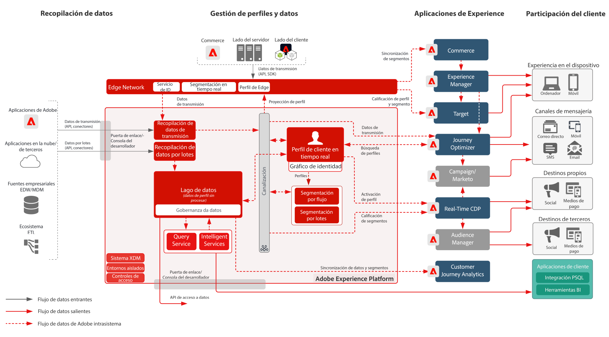

# Adobe Experience Platform y otras aplicaciones

## Diagrama de la arquitectura de Adobe Experience Platform y otras aplicaciones

Este diagrama de arquitectura muestra cómo Adobe Experience Platform se relaciona con las aplicaciones y los servicios de aplicaciones de Adobe Experience Cloud.

>[!VIDEO](https://video.tv.adobe.com/v/32456/?quality=12&learn=on)

## Diagrama detallado de la arquitectura de Adobe Experience Platform y otras aplicaciones

## Integraciones de aplicaciones de Adobe Experience Platform y Experience Cloud

<table class="relative-table wrapped" style="width: 100%;" >
   <colgroup>
    <col style="width: 16.0202%;"/>
    <col style="width: 29.3423%;"/>
    <col style="width: 33.5582%;"/>
    <col style="width: 21.0793%;"/>
  </colgroup>
  <tbody>
    <tr>
      <th>Aplicación</th>
      <th>Experience Platform a aplicación</th>
      <th>Aplicación al Experience Platform</th>
      <th>Modelos relacionados</th>
    </tr>
    <tr>
      <td colspan="1">Ad Cloud</td>
      <td colspan="1">
        <ul>
          <li>Las audiencias definidas en la plataforma de datos del cliente en tiempo real se pueden compartir con Ad Cloud para segmentar mediante Audience Manager.</li>
        </ul>
      </td>
      <td colspan="1">Sin integración actual</td>
      <td colspan="1">
        <ul>
          <li>
            <a href="https://experienceleague.adobe.com/docs/blueprints-learn/architecture/audience-activation/anonymous.html?lang=en">Activación de audiencia anónima</a>
          </li>
          <li>
            <a href="https://experienceleague.adobe.com/docs/blueprints-learn/architecture/audience-activation/online-offline.html?lang=en">Activación de audiencia en línea/sin conexión</a>
          </li>
          <li>
            <a href="https://experienceleague.adobe.com/docs/blueprints-learn/architecture/audience-activation/platform-and-applications.html?lang=en">Activación con Experience Platform y aplicaciones</a>
          </li>
        </ul>
      </td>
    </tr>
    <tr>
      <td>Analytics</td>
      <td>Sin integración actual</td>
      <td>
        <ul>
          <li>Los datos recopilados por Analytics se pueden enviar al Experience Platform de datos y al almacén de perfiles. <a href="https://experienceleague.adobe.com/docs/experience-platform/sources/connectors/adobe-applications/analytics.html?lang=en">Conector de datos de Analytics</a>
          </li>
        </ul>
      </td>
      <td>
        <ul>
          <li>
            <a href="https://experienceleague.adobe.com/docs/blueprints-learn/architecture/architecture-overview/platform-data-flow.html?lang=en">Flujos de datos del Experience Platform</a>
          </li>
        </ul>
        

           
        

      </td>
    </tr>
    <tr>
      <td>Audience Manager</td>
      <td>
        <ul>
          <li>Las audiencias definidas en la plataforma de datos del cliente en tiempo real se pueden compartir con el Audience Manager para su activación en destinos de cookies de terceros.</li>
        </ul>
      </td>
      <td>
        <ul>
          <li>Los datos recopilados y evaluados sobre la pertenencia a la audiencia se pueden compartir con el almacén de perfiles y el lago de datos del Experience Platform. <a href="https://experienceleague.adobe.com/docs/experience-platform/sources/connectors/adobe-applications/audience-manager.html?lang=en">Conector de origen de Audience Manager</a>
          </li>
        </ul>
      </td>
      <td>
        <ul>
          <li>
            <a href="https://experienceleague.adobe.com/docs/blueprints-learn/architecture/audience-activation/anonymous.html?lang=en">Activación de audiencia anónima</a>
          </li>
          <li>
            <a href="https://experienceleague.adobe.com/docs/blueprints-learn/architecture/audience-activation/online-offline.html?lang=en">Activación de audiencia en línea/sin conexión</a>
          </li>
          <li>
            <a href="https://experienceleague.adobe.com/docs/blueprints-learn/architecture/audience-activation/platform-and-applications.html?lang=en">Activación con Experience Platform y aplicaciones</a>
          </li>
        </ul>
      </td>
    </tr>
    <tr>
      <td colspan="1">Campaign Classic</td>
      <td colspan="1">
        <ul>
          <li>Las audiencias definidas en la plataforma de datos del cliente en tiempo real se pueden compartir con el Campaign Classic como audiencia para iniciar campañas.</li>
        </ul>
      </td>
      <td colspan="1">
        <ul>
          <li>Los datos de interacción y campaña recopilados por Campaign se pueden ingerir a Experience Platform como fuente de datos para su uso posterior en la creación de audiencias mediante la plataforma de datos del cliente en tiempo real y el análisis a través del servicio de consultas del Customer Journey Analytics y el Experience Platform y Data Science Workspace.</li>
        </ul>
      </td>
      <td colspan="1">
        <ul>
          <li>
            <a href="https://experienceleague.adobe.com/docs/blueprints-learn/architecture/multi-channel-message-orchestration/batch-messaging.html?lang=en">Mensajería por lotes</a>
          </li>
        </ul>
      </td>
    </tr>
    <tr>
      <td colspan="1">Campaign Standard</td>
      <td colspan="1">
        <ul>
          <li>Las audiencias definidas en la plataforma de datos del cliente en tiempo real se pueden compartir con el Campaign Standard como audiencia para iniciar campañas.</li>
        </ul>
      </td>
      <td colspan="1">
        <ul>
          <li>Los datos de interacción y campaña recopilados por Campaign se pueden ingerir a Experience Platform como fuente de datos para su uso posterior en la creación de audiencias mediante la plataforma de datos del cliente en tiempo real y el análisis a través del servicio de consultas del Customer Journey Analytics y el Experience Platform y Data Science Workspace.</li>
        </ul>
      </td>
      <td colspan="1">
        <ul>
          <li>
            <a href="https://experienceleague.adobe.com/docs/blueprints-learn/architecture/multi-channel-message-orchestration/batch-messaging.html?lang=en">Mensajería por lotes</a>
          </li>
        </ul>
      </td>
    </tr>
    <tr>
      <td colspan="1">Customer Journey Analytics</td>
      <td colspan="1">
        <ul>
          <li>Los datos recopilados e introducidos en el lago de datos del Experience Platform están disponibles para su procesamiento en el Customer Journey Analytics. </li>
        </ul>
      </td>
      <td colspan="1">No hay integración actual disponible. La capacidad de compartir resultados de audiencia con el Experience Platform del Customer Journey Analytics está en la hoja de ruta.</td>
      <td colspan="1">
        <ul>
          <li>
            <a href="https://experienceleague.adobe.com/docs/blueprints-learn/architecture/customer-journey-analytics/overview.html?lang=en">Customer Journey Analytics </a>
          </li>
        </ul>
      </td>
    </tr>
    <tr>
      <td colspan="1">Experience Manager</td>
      <td colspan="1">
        <ul>
          <li>Se puede acceder directamente al perfil del Experience Platform en el servidor para potenciar las experiencias personalizadas ofrecidas mediante el Experience Manager. Tenga en cuenta que las actividades de personalización generalmente se entregan mediante Experience Manager a través de la integración de Target. </li>
        </ul>
      </td>
      <td colspan="1">Ninguna integración actual, los comportamientos y las interacciones realizados en los sitios de Experience Manager se recopilan directamente mediante el SDK web y móvil de Experience Platform.</td>
      <td colspan="1">
        <ul>
          <li>
            <a href="https://experienceleague.adobe.com/docs/blueprints-learn/architecture/audience-activation/online-offline.html?lang=en">Activación de audiencia en línea/sin conexión</a>
          </li>
        </ul>
      </td>
    </tr>
    <tr>
      <td colspan="1">Journey Optimizer</td>
      <td colspan="1">
        <ul>
          <li>Los eventos de datos y perfiles ingeridos en Experience Platform están disponibles para que Journey Optimizer inicie y active los recorridos en Journey Optimizer.</li>
        </ul>
      </td>
      <td colspan="1">
        <ul>
          <li>Los datos de interacción y campaña producidos por Journey Optimizer se recopilan en Experience Platform para su uso posterior en la creación de audiencias mediante la plataforma de datos del cliente en tiempo real y el análisis a través del Customer Journey Analytics, el servicio de consultas al Experience Platform y Data Science Workspace.</li>
        </ul>
      </td>
      <td colspan="1">
        <ul>
          <li>
            <a href="https://experienceleague.adobe.com/docs/blueprints-learn/architecture/multi-channel-message-orchestration/triggered-messaging.html?lang=en">Mensajería activada</a>
          </li>
        </ul>
      </td>
    </tr>
    <tr>
      <td colspan="1">Magento</td>
      <td colspan="1">Sin integración actual</td>
      <td colspan="1">Sin integración actual</td>
      <td colspan="1">Sin integración actual</td>
    </tr>
    <tr>
      <td colspan="1">Marketo</td>
      <td colspan="1">
        <ul>
          <li>Las audiencias definidas en la plataforma de datos del cliente en tiempo real se pueden compartir con Marketo como audiencia para iniciar campañas de Marketo y actualizar objetos de Marketo.</li>
        </ul>
      </td>
      <td colspan="1">
        <ul>
          <li>Las cuentas, los contactos y los datos de oportunidad de Marketo, junto con los datos de interacción y campaña producidos por Marketo, se incorporan en Experience Platform para su uso posterior en la creación de audiencias mediante B2B-CDP y el análisis a través del servicio de consultas de Customer Journey Analytics, Experience Platform y Data Science Workspace. <a href="https://experienceleague.adobe.com/docs/experience-platform/sources/connectors/adobe-applications/marketo/marketo.html?lang=en">Conector del Marketo Engage</a>
          </li>
        </ul>
      </td>
      <td colspan="1">
        <ul>
          <li>Activación B2B: en desarrollo</li>
        </ul>
      </td>
    </tr>
    <tr>
      <td colspan="1">CDP en tiempo real</td>
      <td colspan="1">
        <ul>
          <li>Los datos introducidos y recopilados en Experience Platform son la fuente de datos para ensamblar perfiles de clientes en tiempo real que alimentan la plataforma de datos del cliente en tiempo real.</li>
        </ul>
      </td>
      <td colspan="1">
        <ul>
          <li>Las métricas de audiencia y perfil se envían al lago de datos del Experience Platform para impulsar los tableros de informes de perspectivas de perfil.</li>
          <li>Los datos Audiencia y Perfil del lago de datos se pueden usar para obtener más información mediante Query Service, Data Science Workspace y Customer Journey Analytics.</li>
        </ul>
      </td>
      <td colspan="1">
        <ul>
          <li>
            <a href="https://experienceleague.adobe.com/docs/blueprints-learn/architecture/audience-activation/online-offline.html?lang=en">Activación de audiencia en línea/sin conexión</a>
          </li>
          <li>
            <a href="https://experienceleague.adobe.com/docs/blueprints-learn/architecture/audience-activation/platform-and-applications.html?lang=en">Activación con Experience Platform y aplicaciones</a>
          </li>
        </ul>
      </td>
    </tr>
    <tr>
      <td colspan="1">Target</td>
      <td colspan="1">
        <ul>
          <li>Las audiencias definidas en la plataforma de datos del cliente en tiempo real se pueden compartir con Target y usar en las experiencias de personalización y segmentación que Target proporcione. </li>
          <li>La integración directa de Experience Edge con Target para la pertenencia a segmentos en tiempo real y el acceso a atributos de perfil está en la hoja de ruta.</li>
        </ul>
      </td>
      <td colspan="1">
        <ul>
          <li>Los datos recopilados para las experiencias e interacciones de Target se pueden recopilar para el Experience Platform mediante el SDK web del Experience Platform. Estos datos se pueden utilizar en la creación de audiencias a través de la plataforma de datos del cliente en tiempo real y para el análisis mediante el Customer Journey Analytics.  Servicio de consultas de Experience Platform y Data Science Workspace.</li>
        </ul>
      </td>
      <td colspan="1">
        <ul>
          <li>
            <a href="https://experienceleague.adobe.com/docs/blueprints-learn/architecture/audience-activation/online-offline.html?lang=en">Activación de audiencia en línea/sin conexión</a>
          </li>
          <li>
            <a href="https://experienceleague.adobe.com/docs/blueprints-learn/architecture/audience-activation/platform-and-applications.html?lang=en">Activación con Experience Platform y aplicaciones</a>
          </li>
        </ul>
      </td>
    </tr>
  </tbody>
</table>
