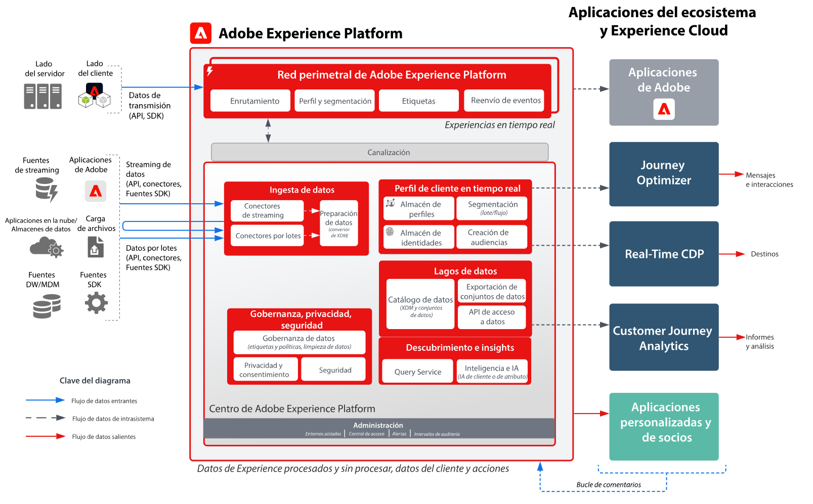
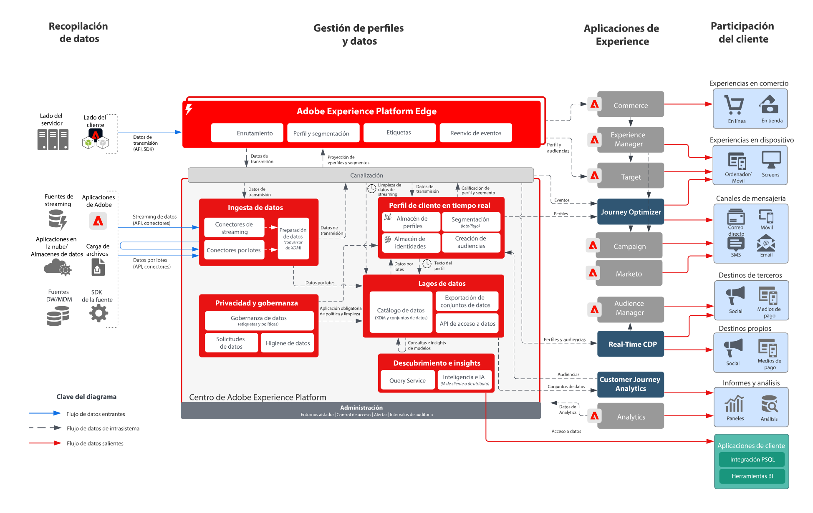

# Diagramas de arquitectura de aplicaciones y Adobe Experience Platform

Estos diagramas de arquitectura muestran cómo se relaciona Experience Platform (AEP) con otras aplicaciones y servicios de aplicaciones de Experience Cloud.

>[!MORELIKETHIS]
>
>[Configuraciones de integración para integraciones de aplicaciones de Experience Cloud](https://experienceleague.adobe.com/docs/integrations-learn/experience-cloud/overview.html?lang=en).

## Diagrama de arquitectura

Este diagrama de arquitectura muestra cómo Adobe Experience Platform se relaciona con las aplicaciones y los servicios de aplicaciones de Adobe Experience Cloud.

## Diagrama de información general

## Diagrama detallado de la arquitectura

>[!VIDEO](https://video.tv.adobe.com/v/32456/?quality=12&learn=on)

## Integraciones de aplicaciones de AEP y Experience Cloud

| Aplicación | De Experience Platform a la aplicación | De la aplicación a Experience Platform |
|------------------------------|-----------------------------------|-----------------------------------|
| **Ad Cloud** | : Las audiencias definidas en Real-time Customer Data Platform se pueden compartir con Ad Cloud para su segmentación mediante Audience Manager. | - No hay integración actual |
| **Analytics** | - Los datos recopilados a través de la web/móvil SDK se pueden reenviar a Adobe Analytics. | : los datos recopilados por Analytics se pueden enviar al repositorio de datos y al almacén de perfiles de Experience Platform. [Conector de datos de Analytics](https://experienceleague.adobe.com/docs/experience-platform/sources/connectors/adobe-applications/analytics.html?lang=es) |
| **Audience Manager** | : Las audiencias definidas en Real-time Customer Data Platform se pueden compartir con Audience Manager para su activación en destinos de cookies de terceros. | : los datos recopilados y evaluados junto con los miembros de audiencia de Audience Manager se pueden compartir con el repositorio de datos de Experience Platform y el almacén de perfiles. [Conector de origen de Audience Manager](https://experienceleague.adobe.com/docs/experience-platform/sources/connectors/adobe-applications/audience-manager.html?lang=es) |
| **Adobe Campaign** | : Las audiencias definidas en Real-time Customer Data Platform se pueden compartir con Campaign Classic para iniciar campañas. | : los datos de interacción y campaña recopilados por Campaign se pueden ingerir en Experience Platform para su uso posterior en la creación de audiencias, Customer Journey Analytics y Query Service. |
| **Campaign Standard** | : Las audiencias definidas en Real-time Customer Data Platform se pueden compartir con Campaign Standard para iniciar campañas. | : los datos de interacción y campaña recopilados por Campaign se pueden ingerir en Experience Platform para su uso posterior. |
| **Customer Journey Analytics** | : Los datos recopilados e ingeridos en el lago de datos de Experience Platform están disponibles para su procesamiento en Customer Journey Analytics.  : los datos de perfil y audiencia de Real-time Customer Data Platform se pueden ingerir en CJA. [Integración de RTCDP a CJA](https://experienceleague.adobe.com/docs/analytics-platform/using/cja-usecases/ingest-aep-segments.html?lang=es) | : cree audiencias en CJA y comparta los resultados de las audiencias con Real-time Customer Data Platform. [Publicación de audiencias de CJA](https://experienceleague.adobe.com/docs/analytics-platform/using/cja-components/audiences/publish.html?lang=es) |
| **Experience Manager** | : se puede acceder al perfil de Experience Platform del lado del servidor para potenciar las experiencias personalizadas en Experience Manager. | - Sin integración actual, las interacciones realizadas en los sitios de Experience Manager se recopilan mediante Experience Platform Web y Mobile SDK. |
| **Journey Optimizer** | : Los eventos de datos y perfiles introducidos en Experience Platform están disponibles para Journey Optimizer. | : Los datos de interacción y campaña producidos por Journey Optimizer se recopilan en Experience Platform para su uso posterior. |
| **Adobe Commerce** | : Los perfiles y audiencias creados en Real-time Customer Data Platform se pueden utilizar para la personalización en Adobe Commerce. | : los datos nativos de Adobe Commerce se pueden enviar a Experience Platform mediante un conector de origen de Adobe Commerce. |
| **Marketo** | : Las audiencias definidas en Real-time Customer Data Platform se pueden compartir con Marketo para iniciar campañas y actualizar objetos. | : las cuentas de Marketo, los contactos y los datos de campaña se incorporan en Experience Platform para un análisis más detallado. [Conector de Marketo Engage](https://experienceleague.adobe.com/docs/experience-platform/sources/connectors/adobe-applications/marketo/marketo.html?lang=es) |
| **Real-Time CDP** | : Los datos introducidos en Experience Platform son la fuente de perfiles de clientes en tiempo real que alimentan Real-time Customer Data Platform. | : Las métricas de audiencia y perfil se envían al lago de datos de Experience Platform para obtener información. |
| **Target** | : Las audiencias y los atributos de perfil de Real-time Customer Data Platform se pueden compartir con Target para su personalización. | : los datos recopilados para las experiencias de Target se pueden enviar a Experience Platform para la creación de audiencias y análisis. |
