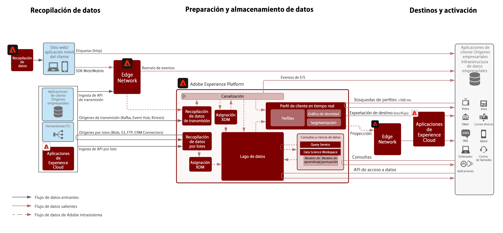
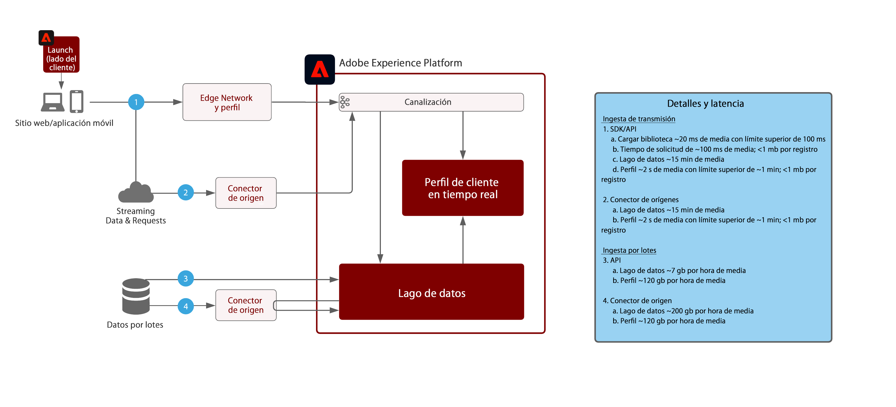

# Arquitectura del flujo de datos de Adobe Experience Platform

## Diagrama de flujo de datos

El diagrama siguiente ilustra las distintas rutas para la ingesta y salida de datos de Adobe Experience Platform.

## Guardas de ingesta de datos

El diagrama siguiente ilustra la latencia y los guardas de rendimiento promedio para la ingesta de datos en Adobe Experience Platform.

