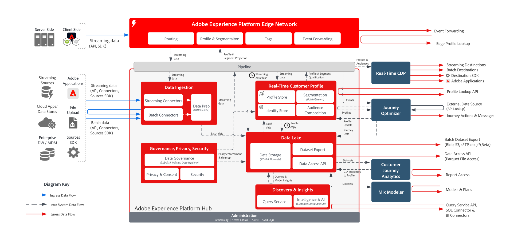

# Arquitectura del flujo de datos de Adobe Experience Platform   diagramas

## Diagrama de flujo de datos

El diagrama siguiente ilustra las distintas rutas para la ingesta y salida de datos de Adobe Experience Platform.

## Patrones de entrada y salida de datos

Para obtener una lista detallada de todos los patrones de ingesta, recopilación y entrada de datos, consulte el [modelo de preparación e ingesta de datos](../data-ingestion/ingestion.md).

Para obtener una lista detallada de todos los patrones de salida y acceso de datos, consulte el [modelo de acceso y exportación de datos](../data-ingestion/egress.md).

## Guardas de ingesta de datos

El diagrama siguiente ilustra la latencia y los guardas de rendimiento promedio para la ingesta de datos en Adobe Experience Platform.

