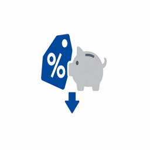
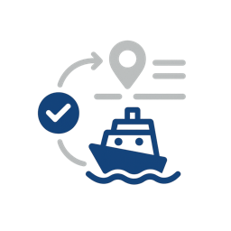

# Catálogo de casos de uso

Los casos de uso del sector muestran cómo las organizaciones de verticales específicos aplican Adobe Experience Platform y aplicaciones para lograr resultados comerciales mensurables. Cada caso de uso describe un escenario empresarial concreto, su impacto esperado y vincula al [patrón de caso de uso](/help/blueprints/use-case-patterns/overview.md) que proporciona instrucciones de implementación detalladas.

Examine por sector para encontrar casos de uso relevantes para su organización y, a continuación, siga los vínculos de patrón para referencias de implementación, incluidas directrices de decisión, cadenas de funciones y documentación de Experience League.

| Industria | Temas clave |
| --- | --- |
| [Automoción](automotive/automotive-overview.md) | Recorrido de compra de vehículo, ciclo de vida del servicio, experiencias del coche conectado, lealtad del propietario |
| [B2B](b2b/b2b-overview.md) | Marketing basado en cuentas, puntuación de posibles clientes, aceleración de la canalización, expansión de clientes |
| [Servicios financieros](financial-services/financial-services-overview.md) | Recomendaciones de productos, prevención de pérdidas, ofertas en la fase de vida, personalización del fraude |
| [Atención médica](healthcare/healthcare-overview.md) | Gestión de citas, cumplimiento de medicamentos, incorporación del paciente, coordinación de la atención |
| [Seguro](insurance/insurance-overview.md) | Renovación de políticas, experiencia en reclamaciones, prevención de riesgos, optimización de ventas cruzadas |
| [Medios de comunicación y entretenimiento](media-entertainment/media-entertainment-overview.md) | Recomendaciones de contenido, retención de suscripciones, conversión de prueba, participación entre plataformas |
| [Comercial](retail/retail-overview.md) | Personalización de productos, recuperación del carro de compras, optimización de ventas cruzadas, participación de fidelidad |
| [Telecomunicaciones](telecommunications/telecommunications-overview.md) | Actualizaciones de dispositivos, prevención de pérdida, optimización de planes, participación en la red |
| [Viajes y hospitalidad](travel-hospitality/travel-hospitality-overview.md) | Personalización de reservas, recuperación de abandonos, programas de fidelidad, campañas de temporada |
| [Tecnología](technology/technology-overview.md) | Recopilación de eventos, reenvío de datos en tiempo real, integración de Analytics, implementación de Edge |

## Conexión de los casos de uso con las directrices de implementación

Cada caso de uso se vincula a un **patrón de caso de uso**: un enfoque de implementación repetible que describe la cadena de funciones, los puntos de decisión y los pasos de configuración necesarios para dar vida al caso de uso. A su vez, los patrones de casos de uso se conectan a [objetivos empresariales clave](/help/blueprints/business-objectives/overview.md), lo que le ayuda a alinear el trabajo de implementación con los resultados estratégicos.

```
Industry Use Case → Use Case Pattern → Key Business Objective
```

## Examinar por sector

>[!BEGINTABS]

>[!TAB Comercial]

| | Ejemplo de uso | Descripción | Vencimiento | Patrón |
| --- | --- | --- | --- | --- |
|  | [Recuperación de correo electrónico del carro de compras abandonado](retail/retail-overview.md#abandoned-cart-email-recovery) | Envíe automáticamente recordatorios de correo electrónico personalizados a los clientes que abandonaron el carro de compras, incluido el contenido del carro de compras y las ofertas relevantes. | [!BADGE Fundacional]{type=Neutral} | [Mensajería activada por eventos](/help/blueprints/use-case-patterns/campaign-management-orchestration/event-triggered-messaging.md) |
|  | [Campañas de urgencia basadas en inventario](retail/retail-overview.md#inventory-based-urgency-campaigns) | Déclencheur alertas y campañas en tiempo real cuando el inventario de productos es bajo, lo que crea urgencia y fomenta la compra inmediata. | [!BADGE Fundacional]{type=Neutral} | [Mensajería activada por eventos](/help/blueprints/use-case-patterns/campaign-management-orchestration/event-triggered-messaging.md) |
|  | [Alertas de bajada de precios](retail/retail-overview.md#price-drop-alerts) | Notificar a los clientes por correo electrónico o push cuando los productos de su lista de deseos o los artículos vistos anteriormente bajen de precio. | [!BADGE Fundacional]{type=Neutral} | [Mensajería activada por eventos](/help/blueprints/use-case-patterns/campaign-management-orchestration/event-triggered-messaging.md) |
|  | [Notificaciones sin existencias](retail/retail-overview.md#out-of-stock-notifications) | Permita que los clientes se registren para recibir notificaciones cuando los productos sin existencias estén disponibles y, a continuación, notifíquelos automáticamente por correo electrónico o SMS. | [!BADGE Fundacional]{type=Neutral} | [Mensajería activada por eventos](/help/blueprints/use-case-patterns/campaign-management-orchestration/event-triggered-messaging.md) |
|  | [Recomendaciones de productos personalizadas](retail/retail-overview.md#personalized-product-recommendations) | Muestre recomendaciones de productos personalizadas en la página de inicio, en las páginas de categoría y en las páginas de detalles del producto, en función del historial de navegación, el historial de compras y un comportamiento similar del cliente. | [!BADGE Emergente]{type=Informative} | [Recomendación de comportamiento](/help/blueprints/use-case-patterns/personalization/behavioral-recommendation.md) |
|  | [Páginas de categoría personalizadas](retail/retail-overview.md#personalized-category-pages) | Personalice de forma dinámica las páginas de categorías para mostrar primero los productos más relevantes en función de las preferencias de los clientes, las compras anteriores y el comportamiento de navegación. | [!BADGE Emergente]{type=Informative} | [Recomendación de comportamiento](/help/blueprints/use-case-patterns/personalization/behavioral-recommendation.md) |
|  | [Nueva serie de bienvenida al cliente](retail/retail-overview.md#new-customer-welcome-series) | Automatice una serie de bienvenida de varios correos electrónicos para nuevos clientes con recomendaciones de productos personalizadas, historia de marcas y ofertas especiales. | [!BADGE Emergente]{type=Informative} | [Recorrido orquestado de varios pasos](/help/blueprints/use-case-patterns/campaign-management-orchestration/multi-step-orchestrated-journey.md) |
|  | [Recordatorios de reabastecimiento](retail/retail-overview.md#replenishment-reminders) | Envíe recordatorios automatizados a los clientes sobre los productos que compran con regularidad (artículos de suscripción, consumibles) para animar a los clientes a que realicen compras más frecuentes. | [!BADGE Emergente]{type=Informative} | [Recorrido orquestado de varios pasos](/help/blueprints/use-case-patterns/campaign-management-orchestration/multi-step-orchestrated-journey.md) |
|  | [Campañas de seguimiento posteriores a la compra](retail/retail-overview.md#post-purchase-follow-up-campaigns) | Envíe correos electrónicos posteriores a la compra con consejos de atención del producto, productos relacionados, solicitudes de revisión e información del programa de fidelidad. | [!BADGE Emergente]{type=Informative} | [Recorrido orquestado de varios pasos](/help/blueprints/use-case-patterns/campaign-management-orchestration/multi-step-orchestrated-journey.md) |
|  | [Personalization de Social Proof](retail/retail-overview.md#social-proof-personalization) | Muestre una prueba social personalizada en función del perfil y las preferencias del cliente. | [!BADGE Emergente]{type=Informative} | [Personalization de aplicación/web de visitante conocido](/help/blueprints/use-case-patterns/personalization/known-visitor-web-app-personalization.md) |
|  | [Recomendaciones de venta cruzada y aumento de ventas](retail/retail-overview.md#cross-sell-and-upsell-recommendations) | Muestre los productos de venta cruzada y de ampliación de ventas relevantes al cerrar la compra, en correos electrónicos y en páginas de productos basadas en patrones de compra y relaciones de productos. | [!BADGE Avanzado]{type=Caution} | [Offer Decisioning](/help/blueprints/use-case-patterns/personalization/offer-decisioning.md) |
|  | [Ofertas exclusivas para clientes de VIP](retail/retail-overview.md#vip-customer-exclusive-offers) | Identifique a los clientes de alto valor y proporcione ofertas exclusivas, acceso anticipado a las ventas y experiencias de compra personalizadas. | [!BADGE Avanzado]{type=Caution} | [Recorrido en canales múltiples con toma de decisiones](/help/blueprints/use-case-patterns/campaign-management-orchestration/cross-channel-journey-with-decisioning.md) |
|  | [Asesor de productos de IA](retail/retail-overview.md#ai-product-advisor) | Implemente un asesor de IA conversacional que guíe a los compradores a través del descubrimiento de productos mediante el diálogo natural, el inventario en tiempo real y los datos de perfil personalizados. | [!BADGE Avanzado]{type=Caution} | [Experiencia de conversación en Brand Concierge](/help/blueprints/use-case-patterns/conversational-experience/brand-concierge-conversational-experience.md) |
|  | [Análisis de atribución en canales múltiples](retail/retail-overview.md#cross-channel-attribution-analysis) | Mida cómo los puntos de contacto de correo electrónico, de pago y en tienda contribuyen a la conversión de compras mediante modelos de atribución multitáctil. | [!BADGE Avanzado]{type=Caution} | [Generación de Customer Analytics y Insight](/help/blueprints/use-case-patterns/analysis/customer-analytics-insight-generation.md) |
|  | [Segmentación de audiencia y activación para medios de pago](retail/retail-overview.md#audience-segmentation--activation-for-paid-media) | Cree segmentos de audiencia de alto valor a partir de perfiles de clientes unificados y actívelos en destinos de medios de pago como Google Ads, Meta y Trade Desk para campañas de adquisición y retargeting. | [!BADGE Emergente]{type=Informative} | [Audience Activation a destinos](/help/blueprints/use-case-patterns/audience-building-activation/audience-activation-to-destinations.md) |
|  | [Supresión de clientes para campañas de adquisición](retail/retail-overview.md#customer-suppression-for-acquisition-campaigns) | Elimine los clientes existentes y los convertidores recientes de la adquisición y el gasto mediante la activación de audiencias de exclusión en destinos de medios de pago, lo que reduce el gasto desperdiciado. | [!BADGE Fundacional]{type=Neutral} | [Audience Activation a destinos](/help/blueprints/use-case-patterns/audience-building-activation/audience-activation-to-destinations.md) |
|  | [Experiencias web personalizadas para visitantes conocidos](retail/retail-overview.md#personalized-web-experiences-for-known-visitors) | Ofrezca titulares personalizados, recomendaciones de productos y contenido promocional a los visitantes de sitios web autenticados en función de su perfil en tiempo real, pertenencia a segmentos e historial de comportamiento. | [!BADGE Avanzado]{type=Caution} | [Personalization de aplicación/web de visitante conocido](/help/blueprints/use-case-patterns/personalization/known-visitor-web-app-personalization.md) |
|  | [Personalization web de visitante anónimo](retail/retail-overview.md#anonymous-visitor-web-personalization) | Personalice el contenido para visitantes de sitios web no identificados mediante señales de comportamiento en la sesión, como páginas vistas, categorías de productos exploradas y fuentes de referencia. | [!BADGE Emergente]{type=Informative} | [Personalization web de visitante anónimo](/help/blueprints/use-case-patterns/personalization/anonymous-visitor-web-personalization.md) |
|  | [Recorrido de la serie de bienvenida](retail/retail-overview.md#welcome-series-journey) | Organice un recorrido de bienvenida de varios pasos para los clientes recién registrados, lo que ofrece contenido de incorporación, educación sobre productos y un incentivo de primera compra en canales push y de correo electrónico. | [!BADGE Emergente]{type=Informative} | [Recorrido orquestado de varios pasos](/help/blueprints/use-case-patterns/campaign-management-orchestration/multi-step-orchestrated-journey.md) |
|  | [Recuperación de abandono del carro de compras](retail/retail-overview.md#cart-abandonment-recovery) | Déclencheur notificaciones push y por correo electrónico en tiempo real cuando un cliente abandone el carro de compras, con recordatorios de productos personalizados e incentivos limitados en el tiempo para completar la compra. | [!BADGE Emergente]{type=Informative} | [Mensajería activada por eventos](/help/blueprints/use-case-patterns/campaign-management-orchestration/event-triggered-messaging.md) |
|  | [Recorrido de participación posterior a la compra](retail/retail-overview.md#post-purchase-engagement-journey) | Envíe comunicaciones posteriores a la compra, incluida la confirmación del pedido, las actualizaciones de envío, las recomendaciones de venta cruzada y las solicitudes de revisión a través de un recorrido organizado de varios pasos. | [!BADGE Emergente]{type=Informative} | [Recorrido orquestado de varios pasos](/help/blueprints/use-case-patterns/campaign-management-orchestration/multi-step-orchestrated-journey.md) |
|  | [Campaña de actualización de nivel de fidelización](retail/retail-overview.md#loyalty-tier-upgrade-campaign) | Identifique a los clientes que se acercan a los umbrales de nivel de lealtad y publique campañas dirigidas para alentarlos a llegar al siguiente nivel con ofertas personalizadas basadas en el historial de compras y las preferencias. | [!BADGE Avanzado]{type=Caution} | [Recorrido orquestado de varios pasos](/help/blueprints/use-case-patterns/campaign-management-orchestration/multi-step-orchestrated-journey.md) |
|  | [Organización de campañas en canales múltiples](retail/retail-overview.md#cross-channel-campaign-orchestration) | Orqueste campañas de marketing coordinadas en canales web, push, SMS y de correo electrónico con ramificación de recorridos, pasos de espera y límite de frecuencia para maximizar la participación sin fatiga. | [!BADGE Avanzado]{type=Caution} | [Recorrido en canales múltiples con toma de decisiones](/help/blueprints/use-case-patterns/campaign-management-orchestration/cross-channel-journey-with-decisioning.md) |
|  | [Experiencia de conversación en Brand Concierge](retail/retail-overview.md#brand-concierge-conversational-experience) | Implemente un agente conversacional con tecnología de IA y seguridad de marca en todas las propiedades digitales para proporcionar orientación personalizada sobre el producto, ayuda para la navegación del sitio y transferencia perfecta a los agentes activos. | [!BADGE Avanzado]{type=Caution} | [Experiencia de conversación en Brand Concierge](/help/blueprints/use-case-patterns/conversational-experience/brand-concierge-conversational-experience.md) |
|  | [Recordatorio de registro con la descarga de la aplicación CTA](retail/retail-overview.md#check-in-reminder-with-app-download-cta) | Recuerde a los huéspedes que deben registrarse y animarlos a descargar la aplicación para acceder a la información fácilmente. | [!BADGE Fundacional]{type=Neutral} | [Mensajería activada por eventos](/help/blueprints/use-case-patterns/campaign-management-orchestration/event-triggered-messaging.md) |
|  | [Campañas de cumpleaños para fans](retail/retail-overview.md#birthday-campaigns-for-fans) | Segmenta a los fans en su cumpleaños con un mensaje de cumpleaños personalizado y una oferta exclusiva. | [!BADGE Emergente]{type=Informative} | [Mensajería activada por eventos](/help/blueprints/use-case-patterns/campaign-management-orchestration/event-triggered-messaging.md) |
|  | [Campañas de cumpleaños para compradores](retail/retail-overview.md#birthday-campaigns-for-shoppers) | Segmente a los compradores en su cumpleaños con un mensaje de cumpleaños personalizado y una oferta exclusiva. | [!BADGE Emergente]{type=Informative} | [Mensajería activada por eventos](/help/blueprints/use-case-patterns/campaign-management-orchestration/event-triggered-messaging.md) |
|  | [Campañas de promoción de Game Day](retail/retail-overview.md#game-day-promotion-campaigns) | Segmenta a los fans para comprar entradas para un próximo juego con promociones y ofertas personalizadas. | [!BADGE Emergente]{type=Informative} | [Activación de mensaje saliente por lotes](/help/blueprints/use-case-patterns/campaign-management-orchestration/batch-outbound-message-activation.md) |
|  | [Campañas de promoción de productos](retail/retail-overview.md#product-promotion-campaigns) | Segmente a los compradores para que compren productos durante una campaña de promoción de productos en curso. | [!BADGE Emergente]{type=Informative} | [Activación de mensaje saliente por lotes](/help/blueprints/use-case-patterns/campaign-management-orchestration/batch-outbound-message-activation.md) |
|  | [Abandono del carro de compras](retail/retail-overview.md#shopping-cart-abandon) | Vuelva a atraer a los clientes que abandonen su carro de compras con recordatorios e incentivos personalizados para completar la compra. | [!BADGE Emergente]{type=Informative} | [Mensajería activada por eventos](/help/blueprints/use-case-patterns/campaign-management-orchestration/event-triggered-messaging.md) |

>[!TAB Automoción]

| | Ejemplo de uso | Descripción | Vencimiento | Patrón |
| --- | --- | --- | --- | --- |
|  | [Recordatorios de cita de servicio](automotive/automotive-overview.md#service-appointment-reminders) | Envíe recordatorios personalizados de citas de servicio en función del kilometraje del vehículo, el historial de servicio y las preferencias del cliente. | [!BADGE Fundacional]{type=Neutral} | [Mensajería activada por eventos](/help/blueprints/use-case-patterns/campaign-management-orchestration/event-triggered-messaging.md) |
|  | [Notificaciones de retirada de vehículo](automotive/automotive-overview.md#vehicle-recall-notifications) | Envíe notificaciones de retirada personalizadas con opciones de programación de servicios e información de seguridad basada en el vehículo y la ubicación del cliente. | [!BADGE Fundacional]{type=Neutral} | [Mensajería activada por eventos](/help/blueprints/use-case-patterns/campaign-management-orchestration/event-triggered-messaging.md) |
|  | [Programación de unidades de prueba](automotive/automotive-overview.md#test-drive-scheduling) | Habilite la programación personalizada de pruebas de conducción con las recomendaciones del concesionario y la disponibilidad del vehículo según las preferencias y la ubicación del cliente. | [!BADGE Fundacional]{type=Neutral} | [Mensajería activada por eventos](/help/blueprints/use-case-patterns/campaign-management-orchestration/event-triggered-messaging.md) |
|  | [Campañas de lanzamiento de modelos nuevos](automotive/automotive-overview.md#new-model-launch-campaigns) | Segmente a los clientes que puedan estar interesados en lanzamientos de nuevos modelos en función de su vehículo actual, preferencias e historial de compras. | [!BADGE Fundacional]{type=Neutral} | [Activación de mensaje saliente por lotes](/help/blueprints/use-case-patterns/campaign-management-orchestration/batch-outbound-message-activation.md) |
|  | [Campañas de valor de intercambio](automotive/automotive-overview.md#trade-in-value-campaigns) | Ofrezca de forma proactiva evaluaciones de valor de intercambio y campañas a clientes que puedan estar listos para actualizar su vehículo. | [!BADGE Emergente]{type=Informative} | [Recorrido orquestado de varios pasos](/help/blueprints/use-case-patterns/campaign-management-orchestration/multi-step-orchestrated-journey.md) |
|  | [Recomendaciones de piezas y accesorios](automotive/automotive-overview.md#parts-and-accessories-recommendations) | Recomendar piezas, accesorios y actualizaciones relevantes en función del modelo del vehículo, la duración de la propiedad y las preferencias del cliente. | [!BADGE Emergente]{type=Informative} | [Recomendación de comportamiento](/help/blueprints/use-case-patterns/personalization/behavioral-recommendation.md) |
|  | [Planes de garantía y servicio ampliado](automotive/automotive-overview.md#warranty-and-extended-service-plans) | Recomendar planes de garantía y servicio extendido en momentos óptimos en función de la edad del vehículo, el kilometraje y los patrones de compra del cliente. | [!BADGE Emergente]{type=Informative} | [Recorrido orquestado de varios pasos](/help/blueprints/use-case-patterns/campaign-management-orchestration/multi-step-orchestrated-journey.md) |
|  | [Activación de característica de coche conectado](automotive/automotive-overview.md#connected-car-feature-activation) | Personalice las recomendaciones de funciones de coche conectado y las campañas de activación en función de las capacidades del vehículo y las preferencias técnicas del cliente. | [!BADGE Emergente]{type=Informative} | [Recorrido orquestado de varios pasos](/help/blueprints/use-case-patterns/campaign-management-orchestration/multi-step-orchestrated-journey.md) |
|  | [Coordinación de la red del concesionario](automotive/automotive-overview.md#dealer-network-coordination) | Activa las recomendaciones y la coordinación personalizadas del distribuidor según la ubicación del cliente, las preferencias y el inventario del distribuidor. | [!BADGE Emergente]{type=Informative} | [Personalization de aplicación/web de visitante conocido](/help/blueprints/use-case-patterns/personalization/known-visitor-web-app-personalization.md) |
|  | [Recorrido de compra de vehículo Personalization](automotive/automotive-overview.md#vehicle-purchase-journey-personalization) | Personalice el recorrido de compra de vehículos desde la investigación hasta la compra con las recomendaciones relevantes sobre vehículos, opciones de financiamiento e información sobre distribuidores. | [!BADGE Avanzado]{type=Caution} | [Recorrido en canales múltiples con toma de decisiones](/help/blueprints/use-case-patterns/campaign-management-orchestration/cross-channel-journey-with-decisioning.md) |
|  | [Ofertas de financiación y seguros](automotive/automotive-overview.md#financing-and-insurance-offers) | Presente ofertas personalizadas de financiación y seguros basadas en el perfil de crédito del cliente, la selección del vehículo y la cronología de compra. | [!BADGE Avanzado]{type=Caution} | [Offer Decisioning](/help/blueprints/use-case-patterns/personalization/offer-decisioning.md) |
|  | [Programas de fidelización de propietarios](automotive/automotive-overview.md#owner-loyalty-programs) | Personalice las comunicaciones, las recompensas y las ofertas exclusivas del programa de lealtad del propietario en función del historial de propiedad y el nivel de lealtad. | [!BADGE Avanzado]{type=Caution} | [Recorrido en canales múltiples con toma de decisiones](/help/blueprints/use-case-patterns/campaign-management-orchestration/cross-channel-journey-with-decisioning.md) |

>[!TAB Servicios financieros]

| | Ejemplo de uso | Descripción | Vencimiento | Patrón |
| --- | --- | --- | --- | --- |
|  | [Alertas y recomendaciones basadas en transacciones](financial-services/financial-services-overview.md#transaction-based-alerts-and-recommendations) | Envíe alertas en tiempo real de transacciones y proporcione recomendaciones personalizadas basadas en patrones de gasto y actividad de cuenta. | [!BADGE Fundacional]{type=Neutral} | [Mensajería activada por eventos](/help/blueprints/use-case-patterns/campaign-management-orchestration/event-triggered-messaging.md) |
|  | [Recuperación por abandono de solicitud de tarjeta de crédito](financial-services/financial-services-overview.md#credit-card-application-abandonment-recovery) | Identifique a los clientes que iniciaron las solicitudes de tarjeta de crédito, pero no las completaron, y vuelva a interactuar con ellos con mensajes y ofertas personalizados. | [!BADGE Fundacional]{type=Neutral} | [Mensajería activada por eventos](/help/blueprints/use-case-patterns/campaign-management-orchestration/event-triggered-messaging.md) |
|  | [Personalization de alerta de fraude](financial-services/financial-services-overview.md#fraud-alert-personalization) | Personalice las alertas de fraude y las comunicaciones de seguridad en función de las preferencias de comunicación del cliente y el historial de interacción anterior. | [!BADGE Fundacional]{type=Neutral} | [Mensajería activada por eventos](/help/blueprints/use-case-patterns/campaign-management-orchestration/event-triggered-messaging.md) |
|  | [Nutrición de clientes potenciales de alto valor](financial-services/financial-services-overview.md#high-value-lead-nurturing) | Identifique los posibles clientes de alto valor en función de los datos y el comportamiento del perfil y, a continuación, nutra a los mismos con contenido y ofertas personalizados mediante recorridos automatizados. | [!BADGE Emergente]{type=Informative} | [Recorrido orquestado de varios pasos](/help/blueprints/use-case-patterns/campaign-management-orchestration/multi-step-orchestrated-journey.md) |
|  | [Tablero de cuenta personalizado](financial-services/financial-services-overview.md#personalized-account-dashboard) | Personalice la experiencia del tablero de banca en línea y la aplicación móvil en función de la actividad de la cuenta del cliente, las preferencias y los objetivos financieros. | [!BADGE Emergente]{type=Informative} | [Personalization de aplicación/web de visitante conocido](/help/blueprints/use-case-patterns/personalization/known-visitor-web-app-personalization.md) |
|  | [Recomendaciones de Portfolio de inversión](financial-services/financial-services-overview.md#investment-portfolio-recommendations) | Proporcione recomendaciones de inversión personalizadas basadas en el perfil de riesgo del cliente, el historial de inversión y los objetivos financieros. | [!BADGE Emergente]{type=Informative} | [Recomendación de comportamiento](/help/blueprints/use-case-patterns/personalization/behavioral-recommendation.md) |
|  | [Campañas de preaprobación hipotecaria](financial-services/financial-services-overview.md#mortgage-pre-approval-campaigns) | Clientes objetivo que es probable que estén en el mercado de una hipoteca en función de datos de perfil, comportamiento e indicadores de fase de vida. | [!BADGE Emergente]{type=Informative} | [Recorrido orquestado de varios pasos](/help/blueprints/use-case-patterns/campaign-management-orchestration/multi-step-orchestrated-journey.md) |
|  | [Recomendación de producto para clientes existentes](financial-services/financial-services-overview.md#product-recommendation-for-existing-customers) | Recomendar productos financieros relevantes a los clientes existentes en función de su perfil, historial de transacciones y fase de vida. | [!BADGE Avanzado]{type=Caution} | [Offer Decisioning](/help/blueprints/use-case-patterns/personalization/offer-decisioning.md) |
|  | [Campañas de prevención de pérdida](financial-services/financial-services-overview.md#churn-prevention-campaigns) | Identifique a los clientes en riesgo de pérdida mediante predicciones impulsadas por IA e inclúyalos en ofertas de retención y comunicaciones personalizadas. | [!BADGE Avanzado]{type=Caution} | [Recorrido en canales múltiples con toma de decisiones](/help/blueprints/use-case-patterns/campaign-management-orchestration/cross-channel-journey-with-decisioning.md) |
|  | [Ofertas de productos basados en fases de vida](financial-services/financial-services-overview.md#life-stage-based-product-offers) | Identifique a los clientes que entran en nuevas etapas de vida y ofrezca proactivamente productos y servicios financieros relevantes. | [!BADGE Avanzado]{type=Caution} | [Recorrido en canales múltiples con toma de decisiones](/help/blueprints/use-case-patterns/campaign-management-orchestration/cross-channel-journey-with-decisioning.md) |
|  | [Participación en el programa de fidelización](financial-services/financial-services-overview.md#loyalty-program-engagement) | Personalice las comunicaciones, las recompensas y las ofertas del programa de fidelidad en función del nivel del cliente, el saldo de puntos y el historial de canje. | [!BADGE Avanzado]{type=Caution} | [Recorrido en canales múltiples con toma de decisiones](/help/blueprints/use-case-patterns/campaign-management-orchestration/cross-channel-journey-with-decisioning.md) |
|  | [Contenido personalizado de educación financiera](financial-services/financial-services-overview.md#personalized-financial-education-content) | Ofrezca contenido, sugerencias y recursos personalizados de educación financiera en función del perfil financiero, los objetivos y los intereses del cliente. | [!BADGE Avanzado]{type=Caution} | [Recorrido en canales múltiples con toma de decisiones](/help/blueprints/use-case-patterns/campaign-management-orchestration/cross-channel-journey-with-decisioning.md) |
|  | [Guía del producto financiero de IA](financial-services/financial-services-overview.md#ai-financial-product-guide) | Ayude a los clientes a comprender los productos financieros y a navegar por las opciones de la cuenta a través de IA conversacional basada en contenido revisado por el cumplimiento y datos de perfil en tiempo real. | [!BADGE Avanzado]{type=Caution} | [Experiencia de conversación en Brand Concierge](/help/blueprints/use-case-patterns/conversational-experience/brand-concierge-conversational-experience.md) |
|  | [Análisis de controlador de cancelación y Funnel de adopción de productos](financial-services/financial-services-overview.md#product-adoption-funnel-and-churn-driver-analysis) | Identificar dónde abandonan los clientes en los flujos de incorporación y qué comportamientos predicen la desgaste del producto. | [!BADGE Avanzado]{type=Caution} | [Generación de Customer Analytics y Insight](/help/blueprints/use-case-patterns/analysis/customer-analytics-insight-generation.md) |
|  | [Siguiente Mejor Offer Decisioning](financial-services/financial-services-overview.md#next-best-offer-decisioning) | Utilice la lógica de decisión centralizada para seleccionar la oferta más relevante para cada cliente en todos los canales, combinando reglas de elegibilidad, restricciones comerciales y estrategias de clasificación impulsadas por IA. | [!BADGE Avanzado]{type=Caution} | [Offer Decisioning](/help/blueprints/use-case-patterns/personalization/offer-decisioning.md) |
|  | [Tablero de Customer Journey Analytics](financial-services/financial-services-overview.md#customer-journey-analytics-dashboard) | Cree espacios de trabajo de análisis en canales múltiples que combinen datos de la web, la aplicación, el correo electrónico y el centro de llamadas para visualizar los recorridos de los clientes, identificar puntos de entrega y medir la atribución de campañas. | [!BADGE Emergente]{type=Informative} | [Generación de Customer Analytics y Insight](/help/blueprints/use-case-patterns/analysis/customer-analytics-insight-generation.md) |

>[!TAB Atención médica]

| | Ejemplo de uso | Descripción | Vencimiento | Patrón |
| --- | --- | --- | --- | --- |
|  | [Automatización de recordatorio de cita](healthcare/healthcare-overview.md#appointment-reminder-automation) | Envíe recordatorios de cita personalizados por correo electrónico, SMS y notificaciones push en función de las preferencias del paciente y el tipo de cita. | [!BADGE Fundacional]{type=Neutral} | [Mensajería activada por eventos](/help/blueprints/use-case-patterns/campaign-management-orchestration/event-triggered-messaging.md) |
|  | [Campañas De Seguimiento Posteriores A La Visita](healthcare/healthcare-overview.md#post-visit-follow-up-campaigns) | Envíe automáticamente encuestas posteriores a la visita, instrucciones de atención y recordatorios de citas de seguimiento en función del tipo de visita y las necesidades del paciente. | [!BADGE Fundacional]{type=Neutral} | [Mensajería activada por eventos](/help/blueprints/use-case-patterns/campaign-management-orchestration/event-triggered-messaging.md) |
|  | [Notificación de resultados de laboratorio](healthcare/healthcare-overview.md#lab-results-notification) | Notificar a los pacientes cuando los resultados de laboratorio estén disponibles a través de su canal de comunicación preferido con mensajes personalizados. | [!BADGE Fundacional]{type=Neutral} | [Mensajería activada por eventos](/help/blueprints/use-case-patterns/campaign-management-orchestration/event-triggered-messaging.md) |
|  | [Verificación de cobertura de seguro](healthcare/healthcare-overview.md#insurance-coverage-verification) | Verificar y comunicar de forma proactiva la información de cobertura del seguro a los pacientes antes de las citas para reducir los problemas de facturación y mejorar la experiencia del paciente. | [!BADGE Fundacional]{type=Neutral} | [Mensajería activada por eventos](/help/blueprints/use-case-patterns/campaign-management-orchestration/event-triggered-messaging.md) |
|  | [Recordatorios de cita de telesalud](healthcare/healthcare-overview.md#telehealth-appointment-reminders) | Envíe recordatorios personalizados para citas de salud con instrucciones de conexión, consejos de preparación e información de soporte técnico. | [!BADGE Fundacional]{type=Neutral} | [Mensajería activada por eventos](/help/blueprints/use-case-patterns/campaign-management-orchestration/event-triggered-messaging.md) |
|  | [Recordatorios de atención preventiva](healthcare/healthcare-overview.md#preventive-care-reminders) | Recordar proactivamente a los pacientes la atención preventiva recomendada en función de su edad, antecedentes médicos y factores de riesgo. | [!BADGE Fundacional]{type=Neutral} | [Activación de mensaje saliente por lotes](/help/blueprints/use-case-patterns/campaign-management-orchestration/batch-outbound-message-activation.md) |
|  | [Campañas de adherencia a medicamentos](healthcare/healthcare-overview.md#medication-adherence-campaigns) | Envíe recordatorios personalizados y contenido educativo para ayudar a los pacientes a cumplir con los horarios de medicación y los planes de tratamiento. | [!BADGE Emergente]{type=Informative} | [Recorrido orquestado de varios pasos](/help/blueprints/use-case-patterns/campaign-management-orchestration/multi-step-orchestrated-journey.md) |
|  | [Programas de Manejo de Enfermedades Crónicas](healthcare/healthcare-overview.md#chronic-disease-management-programs) | Personalice las comunicaciones sobre el manejo de enfermedades crónicas, el contenido educativo y los recordatorios de supervisión basados en la condición del paciente y el plan de tratamiento. | [!BADGE Emergente]{type=Informative} | [Recorrido orquestado de varios pasos](/help/blueprints/use-case-patterns/campaign-management-orchestration/multi-step-orchestrated-journey.md) |
|  | [Nuevo Recorrido de incorporación del paciente](healthcare/healthcare-overview.md#new-patient-onboarding-journey) | Automatice un recorrido de incorporación de varios pasos para nuevos pacientes con información de bienvenida, instrucciones de acceso al portal y guía de programación de citas. | [!BADGE Emergente]{type=Informative} | [Recorrido orquestado de varios pasos](/help/blueprints/use-case-patterns/campaign-management-orchestration/multi-step-orchestrated-journey.md) |
|  | [Participación en el programa de bienestar](healthcare/healthcare-overview.md#wellness-program-engagement) | Personalice las comunicaciones, los desafíos y las recompensas del programa de bienestar en función de los objetivos de salud del paciente, el nivel de actividad y las preferencias. | [!BADGE Emergente]{type=Informative} | [Recorrido orquestado de varios pasos](/help/blueprints/use-case-patterns/campaign-management-orchestration/multi-step-orchestrated-journey.md) |
|  | [Coordinación del equipo de atención](healthcare/healthcare-overview.md#care-team-coordination) | Permita la comunicación y coordinación personalizadas entre los pacientes y los miembros de su equipo de atención en función de las preferencias y el plan de atención. | [!BADGE Emergente]{type=Informative} | [Recorrido orquestado de varios pasos](/help/blueprints/use-case-patterns/campaign-management-orchestration/multi-step-orchestrated-journey.md) |
|  | [Entrega de contenido de mantenimiento personalizado](healthcare/healthcare-overview.md#personalized-health-content-delivery) | Ofrezca contenido personalizado de educación para la salud, consejos y recursos de bienestar en función de las condiciones del paciente, los intereses y los objetivos de salud. | [!BADGE Avanzado]{type=Caution} | [Recorrido en canales múltiples con toma de decisiones](/help/blueprints/use-case-patterns/campaign-management-orchestration/cross-channel-journey-with-decisioning.md) |
|  | [Análisis de la brecha de atención y Funnel del Recorrido del paciente](healthcare/healthcare-overview.md#patient-journey-funnel-and-care-gap-analysis) | Identificar dónde se desvinculan los pacientes de las rutas de atención y qué poblaciones de miembros tienen lagunas en la atención recomendada. | [!BADGE Avanzado]{type=Caution} | [Generación de Customer Analytics y Insight](/help/blueprints/use-case-patterns/analysis/customer-analytics-insight-generation.md) |
|  | [Contenido del portal del paciente Personalization](healthcare/healthcare-overview.md#patient-portal-content-personalization) | Personalice la experiencia del portal del paciente en función del comportamiento de navegación en la sesión y el historial de participación | [!BADGE Avanzado]{type=Caution} | [Recomendación de comportamiento](/help/blueprints/use-case-patterns/personalization/behavioral-recommendation.md) |
|  | [Recordatorios de cita y participación del paciente](healthcare/healthcare-overview.md#patient-engagement--appointment-reminders) | Envíe recordatorios de citas personalizados, consejos médicos y comunicaciones de atención de seguimiento a través de recorridos multicanal compatibles y con conocimiento de consentimiento. | [!BADGE Emergente]{type=Informative} | [Mensajería activada por eventos](/help/blueprints/use-case-patterns/campaign-management-orchestration/event-triggered-messaging.md) |

>[!TAB Seguro]

| | Ejemplo de uso | Descripción | Vencimiento | Patrón |
| --- | --- | --- | --- | --- |
|  | [Campañas de renovación de directivas](insurance/insurance-overview.md#policy-renewal-campaigns) | Envíe recordatorios y ofertas personalizados de renovación de directivas en función del historial de directivas de cliente, las reclamaciones y las preferencias. | [!BADGE Fundacional]{type=Neutral} | [Recorrido orquestado de varios pasos](/help/blueprints/use-case-patterns/campaign-management-orchestration/multi-step-orchestrated-journey.md) |
|  | [Notificaciones de cambio de directiva](insurance/insurance-overview.md#policy-change-notifications) | Envíe notificaciones personalizadas sobre cambios de políticas, actualizaciones y nuevas opciones de cobertura en función de las preferencias y la política del cliente. | [!BADGE Fundacional]{type=Neutral} | [Mensajería activada por eventos](/help/blueprints/use-case-patterns/campaign-management-orchestration/event-triggered-messaging.md) |
|  | [Recuperación de abandono de presupuesto](insurance/insurance-overview.md#quote-abandonment-recovery) | Vuelva a atraer a los clientes que empezaron pero no completaron las cotizaciones de seguro con seguimiento y ofertas personalizadas. | [!BADGE Fundacional]{type=Neutral} | [Mensajería activada por eventos](/help/blueprints/use-case-patterns/campaign-management-orchestration/event-triggered-messaging.md) |
|  | [Prevención de fraude de reclamaciones](insurance/insurance-overview.md#claims-fraud-prevention) | Utilice la detección de fraude con tecnología de IA para identificar reclamaciones sospechosas y personalizar las comunicaciones de investigación al tiempo que mantiene la confianza de los clientes. | [!BADGE Fundacional]{type=Neutral} | [Mensajería activada por eventos](/help/blueprints/use-case-patterns/campaign-management-orchestration/event-triggered-messaging.md) |
|  | [Respuesta a evento catastrófico](insurance/insurance-overview.md#catastrophic-event-response) | Comuníquese proactivamente con los clientes en las áreas afectadas durante desastres naturales o eventos catastróficos con soporte personalizado e información de reclamos. | [!BADGE Fundacional]{type=Neutral} | [Mensajería activada por eventos](/help/blueprints/use-case-patterns/campaign-management-orchestration/event-triggered-messaging.md) |
|  | [Coordinación de agente y agente](insurance/insurance-overview.md#agent-and-broker-coordination) | Permita una comunicación y coordinación personalizadas entre los clientes y sus agentes/agentes en función de las necesidades y preferencias de las políticas. | [!BADGE Fundacional]{type=Neutral} | [Activación de mensaje saliente por lotes](/help/blueprints/use-case-patterns/campaign-management-orchestration/batch-outbound-message-activation.md) |
|  | [Proceso de reclamaciones Personalization](insurance/insurance-overview.md#claims-process-personalization) | Personalice las comunicaciones, las actualizaciones y la asistencia del proceso de reclamaciones en función del tipo de reclamación, las preferencias del cliente y el historial de reclamaciones. | [!BADGE Emergente]{type=Informative} | [Recorrido orquestado de varios pasos](/help/blueprints/use-case-patterns/campaign-management-orchestration/multi-step-orchestrated-journey.md) |
|  | [Evaluación y prevención de riesgos](insurance/insurance-overview.md#risk-assessment-and-prevention) | Proporcione información personalizada sobre la evaluación de riesgos y consejos de prevención en función del tipo de directiva del cliente, la ubicación y los factores de riesgo. | [!BADGE Emergente]{type=Informative} | [Recorrido orquestado de varios pasos](/help/blueprints/use-case-patterns/campaign-management-orchestration/multi-step-orchestrated-journey.md) |
|  | [Programas de Bienestar y Prevención](insurance/insurance-overview.md#wellness-and-prevention-programs) | Personalice las comunicaciones y recompensas del programa de bienestar para clientes de seguros de salud/vida en función de la participación y los objetivos. | [!BADGE Emergente]{type=Informative} | [Recorrido orquestado de varios pasos](/help/blueprints/use-case-patterns/campaign-management-orchestration/multi-step-orchestrated-journey.md) |
|  | [Recomendaciones de productos de venta cruzada](insurance/insurance-overview.md#cross-sell-product-recommendations) | Recomendar productos de seguro adicionales basados en las pólizas existentes del cliente, la etapa de vida y el perfil de riesgo. | [!BADGE Avanzado]{type=Caution} | [Offer Decisioning](/help/blueprints/use-case-patterns/personalization/offer-decisioning.md) |
|  | [Oportunidades de descuento y ahorro](insurance/insurance-overview.md#discount-and-savings-opportunities) | Identifique y comunique oportunidades de descuento personalizadas basadas en el perfil y el comportamiento del cliente. | [!BADGE Avanzado]{type=Caution} | [Offer Decisioning](/help/blueprints/use-case-patterns/personalization/offer-decisioning.md) |
|  | [Contenido del portal del asegurado Personalization](insurance/insurance-overview.md#policyholder-portal-content-personalization) | Personalice el portal autenticado y la experiencia de la aplicación en función del comportamiento y la cartera de políticas | [!BADGE Avanzado]{type=Caution} | [Recomendación de comportamiento](/help/blueprints/use-case-patterns/personalization/behavioral-recommendation.md) |

>[!TAB Medios de comunicación y entretenimiento]

| | Ejemplo de uso | Descripción | Vencimiento | Patrón |
| --- | --- | --- | --- | --- |
|  | [Nuevas notificaciones de publicación de contenido](media-entertainment/media-entertainment-overview.md#new-content-release-notifications) | Notificar a los suscriptores sobre nuevas versiones de contenido que coincidan con sus preferencias y el historial de visualización. | [!BADGE Fundacional]{type=Neutral} | [Mensajería activada por eventos](/help/blueprints/use-case-patterns/campaign-management-orchestration/event-triggered-messaging.md) |
|  | [Lista de observación y recordatorios favoritos](media-entertainment/media-entertainment-overview.md#watchlist-and-favorites-reminders) | Envíe recordatorios a los usuarios sobre el contenido de su lista de observación o sus favoritos que aún no hayan visto. | [!BADGE Fundacional]{type=Neutral} | [Mensajería activada por eventos](/help/blueprints/use-case-patterns/campaign-management-orchestration/event-triggered-messaging.md) |
|  | [Recordatorios para la visualización de eventos en directo](media-entertainment/media-entertainment-overview.md#live-event-viewing-reminders) | Notificar a los usuarios sobre próximos eventos en directo, juegos deportivos o estrenos que coincidan con sus intereses y el historial de visualización. | [!BADGE Fundacional]{type=Neutral} | [Mensajería activada por eventos](/help/blueprints/use-case-patterns/campaign-management-orchestration/event-triggered-messaging.md) |
|  | [Campañas de finalización de contenido](media-entertainment/media-entertainment-overview.md#content-completion-campaigns) | Recordar a los usuarios que dejen de ver o escuchar el contenido que han iniciado pero que no han completado. | [!BADGE Fundacional]{type=Neutral} | [Mensajería activada por eventos](/help/blueprints/use-case-patterns/campaign-management-orchestration/event-triggered-messaging.md) |
|  | [Motor de recomendación de contenido](media-entertainment/media-entertainment-overview.md#content-recommendation-engine) | Genere recomendaciones de contenido personalizadas mediante señales de comportamiento y estrategias de selección, entregadas a través de canales web, de correo electrónico y en la aplicación. | [!BADGE Emergente]{type=Informative} | [Recomendación de comportamiento](/help/blueprints/use-case-patterns/personalization/behavioral-recommendation.md) |
|  | [Experiencia personalizada en la página de inicio](media-entertainment/media-entertainment-overview.md#personalized-homepage-experience) | Personalice de forma dinámica las páginas de inicio y de detección de contenido para mostrar primero el contenido más relevante en función del perfil y el comportamiento del usuario. | [!BADGE Emergente]{type=Informative} | [Recomendación de comportamiento](/help/blueprints/use-case-patterns/personalization/behavioral-recommendation.md) |
|  | [Generación de listas de reproducción personalizadas](media-entertainment/media-entertainment-overview.md#personalized-playlist-generation) | Genere y actualice automáticamente listas de reproducción personalizadas basadas en el historial de escucha del usuario, las preferencias y los indicadores de estado de ánimo. | [!BADGE Emergente]{type=Informative} | [Recomendación de comportamiento](/help/blueprints/use-case-patterns/personalization/behavioral-recommendation.md) |
|  | [Campañas de conversión de prueba gratuitas](media-entertainment/media-entertainment-overview.md#free-trial-conversion-campaigns) | Fomente la participación de usuarios de prueba gratuita con recomendaciones y ofertas de contenido personalizadas para fomentar la conversión de suscripciones antes de que finalice la prueba. | [!BADGE Emergente]{type=Informative} | [Recorrido orquestado de varios pasos](/help/blueprints/use-case-patterns/campaign-management-orchestration/multi-step-orchestrated-journey.md) |
|  | [Sincronización de contenido entre plataformas](media-entertainment/media-entertainment-overview.md#cross-platform-content-sync) | Proporciona una experiencia de contenido perfecta en todos los dispositivos sincronizando el historial de visualización, las preferencias y las recomendaciones en tiempo real. | [!BADGE Emergente]{type=Informative} | [Personalization de aplicación/web de visitante conocido](/help/blueprints/use-case-patterns/personalization/known-visitor-web-app-personalization.md) |
|  | [Uso compartido en medios sociales de Personalization](media-entertainment/media-entertainment-overview.md#social-sharing-personalization) | Personalice las recomendaciones y los indicadores de uso compartido en redes sociales en función de las conexiones sociales del usuario y las preferencias de contenido. | [!BADGE Emergente]{type=Informative} | [Personalization de aplicación/web de visitante conocido](/help/blueprints/use-case-patterns/personalization/known-visitor-web-app-personalization.md) |
|  | [Prevención de cancelación de suscripción](media-entertainment/media-entertainment-overview.md#subscription-churn-prevention) | Identifique a los suscriptores que corren el riesgo de cancelarse y envíeles recomendaciones de contenido personalizado, ofertas y campañas de retención. | [!BADGE Avanzado]{type=Caution} | [Recorrido en canales múltiples con toma de decisiones](/help/blueprints/use-case-patterns/campaign-management-orchestration/cross-channel-journey-with-decisioning.md) |
|  | [Ampliación de venta de funciones premium](media-entertainment/media-entertainment-overview.md#premium-feature-upsell) | Identifique a los usuarios que se beneficiarían de las funciones avanzadas y presenten ofertas de ampliación de venta personalizadas en función de sus patrones de uso. | [!BADGE Avanzado]{type=Caution} | [Offer Decisioning](/help/blueprints/use-case-patterns/personalization/offer-decisioning.md) |
|  | [Controlador de cancelación de suscriptor y análisis de participación de contenido](media-entertainment/media-entertainment-overview.md#subscriber-churn-driver-and-content-engagement-analysis) | Identifique los patrones de participación de contenido que preceden a la cancelación del suscriptor y mida el impacto de la retención por tipo de contenido y cohorte. | [!BADGE Avanzado]{type=Caution} | [Generación de Customer Analytics y Insight](/help/blueprints/use-case-patterns/analysis/customer-analytics-insight-generation.md) |

>[!TAB Telecomunicaciones]

| | Ejemplo de uso | Descripción | Vencimiento | Patrón |
| --- | --- | --- | --- | --- |
|  | [Alertas y recomendaciones de uso de datos](telecommunications/telecommunications-overview.md#data-usage-alerts-and-recommendations) | Envíe alertas personalizadas cuando los clientes se aproximen a los límites de datos y recomienden actualizaciones de planes o complementos según los patrones de uso. | [!BADGE Fundacional]{type=Neutral} | [Mensajería activada por eventos](/help/blueprints/use-case-patterns/campaign-management-orchestration/event-triggered-messaging.md) |
|  | [Notificaciones de interrupción del servicio](telecommunications/telecommunications-overview.md#service-outage-notifications) | Notificar a los clientes de forma proactiva sobre las interrupciones del servicio en su área con actualizaciones personalizadas y ofertas de compensación. | [!BADGE Fundacional]{type=Neutral} | [Mensajería activada por eventos](/help/blueprints/use-case-patterns/campaign-management-orchestration/event-triggered-messaging.md) |
|  | [Recordatorios de pago de factura](telecommunications/telecommunications-overview.md#bill-payment-reminders) | Envíe recordatorios personalizados de pago de factura a través de los canales preferidos con opciones de pago e información de saldo de cuenta. | [!BADGE Fundacional]{type=Neutral} | [Mensajería activada por eventos](/help/blueprints/use-case-patterns/campaign-management-orchestration/event-triggered-messaging.md) |
|  | [Campañas de actualización 5G](telecommunications/telecommunications-overview.md#5g-upgrade-campaigns) | Clientes objetivo elegibles para actualizaciones de red 5G con ofertas y beneficios personalizados en función de su ubicación y patrones de uso. | [!BADGE Fundacional]{type=Neutral} | [Activación de mensaje saliente por lotes](/help/blueprints/use-case-patterns/campaign-management-orchestration/batch-outbound-message-activation.md) |
|  | [Campañas de optimización del plan](telecommunications/telecommunications-overview.md#plan-optimization-campaigns) | Analice los patrones de uso de los clientes y recomiende cambios de plan óptimos para ahorrar dinero u obtener mejores funciones según sus necesidades. | [!BADGE Emergente]{type=Informative} | [Recorrido orquestado de varios pasos](/help/blueprints/use-case-patterns/campaign-management-orchestration/multi-step-orchestrated-journey.md) |
|  | [Nuevo Recorrido de incorporación del cliente](telecommunications/telecommunications-overview.md#new-customer-onboarding-journey) | Automatice un recorrido de incorporación personalizado para nuevos clientes con información de bienvenida, directrices de configuración de cuentas y tutoriales de funciones. | [!BADGE Emergente]{type=Informative} | [Recorrido orquestado de varios pasos](/help/blueprints/use-case-patterns/campaign-management-orchestration/multi-step-orchestrated-journey.md) |
|  | [Personalization de rendimiento de red](telecommunications/telecommunications-overview.md#network-performance-personalization) | Personalice la información y las recomendaciones de rendimiento de red en función de la ubicación del cliente, el dispositivo y los patrones de uso. | [!BADGE Emergente]{type=Informative} | [Personalization de aplicación/web de visitante conocido](/help/blueprints/use-case-patterns/personalization/known-visitor-web-app-personalization.md) |
|  | [Recomendaciones de actualización de dispositivos](telecommunications/telecommunications-overview.md#device-upgrade-recommendations) | Identifique a los clientes que cumplen los requisitos para las actualizaciones de dispositivos y presente recomendaciones y ofertas de actualización de dispositivos personalizadas. | [!BADGE Avanzado]{type=Caution} | [Recorrido en canales múltiples con toma de decisiones](/help/blueprints/use-case-patterns/campaign-management-orchestration/cross-channel-journey-with-decisioning.md) |
|  | [Prevención de pérdida para clientes de alto valor](telecommunications/telecommunications-overview.md#churn-prevention-for-high-value-customers) | Identifique a los clientes de alto valor que corren el riesgo de sufrir una pérdida de tiempo y actívelos con ofertas de retención personalizadas y un servicio de atención al cliente proactivo. | [!BADGE Avanzado]{type=Caution} | [Recorrido en canales múltiples con toma de decisiones](/help/blueprints/use-case-patterns/campaign-management-orchestration/cross-channel-journey-with-decisioning.md) |
|  | [Administración del plan familiar](telecommunications/telecommunications-overview.md#family-plan-management) | Personalice las comunicaciones y ofertas para los administradores de planes familiares en función de los patrones de uso familiar y las necesidades individuales de los miembros. | [!BADGE Avanzado]{type=Caution} | [Recorrido en canales múltiples con toma de decisiones](/help/blueprints/use-case-patterns/campaign-management-orchestration/cross-channel-journey-with-decisioning.md) |
|  | [Recomendaciones del servicio de complementos](telecommunications/telecommunications-overview.md#add-on-service-recommendations) | Recomendar servicios adicionales relevantes en función del plan del cliente, el uso y las preferencias. | [!BADGE Avanzado]{type=Caution} | [Offer Decisioning](/help/blueprints/use-case-patterns/personalization/offer-decisioning.md) |
|  | [Asesor de planes de IA](telecommunications/telecommunications-overview.md#ai-plan-advisor) | Guía a los suscriptores a través de la selección personalizada de planes usando IA conversacional basada en datos de uso en tiempo real, perfil de cuenta y el catálogo completo de planes. | [!BADGE Avanzado]{type=Caution} | [Experiencia de conversación en Brand Concierge](/help/blueprints/use-case-patterns/conversational-experience/brand-concierge-conversational-experience.md) |
|  | [Análisis de propensión a la pérdida y experiencia de red](telecommunications/telecommunications-overview.md#churn-propensity-and-network-experience-analytics) | Correlacione eventos de calidad de red y contactos de servicio con la pérdida de suscriptores para identificar qué errores de experiencia provocan la desgaste. | [!BADGE Avanzado]{type=Caution} | [Generación de Customer Analytics y Insight](/help/blueprints/use-case-patterns/analysis/customer-analytics-insight-generation.md) |
|  | [Prevención de pérdida y recuperación](telecommunications/telecommunications-overview.md#churn-prevention--win-back) | Utilice modelos predictivos y señales de comportamiento para identificar a los clientes en riesgo y déclencheur campañas de retención personalizadas con ofertas adaptadas antes de que se produzcan. | [!BADGE Avanzado]{type=Caution} | [Recorrido en canales múltiples con toma de decisiones](/help/blueprints/use-case-patterns/campaign-management-orchestration/cross-channel-journey-with-decisioning.md) |

>[!TAB Viajes y hospitalidad]

| | Ejemplo de uso | Descripción | Vencimiento | Patrón |
| --- | --- | --- | --- | --- |
|  | [Recorrido de recuperación de abandono del carro de compras](travel-hospitality/travel-hospitality-overview.md#cart-abandonment-recovery-journey) | Detecte automáticamente cuando un cliente abandona el carro de compras y almacena en déclencheur un recorrido de correo electrónico de varios pasos con ofertas personalizadas para fomentar la finalización. | [!BADGE Fundacional]{type=Neutral} | [Mensajería activada por eventos](/help/blueprints/use-case-patterns/campaign-management-orchestration/event-triggered-messaging.md) |
|  | [Recordatorios de reserva multicanal](travel-hospitality/travel-hospitality-overview.md#multi-channel-booking-reminders) | Envíe recordatorios de reserva personalizados por correo electrónico, SMS y notificaciones push a los clientes que hayan iniciado reservas, pero no las hayan completado. | [!BADGE Fundacional]{type=Neutral} | [Mensajería activada por eventos](/help/blueprints/use-case-patterns/campaign-management-orchestration/event-triggered-messaging.md) |
|  | [Personalization de campaña estacional](travel-hospitality/travel-hospitality-overview.md#seasonal-campaign-personalization) | Personalice campañas y ofertas en función de las preferencias de temporada, las reservas de temporada anteriores y las tendencias de temporada actuales. | [!BADGE Fundacional]{type=Neutral} | [Activación de mensaje saliente por lotes](/help/blueprints/use-case-patterns/campaign-management-orchestration/batch-outbound-message-activation.md) |
|  | [Página principal personalizada para nuevos visitantes](travel-hospitality/travel-hospitality-overview.md#personalized-homepage-for-new-visitors) | Muestre recomendaciones personalizadas en la página de inicio en función de la ubicación geográfica del visitante, el comportamiento de navegación y la pertenencia a segmentos. | [!BADGE Emergente]{type=Informative} | [Personalization web de visitante anónimo](/help/blueprints/use-case-patterns/personalization/anonymous-visitor-web-personalization.md) |
|  | [Segmentación de visitantes con intenciones altas](travel-hospitality/travel-hospitality-overview.md#high-intent-visitor-targeting) | Identifique a los visitantes con una intención de compra alta mediante una puntuación de tendencia basada en IA y divídalos con ofertas y contenido personalizados. | [!BADGE Emergente]{type=Informative} | [Personalization de aplicación/web de visitante conocido](/help/blueprints/use-case-patterns/personalization/known-visitor-web-app-personalization.md) |
|  | [Campañas de ventas adicionales posteriores a la reserva](travel-hospitality/travel-hospitality-overview.md#post-booking-upsell-campaigns) | Una vez que el cliente completa una reserva, déclencheur automáticamente campañas de ampliación de ventas para actualizaciones, excursiones y otros accesorios. | [!BADGE Emergente]{type=Informative} | [Recorrido orquestado de varios pasos](/help/blueprints/use-case-patterns/campaign-management-orchestration/multi-step-orchestrated-journey.md) |
|  | [Campañas de recuperación para clientes caducados](travel-hospitality/travel-hospitality-overview.md#win-back-campaigns-for-lapsed-customers) | Identifique a los clientes caducados y ocúpese de ellos con ofertas y contenido personalizados de recuperación en función de sus preferencias anteriores. | [!BADGE Emergente]{type=Informative} | [Recorrido orquestado de varios pasos](/help/blueprints/use-case-patterns/campaign-management-orchestration/multi-step-orchestrated-journey.md) |
|  | [Recomendaciones de itinerarios dinámicos](travel-hospitality/travel-hospitality-overview.md#dynamic-itinerary-recommendations) | Muestre itinerarios y destinos personalizados en función de las reservas anteriores de los clientes, el historial de navegación y las preferencias. | [!BADGE Emergente]{type=Informative} | [Personalization de aplicación/web de visitante conocido](/help/blueprints/use-case-patterns/personalization/known-visitor-web-app-personalization.md) |
|  | [Productos examinados recientemente en la página principal](travel-hospitality/travel-hospitality-overview.md#recently-browsed-products-on-homepage) | Muestre los destinos vistos recientemente en la página de inicio para recordar a los visitantes su interés y animar a las visitas de retorno. | [!BADGE Emergente]{type=Informative} | [Personalization de aplicación/web de visitante conocido](/help/blueprints/use-case-patterns/personalization/known-visitor-web-app-personalization.md) |
|  | [Recomendaciones de reserva de grupo](travel-hospitality/travel-hospitality-overview.md#group-booking-recommendations) | Identifique a los clientes que reservan con frecuencia viajes en grupo y recomiende proactivamente paquetes grupales y opciones aptas para familias. | [!BADGE Emergente]{type=Informative} | [Recomendación de comportamiento](/help/blueprints/use-case-patterns/personalization/behavioral-recommendation.md) |
|  | [Modal de intención de salida con ofertas de destino](travel-hospitality/travel-hospitality-overview.md#exit-intent-modal-with-targeted-offers) | Cuando un visitante muestra el intento de salida, muestra un modal personalizado con ofertas relevantes en función de su segmento y comportamiento de navegación. | [!BADGE Avanzado]{type=Caution} | [Offer Decisioning](/help/blueprints/use-case-patterns/personalization/offer-decisioning.md) |
|  | [Programa de fidelización Personalization](travel-hospitality/travel-hospitality-overview.md#loyalty-program-personalization) | Personalice la experiencia del sitio web, las ofertas y las comunicaciones en función del nivel de lealtad del cliente. | [!BADGE Avanzado]{type=Caution} | [Recorrido en canales múltiples con toma de decisiones](/help/blueprints/use-case-patterns/campaign-management-orchestration/cross-channel-journey-with-decisioning.md) |
|  | [Conserje de reservas de IA](travel-hospitality/travel-hospitality-overview.md#ai-booking-concierge) | Guíe a los huéspedes a través de la planificación de itinerarios, la selección de habitaciones y las opciones auxiliares mediante IA conversacional basada en la disponibilidad en tiempo real y los datos del perfil de lealtad. | [!BADGE Avanzado]{type=Caution} | [Experiencia de conversación en Brand Concierge](/help/blueprints/use-case-patterns/conversational-experience/brand-concierge-conversational-experience.md) |
|  | [Campañas de cumpleaños para invitados](travel-hospitality/travel-hospitality-overview.md#birthday-campaigns-for-guests) | Dirija a los invitados en su cumpleaños con un mensaje de cumpleaños personalizado y una oferta exclusiva. | [!BADGE Emergente]{type=Informative} | [Mensajería activada por eventos](/help/blueprints/use-case-patterns/campaign-management-orchestration/event-triggered-messaging.md) |
|  | [Campañas de promoción de destino](travel-hospitality/travel-hospitality-overview.md#destination-promotion-campaigns) | Dirija su reserva a los huéspedes durante una promoción de destino de viaje en curso. | [!BADGE Emergente]{type=Informative} | [Activación de mensaje saliente por lotes](/help/blueprints/use-case-patterns/campaign-management-orchestration/batch-outbound-message-activation.md) |

>[!TAB B2B]

| | Ejemplo de uso | Descripción | Vencimiento | Patrón |
| --- | --- | --- | --- | --- |
|  | [Programación de seminarios web y demostraciones](b2b/b2b-overview.md#webinar-and-demo-scheduling) | Personalice las invitaciones a seminarios web y la programación de demostraciones en función de los intereses del cliente potencial, el sector y el historial de participación. | [!BADGE Fundacional]{type=Neutral} | [Mensajería activada por eventos](/help/blueprints/use-case-patterns/campaign-management-orchestration/event-triggered-messaging.md) |
|  | [Account-Based Marketing Personalization](b2b/b2b-overview.md#account-based-marketing-personalization) | Personalización de las comunicaciones de marketing para cuentas de destino según las señales de compra. | [!BADGE Avanzado]{type=Caution} | [Activación de audiencia B2B](/help/blueprints/use-case-patterns/audience-building-activation/b2b-audience-activation.md) |
|  | [Puntuación y nutrición de clientes potenciales](b2b/b2b-overview.md#lead-scoring-and-nurturing) | Puntúe automáticamente los posibles clientes en función de los datos y el comportamiento del perfil y, a continuación, dirija los posibles clientes de alta puntuación a ventas con campañas de crianza personalizadas para otros. | [!BADGE Emergente]{type=Informative} | [Recorrido orquestado de varios pasos](/help/blueprints/use-case-patterns/campaign-management-orchestration/multi-step-orchestrated-journey.md) |
|  | [Personalization de contenido para clientes potenciales](b2b/b2b-overview.md#content-personalization-for-prospects) | Personalice el contenido, los recursos y las ofertas del sitio web en función de la industria del cliente potencial, el rol, el tamaño de la empresa y el historial de participación. | [!BADGE Emergente]{type=Informative} | [Personalization de aplicación/web de visitante conocido](/help/blueprints/use-case-patterns/personalization/known-visitor-web-app-personalization.md) |
|  | [Registro y seguimiento de eventos](b2b/b2b-overview.md#event-registration-and-follow-up) | Automatice las confirmaciones de registro de eventos personalizadas, los recordatorios y el seguimiento posterior al evento en función del tipo de evento y el perfil del asistente. | [!BADGE Emergente]{type=Informative} | [Recorrido orquestado de varios pasos](/help/blueprints/use-case-patterns/campaign-management-orchestration/multi-step-orchestrated-journey.md) |
|  | [Campañas de conversión de prueba del producto](b2b/b2b-overview.md#product-trial-conversion-campaigns) | Fomente la participación de los usuarios de prueba con recomendaciones de productos personalizadas, recursos de formación y ofertas que fomenten la conversión a planes de pago. | [!BADGE Emergente]{type=Informative} | [Recorrido orquestado de varios pasos](/help/blueprints/use-case-patterns/campaign-management-orchestration/multi-step-orchestrated-journey.md) |
|  | [Éxito e incorporación del cliente](b2b/b2b-overview.md#customer-success-and-onboarding) | Personalice los recorridos de incorporación del cliente con formación, recursos y asistencia relevantes en función del producto comprado y del perfil del cliente. | [!BADGE Emergente]{type=Informative} | [Recorrido orquestado de varios pasos](/help/blueprints/use-case-patterns/campaign-management-orchestration/multi-step-orchestrated-journey.md) |
|  | [Campañas de reemplazo competitivas](b2b/b2b-overview.md#competitive-replacement-campaigns) | Segmente a los posibles clientes con productos de la competencia, mensajes personalizados, ofertas de migración y comparaciones competitivas. | [!BADGE Emergente]{type=Informative} | [Recorrido orquestado de varios pasos](/help/blueprints/use-case-patterns/campaign-management-orchestration/multi-step-orchestrated-journey.md) |
|  | [Caso práctico y ROI Personalization](b2b/b2b-overview.md#case-study-and-roi-personalization) | Ofrezca casos prácticos personalizados, calculadoras del retorno de la inversión e historias de éxito basadas en el sector de clientes potenciales, el tamaño de la empresa y el caso de uso. | [!BADGE Emergente]{type=Informative} | [Personalization de aplicación/web de visitante conocido](/help/blueprints/use-case-patterns/personalization/known-visitor-web-app-personalization.md) |
|  | [Programas de defensa del cliente](b2b/b2b-overview.md#customer-advocacy-programs) | Identifique y capte a los clientes satisfechos con respecto a las oportunidades de promoción basadas en los datos de uso y satisfacción. | [!BADGE Emergente]{type=Informative} | [Recorrido orquestado de varios pasos](/help/blueprints/use-case-patterns/campaign-management-orchestration/multi-step-orchestrated-journey.md) |
|  | [Campañas de renovación de contratos](b2b/b2b-overview.md#contract-renewal-campaigns) | Involucre de forma proactiva a los clientes que se acercan a la renovación del contrato con ofertas personalizadas, perspectivas de uso e incentivos de renovación. | [!BADGE Avanzado]{type=Caution} | [Recorrido en canales múltiples con toma de decisiones](/help/blueprints/use-case-patterns/campaign-management-orchestration/cross-channel-journey-with-decisioning.md) |
|  | [Oportunidades de ampliación y ampliación de ventas](b2b/b2b-overview.md#upsell-and-expansion-opportunities) | Identifique a los clientes listos para recibir actualizaciones de productos o licencias adicionales en función de los patrones de uso y los indicadores de crecimiento. | [!BADGE Avanzado]{type=Caution} | [Recorrido en canales múltiples con toma de decisiones](/help/blueprints/use-case-patterns/campaign-management-orchestration/cross-channel-journey-with-decisioning.md) |
|  | [Audience Activation basado en cuenta B2B](b2b/b2b-overview.md#b2b-account-based-audience-activation) | Cree audiencias de nivel de cuenta que combinen datos firmográficos, señales de grupo de compra y participación de nivel de persona y, a continuación, actívelas en LinkedIn, plataformas del lado de la demanda y destinos CRM. | [!BADGE Avanzado]{type=Caution} | [Activación de audiencia B2B](/help/blueprints/use-case-patterns/audience-building-activation/b2b-audience-activation.md) |
|  | [Journey Orchestration del grupo de compra](b2b/b2b-overview.md#buying-group-journey-orchestration) | Orqueste recorridos a nivel de cuenta que nutren a los miembros del grupo de compra en función de sus funciones, puntuaciones de participación y estado de calificación de la cuenta, con transferencia automatizada a ventas. | [!BADGE Avanzado]{type=Caution} | [Comprar marketing basado en grupos](/help/blueprints/use-case-patterns/campaign-management-orchestration/buying-group-based-marketing.md) |
|  | [Account-Based Marketing (ABM) Personalization](b2b/b2b-overview.md#account-based-marketing-abm-personalization) | Personalice las comunicaciones de marketing y el contenido para cuentas de Target en función del perfil de la cuenta, el historial de participación y las señales de compra. | [!BADGE Avanzado]{type=Caution} | [Activación de audiencia B2B](/help/blueprints/use-case-patterns/audience-building-activation/b2b-audience-activation.md) |

>[!TAB Tecnología]

| | Ejemplo de uso | Descripción | Vencimiento | Patrón |
| --- | --- | --- | --- | --- |
|  | [Reenvío de eventos en tiempo real](technology/technology-overview.md#real-time-event-forwarding) | Reenvíe eventos de comportamiento en tiempo real recopilados mediante Edge Network a análisis de terceros, almacenes de datos y plataformas de socios para su enriquecimiento y activación. | [!BADGE Fundacional]{type=Neutral} | [Reenvío de eventos](/help/blueprints/use-case-patterns/audience-building-activation/event-forwarding.md) |

>[!ENDTABS]
