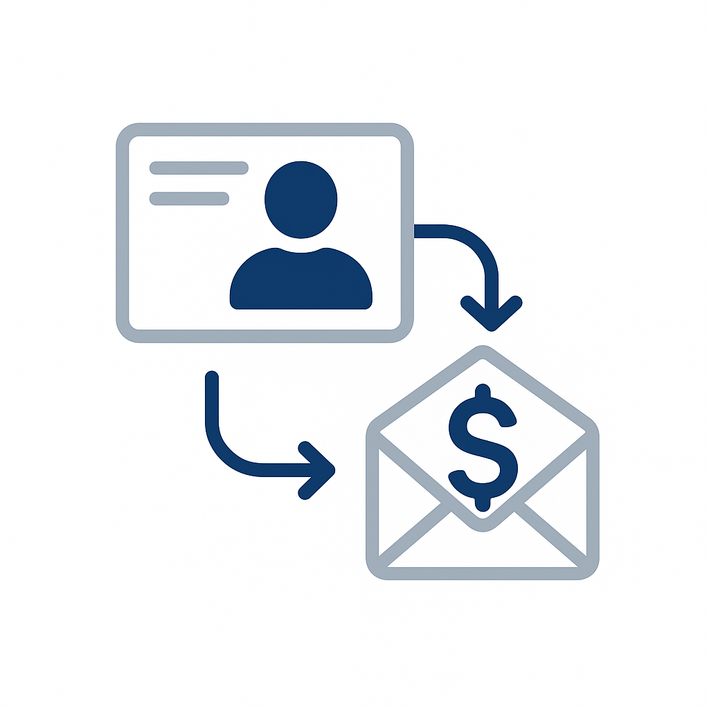

# Catálogo de casos de uso

Los casos de uso del sector muestran cómo las organizaciones de verticales específicos aplican Adobe Experience Platform y aplicaciones para lograr resultados comerciales mensurables. Cada caso de uso describe un escenario empresarial concreto, su impacto esperado y vincula al [patrón de caso de uso](/help/blueprints/use-case-patterns/overview.md) que proporciona instrucciones de implementación detalladas.

Examine por sector para encontrar casos de uso relevantes para su organización y, a continuación, siga los vínculos de patrón para referencias de implementación, incluidas directrices de decisión, cadenas de funciones y documentación de Experience League.

| Industria | Temas clave |
| --- | --- |
| [Automoción](automotive/automotive-overview.md) | Recorrido de compra de vehículo, ciclo de vida del servicio, experiencias del coche conectado, lealtad del propietario |
| [B2B](b2b/b2b-overview.md) | Marketing basado en cuentas, puntuación de posibles clientes, aceleración de la canalización, expansión de clientes |
| [Servicios financieros](financial-services/financial-services-overview.md) | Recomendaciones de productos, prevención de pérdidas, ofertas en la fase de vida, personalización del fraude |
| [Atención médica](healthcare/healthcare-overview.md) | Gestión de citas, cumplimiento de medicamentos, incorporación del paciente, coordinación de la atención |
| [Seguro](insurance/insurance-overview.md) | Renovación de políticas, experiencia en reclamaciones, prevención de riesgos, optimización de ventas cruzadas |
| [Medios de comunicación y entretenimiento](media-entertainment/media-entertainment-overview.md) | Recomendaciones de contenido, retención de suscripciones, conversión de prueba, participación entre plataformas |
| [Comercial](retail/retail-overview.md) | Personalización de productos, recuperación del carro de compras, optimización de ventas cruzadas, participación de fidelidad |
| [Telecomunicaciones](telecommunications/telecommunications-overview.md) | Actualizaciones de dispositivos, prevención de pérdida, optimización de planes, participación en la red |
| [Viajes y hospitalidad](travel-hospitality/travel-hospitality-overview.md) | Personalización de reservas, recuperación de abandonos, programas de fidelidad, campañas de temporada |

## Conexión de los casos de uso con las directrices de implementación

Cada caso de uso se vincula a un **patrón de caso de uso**: un enfoque de implementación repetible que describe la cadena de funciones, los puntos de decisión y los pasos de configuración necesarios para dar vida al caso de uso. A su vez, los patrones de casos de uso se conectan a [objetivos empresariales clave](/help/blueprints/business-objectives/overview.md), lo que le ayuda a alinear el trabajo de implementación con los resultados estratégicos.

```
Industry Use Case → Use Case Pattern → Key Business Objective
```

## Examinar por sector

>[!BEGINTABS]

>[!TAB Comercial]

| | Ejemplo de uso | Descripción | Vencimiento | Patrón |
| --- | --- | --- | --- | --- |
|  | [Recuperación de correo electrónico del carro de compras abandonado](retail/retail-overview.md#abandoned-cart-email-recovery) | Envío de recordatorios personalizados para carros de compras abandonados | [!BADGE Fundacional]{type=Neutral} | [Mensajería activada por eventos](/help/blueprints/use-case-patterns/campaign-management-orchestration/event-triggered-messaging.md) |
|  | [Campañas de urgencia basadas en inventario](retail/retail-overview.md#inventory-based-urgency-campaigns) | Déclencheur alertas en tiempo real cuando el inventario de productos es bajo | [!BADGE Fundacional]{type=Neutral} | [Mensajería activada por eventos](/help/blueprints/use-case-patterns/campaign-management-orchestration/event-triggered-messaging.md) |
|  | [Alertas de bajada de precios](retail/retail-overview.md#price-drop-alerts) | Notificar a los clientes cuando la lista de deseos o los artículos vistos bajen de precio | [!BADGE Fundacional]{type=Neutral} | [Mensajería activada por eventos](/help/blueprints/use-case-patterns/campaign-management-orchestration/event-triggered-messaging.md) |
| | [Notificaciones sin existencias](retail/retail-overview.md#out-of-stock-notifications) | Notificar a los clientes cuando haya productos sin existencias disponibles | [!BADGE Fundacional]{type=Neutral} | [Mensajería activada por eventos](/help/blueprints/use-case-patterns/campaign-management-orchestration/event-triggered-messaging.md) |
|  | [Recomendaciones de productos personalizadas](retail/retail-overview.md#personalized-product-recommendations) | Mostrar productos personalizados basados en el historial de navegación y compras | [!BADGE Emergente]{type=Informative} | [Recomendación de comportamiento](/help/blueprints/use-case-patterns/personalization/behavioral-recommendation.md) |
|  | [Páginas de categoría personalizadas](retail/retail-overview.md#personalized-category-pages) | Reordenar dinámicamente las páginas de categoría en función de las preferencias del cliente | [!BADGE Emergente]{type=Informative} | [Recomendación de comportamiento](/help/blueprints/use-case-patterns/personalization/behavioral-recommendation.md) |
|  | [Nueva serie de bienvenida al cliente](retail/retail-overview.md#new-customer-welcome-series) | Automatice series de bienvenida de varios correos electrónicos con recomendaciones personalizadas | [!BADGE Emergente]{type=Informative} | [Recorrido orquestado de varios pasos](/help/blueprints/use-case-patterns/campaign-management-orchestration/multi-step-orchestrated-journey.md) |
|  | [Recordatorios de reabastecimiento](retail/retail-overview.md#replenishment-reminders) | Envíe recordatorios automatizados para los productos consumibles comprados con regularidad | [!BADGE Emergente]{type=Informative} | [Recorrido orquestado de varios pasos](/help/blueprints/use-case-patterns/campaign-management-orchestration/multi-step-orchestrated-journey.md) |
|  | [Campañas de seguimiento posteriores a la compra](retail/retail-overview.md#post-purchase-follow-up-campaigns) | Envíe consejos de atención, solicitudes de revisión y sugerencias de productos relacionados | [!BADGE Emergente]{type=Informative} | [Recorrido orquestado de varios pasos](/help/blueprints/use-case-patterns/campaign-management-orchestration/multi-step-orchestrated-journey.md) |
| | [Personalization de Social Proof](retail/retail-overview.md#social-proof-personalization) | Mostrar valoraciones y comentarios personalizados según el perfil del cliente | [!BADGE Emergente]{type=Informative} | [Personalization de aplicación/web de visitante conocido](/help/blueprints/use-case-patterns/personalization/known-visitor-web-app-personalization.md) |
|  | [Recomendaciones de venta cruzada y aumento de ventas](retail/retail-overview.md#cross-sell-and-upsell-recommendations) | Mostrar los productos relevantes de venta cruzada y de ampliación de ventas al finalizar la compra y en el correo electrónico | [!BADGE Avanzado]{type=Caution} | [Offer Decisioning](/help/blueprints/use-case-patterns/personalization/offer-decisioning.md) |
| | [Ofertas exclusivas para clientes de VIP](retail/retail-overview.md#vip-customer-exclusive-offers) | Proporcionar ofertas exclusivas y acceso anticipado a clientes de alto valor | [!BADGE Avanzado]{type=Caution} | [Recorrido en canales múltiples con toma de decisiones](/help/blueprints/use-case-patterns/campaign-management-orchestration/cross-channel-journey-with-decisioning.md) |

>[!TAB Automoción]

| | Ejemplo de uso | Descripción | Vencimiento | Patrón |
| --- | --- | --- | --- | --- |
|  | [Recordatorios de cita de servicio](automotive/automotive-overview.md#service-appointment-reminders) | Envíe recordatorios de servicio personalizados en función del kilometraje del vehículo y el historial de servicio | [!BADGE Fundacional]{type=Neutral} | [Mensajería activada por eventos](/help/blueprints/use-case-patterns/campaign-management-orchestration/event-triggered-messaging.md) |
|  | [Notificaciones de retirada de vehículo](automotive/automotive-overview.md#vehicle-recall-notifications) | Enviar notificaciones de retirada personalizadas con opciones de programación de servicios | [!BADGE Fundacional]{type=Neutral} | [Mensajería activada por eventos](/help/blueprints/use-case-patterns/campaign-management-orchestration/event-triggered-messaging.md) |
|  | [Programación de unidades de prueba](automotive/automotive-overview.md#test-drive-scheduling) | Programación personalizada de pruebas de conducción con las recomendaciones del concesionario | [!BADGE Fundacional]{type=Neutral} | [Mensajería activada por eventos](/help/blueprints/use-case-patterns/campaign-management-orchestration/event-triggered-messaging.md) |
|  | [Campañas de lanzamiento de modelos nuevos](automotive/automotive-overview.md#new-model-launch-campaigns) | Clientes de destino interesados en nuevos modelos basados en las preferencias y el vehículo actual. | [!BADGE Fundacional]{type=Neutral} | [Activación de mensaje saliente por lotes](/help/blueprints/use-case-patterns/campaign-management-orchestration/batch-outbound-message-activation.md) |
|  | [Campañas de valor de intercambio](automotive/automotive-overview.md#trade-in-value-campaigns) | Ofrecer de forma proactiva evaluaciones de valor de intercambio a clientes listos para actualizar | [!BADGE Emergente]{type=Informative} | [Recorrido orquestado de varios pasos](/help/blueprints/use-case-patterns/campaign-management-orchestration/multi-step-orchestrated-journey.md) |
|  | [Recomendaciones de piezas y accesorios](automotive/automotive-overview.md#parts-and-accessories-recommendations) | Piezas y accesorios recomendados según el modelo del vehículo y la duración de propiedad | [!BADGE Emergente]{type=Informative} | [Recomendación de comportamiento](/help/blueprints/use-case-patterns/personalization/behavioral-recommendation.md) |
|  | [Planes de garantía y servicio ampliado](automotive/automotive-overview.md#warranty-and-extended-service-plans) | Recomendar planes de garantía y servicio en momentos óptimos según la edad del vehículo | [!BADGE Emergente]{type=Informative} | [Recorrido orquestado de varios pasos](/help/blueprints/use-case-patterns/campaign-management-orchestration/multi-step-orchestrated-journey.md) |
|  | [Activación de característica de coche conectado](automotive/automotive-overview.md#connected-car-feature-activation) | Personalice las recomendaciones de funciones de coche conectadas según las capacidades del vehículo | [!BADGE Emergente]{type=Informative} | [Recorrido orquestado de varios pasos](/help/blueprints/use-case-patterns/campaign-management-orchestration/multi-step-orchestrated-journey.md) |
|  | [Coordinación de la red del concesionario](automotive/automotive-overview.md#dealer-network-coordination) | Habilite recomendaciones personalizadas para distribuidores basadas en la ubicación y las preferencias. | [!BADGE Emergente]{type=Informative} | [Personalization de aplicación/web de visitante conocido](/help/blueprints/use-case-patterns/personalization/known-visitor-web-app-personalization.md) |
|  | [Recorrido de compra de vehículo Personalization](automotive/automotive-overview.md#vehicle-purchase-journey-personalization) | Personalice el recorrido de compra de vehículos desde la investigación hasta la compra | [!BADGE Avanzado]{type=Caution} | [Recorrido en canales múltiples con toma de decisiones](/help/blueprints/use-case-patterns/campaign-management-orchestration/cross-channel-journey-with-decisioning.md) |
|  | [Ofertas de financiación y seguros](automotive/automotive-overview.md#financing-and-insurance-offers) | Presentar ofertas personalizadas de financiamiento y seguro basadas en el perfil de crédito | [!BADGE Avanzado]{type=Caution} | [Offer Decisioning](/help/blueprints/use-case-patterns/personalization/offer-decisioning.md) |
|  | [Programas de fidelización de propietarios](automotive/automotive-overview.md#owner-loyalty-programs) | Personalizar comunicaciones de fidelidad, recompensas y ofertas exclusivas por historial de propiedad | [!BADGE Avanzado]{type=Caution} | [Recorrido en canales múltiples con toma de decisiones](/help/blueprints/use-case-patterns/campaign-management-orchestration/cross-channel-journey-with-decisioning.md) |

>[!TAB Servicios financieros]

| | Ejemplo de uso | Descripción | Vencimiento | Patrón |
| --- | --- | --- | --- | --- |
| | [Alertas y recomendaciones basadas en transacciones](financial-services/financial-services-overview.md#transaction-based-alerts-and-recommendations) | Enviar alertas en tiempo real de transacciones y recomendaciones personalizadas | [!BADGE Fundacional]{type=Neutral} | [Mensajería activada por eventos](/help/blueprints/use-case-patterns/campaign-management-orchestration/event-triggered-messaging.md) |
| | [Recuperación por abandono de solicitud de tarjeta de crédito](financial-services/financial-services-overview.md#credit-card-application-abandonment-recovery) | Vuelva a atraer a los clientes que iniciaron pero no completaron las solicitudes de tarjeta de crédito | [!BADGE Fundacional]{type=Neutral} | [Mensajería activada por eventos](/help/blueprints/use-case-patterns/campaign-management-orchestration/event-triggered-messaging.md) |
| | [Personalization de alerta de fraude](financial-services/financial-services-overview.md#fraud-alert-personalization) | Personalizar alertas de fraude y comunicaciones de seguridad según las preferencias del cliente | [!BADGE Fundacional]{type=Neutral} | [Mensajería activada por eventos](/help/blueprints/use-case-patterns/campaign-management-orchestration/event-triggered-messaging.md) |
|  | [Nutrición de clientes potenciales de alto valor](financial-services/financial-services-overview.md#high-value-lead-nurturing) | Identificar perspectivas de alto valor y nutrirlas con contenido y ofertas personalizados | [!BADGE Emergente]{type=Informative} | [Recorrido orquestado de varios pasos](/help/blueprints/use-case-patterns/campaign-management-orchestration/multi-step-orchestrated-journey.md) |
|  | [Tablero de cuenta personalizado](financial-services/financial-services-overview.md#personalized-account-dashboard) | Personalice el tablero de banca en línea en función de la actividad de la cuenta y los objetivos financieros | [!BADGE Emergente]{type=Informative} | [Personalization de aplicación/web de visitante conocido](/help/blueprints/use-case-patterns/personalization/known-visitor-web-app-personalization.md) |
| | [Recomendaciones de Portfolio de inversión](financial-services/financial-services-overview.md#investment-portfolio-recommendations) | Proporcionar recomendaciones de inversión personalizadas basadas en el perfil de riesgo y los objetivos | [!BADGE Emergente]{type=Informative} | [Recomendación de comportamiento](/help/blueprints/use-case-patterns/personalization/behavioral-recommendation.md) |
| | [Campañas de preaprobación hipotecaria](financial-services/financial-services-overview.md#mortgage-pre-approval-campaigns) | Clientes objetivo que probablemente estén en el mercado de una hipoteca en función del perfil y la fase de vida | [!BADGE Emergente]{type=Informative} | [Recorrido orquestado de varios pasos](/help/blueprints/use-case-patterns/campaign-management-orchestration/multi-step-orchestrated-journey.md) |
|  | [Recomendación de producto para clientes existentes](financial-services/financial-services-overview.md#product-recommendation-for-existing-customers) | Recomendar productos financieros relevantes basados en el perfil, las transacciones y la fase de vida | [!BADGE Avanzado]{type=Caution} | [Offer Decisioning](/help/blueprints/use-case-patterns/personalization/offer-decisioning.md) |
|  | [Campañas de prevención de pérdida](financial-services/financial-services-overview.md#churn-prevention-campaigns) | Identificar a los clientes en riesgo con predicciones impulsadas por IA y participar con ofertas de retención | [!BADGE Avanzado]{type=Caution} | [Recorrido en canales múltiples con toma de decisiones](/help/blueprints/use-case-patterns/campaign-management-orchestration/cross-channel-journey-with-decisioning.md) |
|  | [Ofertas de productos basados en fases de vida](financial-services/financial-services-overview.md#life-stage-based-product-offers) | Identificar a los clientes que entran en nuevas etapas de vida y ofrecer productos financieros relevantes | [!BADGE Avanzado]{type=Caution} | [Recorrido en canales múltiples con toma de decisiones](/help/blueprints/use-case-patterns/campaign-management-orchestration/cross-channel-journey-with-decisioning.md) |
| | [Participación en el programa de fidelización](financial-services/financial-services-overview.md#loyalty-program-engagement) | Personalizar comunicaciones de fidelidad, recompensas y ofertas por nivel e historial | [!BADGE Avanzado]{type=Caution} | [Recorrido en canales múltiples con toma de decisiones](/help/blueprints/use-case-patterns/campaign-management-orchestration/cross-channel-journey-with-decisioning.md) |
| | [Contenido personalizado de educación financiera](financial-services/financial-services-overview.md#personalized-financial-education-content) | Ofrezca una educación financiera personalizada basada en el perfil y los intereses del cliente | [!BADGE Avanzado]{type=Caution} | [Recorrido en canales múltiples con toma de decisiones](/help/blueprints/use-case-patterns/campaign-management-orchestration/cross-channel-journey-with-decisioning.md) |

>[!TAB Atención médica]

| | Ejemplo de uso | Descripción | Vencimiento | Patrón |
| --- | --- | --- | --- | --- |
|  | [Automatización de recordatorio de cita](healthcare/healthcare-overview.md#appointment-reminder-automation) | Enviar recordatorios de cita personalizados a través de los canales de comunicación preferidos | [!BADGE Fundacional]{type=Neutral} | [Mensajería activada por eventos](/help/blueprints/use-case-patterns/campaign-management-orchestration/event-triggered-messaging.md) |
|  | [Campañas De Seguimiento Posteriores A La Visita](healthcare/healthcare-overview.md#post-visit-follow-up-campaigns) | Envíe encuestas posteriores a la visita, instrucciones de atención y recordatorios de citas de seguimiento | [!BADGE Fundacional]{type=Neutral} | [Mensajería activada por eventos](/help/blueprints/use-case-patterns/campaign-management-orchestration/event-triggered-messaging.md) |
| | [Notificación de resultados de laboratorio](healthcare/healthcare-overview.md#lab-results-notification) | Notificar a los pacientes cuando los resultados de laboratorio estén disponibles a través de su canal preferido | [!BADGE Fundacional]{type=Neutral} | [Mensajería activada por eventos](/help/blueprints/use-case-patterns/campaign-management-orchestration/event-triggered-messaging.md) |
| | [Verificación de cobertura de seguro](healthcare/healthcare-overview.md#insurance-coverage-verification) | Verificar y comunicar de forma proactiva la cobertura del seguro antes de las citas | [!BADGE Fundacional]{type=Neutral} | [Mensajería activada por eventos](/help/blueprints/use-case-patterns/campaign-management-orchestration/event-triggered-messaging.md) |
| | [Recordatorios de cita de telesalud](healthcare/healthcare-overview.md#telehealth-appointment-reminders) | Envíe recordatorios personalizados para citas de salud con instrucciones de conexión | [!BADGE Fundacional]{type=Neutral} | [Mensajería activada por eventos](/help/blueprints/use-case-patterns/campaign-management-orchestration/event-triggered-messaging.md) |
|  | [Recordatorios de atención preventiva](healthcare/healthcare-overview.md#preventive-care-reminders) | Recordar a los pacientes la atención preventiva recomendada en función de la edad y los antecedentes médicos | [!BADGE Fundacional]{type=Neutral} | [Activación de mensaje saliente por lotes](/help/blueprints/use-case-patterns/campaign-management-orchestration/batch-outbound-message-activation.md) |
|  | [Campañas de adherencia a medicamentos](healthcare/healthcare-overview.md#medication-adherence-campaigns) | Envíe recordatorios personalizados para ayudar a los pacientes a mantenerse al día con los medicamentos | [!BADGE Emergente]{type=Informative} | [Recorrido orquestado de varios pasos](/help/blueprints/use-case-patterns/campaign-management-orchestration/multi-step-orchestrated-journey.md) |
| | [Programas de Manejo de Enfermedades Crónicas](healthcare/healthcare-overview.md#chronic-disease-management-programs) | Personalizar las comunicaciones y los recordatorios de supervisión de la administración de enfermedades crónicas | [!BADGE Emergente]{type=Informative} | [Recorrido orquestado de varios pasos](/help/blueprints/use-case-patterns/campaign-management-orchestration/multi-step-orchestrated-journey.md) |
| | [Nuevo Recorrido de incorporación del paciente](healthcare/healthcare-overview.md#new-patient-onboarding-journey) | Automatice la incorporación de varios pasos con información de bienvenida, acceso al portal y programación | [!BADGE Emergente]{type=Informative} | [Recorrido orquestado de varios pasos](/help/blueprints/use-case-patterns/campaign-management-orchestration/multi-step-orchestrated-journey.md) |
| | [Participación en el programa de bienestar](healthcare/healthcare-overview.md#wellness-program-engagement) | Personalice las comunicaciones, los desafíos y las recompensas del programa de bienestar | [!BADGE Emergente]{type=Informative} | [Recorrido orquestado de varios pasos](/help/blueprints/use-case-patterns/campaign-management-orchestration/multi-step-orchestrated-journey.md) |
| | [Coordinación del equipo de atención](healthcare/healthcare-overview.md#care-team-coordination) | Permitir la comunicación personalizada entre los pacientes y su equipo de atención | [!BADGE Emergente]{type=Informative} | [Recorrido orquestado de varios pasos](/help/blueprints/use-case-patterns/campaign-management-orchestration/multi-step-orchestrated-journey.md) |
| | [Entrega de contenido de mantenimiento personalizado](healthcare/healthcare-overview.md#personalized-health-content-delivery) | Proporcionar contenido personalizado de educación sanitaria adaptado a las condiciones del paciente. | [!BADGE Avanzado]{type=Caution} | [Recorrido en canales múltiples con toma de decisiones](/help/blueprints/use-case-patterns/campaign-management-orchestration/cross-channel-journey-with-decisioning.md) |

>[!TAB Seguro]

| | Ejemplo de uso | Descripción | Vencimiento | Patrón |
| --- | --- | --- | --- | --- |
|  | [Campañas de renovación de directivas](insurance/insurance-overview.md#policy-renewal-campaigns) | Enviar recordatorios y ofertas personalizados de renovación de directivas | [!BADGE Fundacional]{type=Neutral} | [Mensajería activada por eventos](/help/blueprints/use-case-patterns/campaign-management-orchestration/event-triggered-messaging.md) |
| | [Notificaciones de cambio de directiva](insurance/insurance-overview.md#policy-change-notifications) | Enviar notificaciones personalizadas sobre cambios de políticas y actualizaciones de cobertura | [!BADGE Fundacional]{type=Neutral} | [Mensajería activada por eventos](/help/blueprints/use-case-patterns/campaign-management-orchestration/event-triggered-messaging.md) |
| | [Recuperación de abandono de presupuesto](insurance/insurance-overview.md#quote-abandonment-recovery) | Volver a atraer clientes que hayan iniciado una cotización de seguro, pero no la hayan completado | [!BADGE Fundacional]{type=Neutral} | [Mensajería activada por eventos](/help/blueprints/use-case-patterns/campaign-management-orchestration/event-triggered-messaging.md) |
| | [Prevención de fraude de reclamaciones](insurance/insurance-overview.md#claims-fraud-prevention) | Utilice la detección inteligente de fraudes para identificar patrones de reclamaciones sospechosas | [!BADGE Fundacional]{type=Neutral} | [Mensajería activada por eventos](/help/blueprints/use-case-patterns/campaign-management-orchestration/event-triggered-messaging.md) |
| | [Respuesta a evento catastrófico](insurance/insurance-overview.md#catastrophic-event-response) | Comunicarse proactivamente con los clientes en las zonas afectadas durante los desastres naturales | [!BADGE Fundacional]{type=Neutral} | [Mensajería activada por eventos](/help/blueprints/use-case-patterns/campaign-management-orchestration/event-triggered-messaging.md) |
| | [Coordinación de agente y agente](insurance/insurance-overview.md#agent-and-broker-coordination) | Habilitar comunicación personalizada entre clientes y agentes asignados | [!BADGE Fundacional]{type=Neutral} | [Activación de mensaje saliente por lotes](/help/blueprints/use-case-patterns/campaign-management-orchestration/batch-outbound-message-activation.md) |
|  | [Proceso de reclamaciones Personalization](insurance/insurance-overview.md#claims-process-personalization) | Personalice las comunicaciones del proceso de reclamaciones, las actualizaciones de estado y los recursos de asistencia | [!BADGE Emergente]{type=Informative} | [Recorrido orquestado de varios pasos](/help/blueprints/use-case-patterns/campaign-management-orchestration/multi-step-orchestrated-journey.md) |
| | [Evaluación y prevención de riesgos](insurance/insurance-overview.md#risk-assessment-and-prevention) | Proporcionar información personalizada sobre la evaluación de riesgos y consejos de prevención | [!BADGE Emergente]{type=Informative} | [Recorrido orquestado de varios pasos](/help/blueprints/use-case-patterns/campaign-management-orchestration/multi-step-orchestrated-journey.md) |
| | [Programas de Bienestar y Prevención](insurance/insurance-overview.md#wellness-and-prevention-programs) | Personalice las comunicaciones y recompensas del programa de bienestar para los clientes de seguros | [!BADGE Emergente]{type=Informative} | [Recorrido orquestado de varios pasos](/help/blueprints/use-case-patterns/campaign-management-orchestration/multi-step-orchestrated-journey.md) |
|  | [Recomendaciones de productos de venta cruzada](insurance/insurance-overview.md#cross-sell-product-recommendations) | Recomendar productos de seguro adicionales basados en las pólizas existentes y la fase de vida | [!BADGE Avanzado]{type=Caution} | [Offer Decisioning](/help/blueprints/use-case-patterns/personalization/offer-decisioning.md) |
|  | [Ofertas de productos basados en fases de vida](insurance/insurance-overview.md#life-stage-based-product-offers) | Identificar a los clientes que entran en nuevas etapas de vida y ofrecer productos de seguro relevantes | [!BADGE Avanzado]{type=Caution} | [Recorrido en canales múltiples con toma de decisiones](/help/blueprints/use-case-patterns/campaign-management-orchestration/cross-channel-journey-with-decisioning.md) |
| | [Oportunidades de descuento y ahorro](insurance/insurance-overview.md#discount-and-savings-opportunities) | Identificar y comunicar oportunidades de descuento personalizadas | [!BADGE Avanzado]{type=Caution} | [Offer Decisioning](/help/blueprints/use-case-patterns/personalization/offer-decisioning.md) |

>[!TAB Medios de comunicación y entretenimiento]

| | Ejemplo de uso | Descripción | Vencimiento | Patrón |
| --- | --- | --- | --- | --- |
|  | [Nuevas notificaciones de publicación de contenido](media-entertainment/media-entertainment-overview.md#new-content-release-notifications) | Notificar a los suscriptores sobre contenido nuevo que coincida con sus preferencias | [!BADGE Fundacional]{type=Neutral} | [Mensajería activada por eventos](/help/blueprints/use-case-patterns/campaign-management-orchestration/event-triggered-messaging.md) |
| | [Lista de observación y recordatorios favoritos](media-entertainment/media-entertainment-overview.md#watchlist-and-favorites-reminders) | Enviar recordatorios sobre contenido no visto en listas de observación | [!BADGE Fundacional]{type=Neutral} | [Mensajería activada por eventos](/help/blueprints/use-case-patterns/campaign-management-orchestration/event-triggered-messaging.md) |
| | [Recordatorios para la visualización de eventos en directo](media-entertainment/media-entertainment-overview.md#live-event-viewing-reminders) | Notificar a los usuarios sobre próximos eventos en directo que coincidan con sus intereses | [!BADGE Fundacional]{type=Neutral} | [Mensajería activada por eventos](/help/blueprints/use-case-patterns/campaign-management-orchestration/event-triggered-messaging.md) |
| | [Campañas de finalización de contenido](media-entertainment/media-entertainment-overview.md#content-completion-campaigns) | Recordar a los usuarios que finalicen el contenido que han iniciado pero no han finalizado | [!BADGE Fundacional]{type=Neutral} | [Mensajería activada por eventos](/help/blueprints/use-case-patterns/campaign-management-orchestration/event-triggered-messaging.md) |
|  | [Motor de recomendación de contenido](media-entertainment/media-entertainment-overview.md#content-recommendation-engine) | Proporcionar recomendaciones de contenido personalizadas basadas en el historial de visualización | [!BADGE Emergente]{type=Informative} | [Recomendación de comportamiento](/help/blueprints/use-case-patterns/personalization/behavioral-recommendation.md) |
| | [Experiencia personalizada en la página de inicio](media-entertainment/media-entertainment-overview.md#personalized-homepage-experience) | Personalice de forma dinámica la página principal para mostrar primero el contenido más relevante | [!BADGE Emergente]{type=Informative} | [Recomendación de comportamiento](/help/blueprints/use-case-patterns/personalization/behavioral-recommendation.md) |
| | [Generación de listas de reproducción personalizadas](media-entertainment/media-entertainment-overview.md#personalized-playlist-generation) | Generar automáticamente listas de reproducción basadas en el historial de escucha y las preferencias | [!BADGE Emergente]{type=Informative} | [Recomendación de comportamiento](/help/blueprints/use-case-patterns/personalization/behavioral-recommendation.md) |
| | [Campañas de conversión de prueba gratuitas](media-entertainment/media-entertainment-overview.md#free-trial-conversion-campaigns) | Haga participar a usuarios de prueba gratuita con contenido personalizado para fomentar la conversión | [!BADGE Emergente]{type=Informative} | [Recorrido orquestado de varios pasos](/help/blueprints/use-case-patterns/campaign-management-orchestration/multi-step-orchestrated-journey.md) |
| | [Sincronización de contenido entre plataformas](media-entertainment/media-entertainment-overview.md#cross-platform-content-sync) | Proporciona una experiencia de contenido perfecta entre dispositivos con preferencias sincronizadas | [!BADGE Emergente]{type=Informative} | [Personalization de aplicación/web de visitante conocido](/help/blueprints/use-case-patterns/personalization/known-visitor-web-app-personalization.md) |
| | [Uso compartido en medios sociales de Personalization](media-entertainment/media-entertainment-overview.md#social-sharing-personalization) | Personalizar indicadores de uso compartido en redes sociales según las preferencias de contenido | [!BADGE Emergente]{type=Informative} | [Personalization de aplicación/web de visitante conocido](/help/blueprints/use-case-patterns/personalization/known-visitor-web-app-personalization.md) |
|  | [Prevención de cancelación de suscripción](media-entertainment/media-entertainment-overview.md#subscription-churn-prevention) | Identificación de suscriptores en riesgo y participación en ofertas de retención | [!BADGE Avanzado]{type=Caution} | [Recorrido en canales múltiples con toma de decisiones](/help/blueprints/use-case-patterns/campaign-management-orchestration/cross-channel-journey-with-decisioning.md) |
| | [Ampliación de venta de funciones premium](media-entertainment/media-entertainment-overview.md#premium-feature-upsell) | Identifique a los usuarios que se beneficiarían de las funciones avanzadas con ofertas personalizadas | [!BADGE Avanzado]{type=Caution} | [Offer Decisioning](/help/blueprints/use-case-patterns/personalization/offer-decisioning.md) |

>[!TAB Telecomunicaciones]

| | Ejemplo de uso | Descripción | Vencimiento | Patrón |
| --- | --- | --- | --- | --- |
| | [Alertas y recomendaciones de uso de datos](telecommunications/telecommunications-overview.md#data-usage-alerts-and-recommendations) | Enviar alertas personalizadas cuando los clientes se aproximen a los límites de datos | [!BADGE Fundacional]{type=Neutral} | [Mensajería activada por eventos](/help/blueprints/use-case-patterns/campaign-management-orchestration/event-triggered-messaging.md) |
| | [Notificaciones de interrupción del servicio](telecommunications/telecommunications-overview.md#service-outage-notifications) | Notificar a los clientes de forma proactiva sobre las interrupciones del servicio en su área | [!BADGE Fundacional]{type=Neutral} | [Mensajería activada por eventos](/help/blueprints/use-case-patterns/campaign-management-orchestration/event-triggered-messaging.md) |
| | [Recordatorios de pago de factura](telecommunications/telecommunications-overview.md#bill-payment-reminders) | Enviar recordatorios personalizados de pago de factura con opciones de pago | [!BADGE Fundacional]{type=Neutral} | [Mensajería activada por eventos](/help/blueprints/use-case-patterns/campaign-management-orchestration/event-triggered-messaging.md) |
| | [Campañas de actualización 5G](telecommunications/telecommunications-overview.md#5g-upgrade-campaigns) | Clientes de Target elegibles para actualizaciones de 5G con ofertas personalizadas | [!BADGE Fundacional]{type=Neutral} | [Activación de mensaje saliente por lotes](/help/blueprints/use-case-patterns/campaign-management-orchestration/batch-outbound-message-activation.md) |
|  | [Campañas de optimización del plan](telecommunications/telecommunications-overview.md#plan-optimization-campaigns) | Analizar patrones de uso y recomendar cambios óptimos en el plan | [!BADGE Emergente]{type=Informative} | [Recorrido orquestado de varios pasos](/help/blueprints/use-case-patterns/campaign-management-orchestration/multi-step-orchestrated-journey.md) |
| | [Nuevo Recorrido de incorporación del cliente](telecommunications/telecommunications-overview.md#new-customer-onboarding-journey) | Automatice la incorporación personalizada con información de bienvenida y tutoriales de funciones | [!BADGE Emergente]{type=Informative} | [Recorrido orquestado de varios pasos](/help/blueprints/use-case-patterns/campaign-management-orchestration/multi-step-orchestrated-journey.md) |
| | [Personalization de rendimiento de red](telecommunications/telecommunications-overview.md#network-performance-personalization) | Personalizar la información de rendimiento de la red en función de la ubicación y el dispositivo | [!BADGE Emergente]{type=Informative} | [Personalization de aplicación/web de visitante conocido](/help/blueprints/use-case-patterns/personalization/known-visitor-web-app-personalization.md) |
|  | [Recomendaciones de actualización de dispositivos](telecommunications/telecommunications-overview.md#device-upgrade-recommendations) | Identificar a los clientes aptos y presentar recomendaciones personalizadas de dispositivos | [!BADGE Avanzado]{type=Caution} | [Recorrido en canales múltiples con toma de decisiones](/help/blueprints/use-case-patterns/campaign-management-orchestration/cross-channel-journey-with-decisioning.md) |
|  | [Prevención de pérdida para clientes de alto valor](telecommunications/telecommunications-overview.md#churn-prevention-for-high-value-customers) | Identificar clientes de alto valor en riesgo y participar en ofertas de retención | [!BADGE Avanzado]{type=Caution} | [Recorrido en canales múltiples con toma de decisiones](/help/blueprints/use-case-patterns/campaign-management-orchestration/cross-channel-journey-with-decisioning.md) |
| | [Administración del plan familiar](telecommunications/telecommunications-overview.md#family-plan-management) | Personalice las comunicaciones para los administradores de plan familiar según el uso familiar | [!BADGE Avanzado]{type=Caution} | [Recorrido en canales múltiples con toma de decisiones](/help/blueprints/use-case-patterns/campaign-management-orchestration/cross-channel-journey-with-decisioning.md) |
| | [Recomendaciones del servicio de complementos](telecommunications/telecommunications-overview.md#add-on-service-recommendations) | Recomendar servicios adicionales relevantes basados en el plan, el uso y las preferencias | [!BADGE Avanzado]{type=Caution} | [Offer Decisioning](/help/blueprints/use-case-patterns/personalization/offer-decisioning.md) |
| | [Participación en el programa de fidelización](telecommunications/telecommunications-overview.md#loyalty-program-engagement) | Personalizar comunicaciones de fidelidad, recompensas y ofertas por nivel e historial | [!BADGE Avanzado]{type=Caution} | [Recorrido en canales múltiples con toma de decisiones](/help/blueprints/use-case-patterns/campaign-management-orchestration/cross-channel-journey-with-decisioning.md) |

>[!TAB Viajes y hospitalidad]

| | Ejemplo de uso | Descripción | Vencimiento | Patrón |
| --- | --- | --- | --- | --- |
|  | [Recorrido de recuperación de abandono del carro de compras](travel-hospitality/travel-hospitality-overview.md#cart-abandonment-recovery-journey) | Detectar carros de reservaciones abandonados y recorrido de correo electrónico personalizado de déclencheur | [!BADGE Fundacional]{type=Neutral} | [Mensajería activada por eventos](/help/blueprints/use-case-patterns/campaign-management-orchestration/event-triggered-messaging.md) |
|  | [Recordatorios de reserva multicanal](travel-hospitality/travel-hospitality-overview.md#multi-channel-booking-reminders) | Envíe recordatorios de reserva personalizados por correo electrónico, texto y push | [!BADGE Fundacional]{type=Neutral} | [Mensajería activada por eventos](/help/blueprints/use-case-patterns/campaign-management-orchestration/event-triggered-messaging.md) |
|  | [Personalization de campaña estacional](travel-hospitality/travel-hospitality-overview.md#seasonal-campaign-personalization) | Personalice las campañas en función de las preferencias estacionales y las reservas anteriores | [!BADGE Fundacional]{type=Neutral} | [Activación de mensaje saliente por lotes](/help/blueprints/use-case-patterns/campaign-management-orchestration/batch-outbound-message-activation.md) |
|  | [Página principal personalizada para nuevos visitantes](travel-hospitality/travel-hospitality-overview.md#personalized-homepage-for-new-visitors) | Mostrar recomendaciones personalizadas basadas en la ubicación y el comportamiento de navegación | [!BADGE Emergente]{type=Informative} | [Personalization web de visitante anónimo](/help/blueprints/use-case-patterns/personalization/anonymous-visitor-web-personalization.md) |
|  | [Segmentación de visitantes con intenciones altas](travel-hospitality/travel-hospitality-overview.md#high-intent-visitor-targeting) | Identifique a los visitantes de alta intención con puntuación de IA y segmente con ofertas personalizadas | [!BADGE Emergente]{type=Informative} | [Personalization de aplicación/web de visitante conocido](/help/blueprints/use-case-patterns/personalization/known-visitor-web-app-personalization.md) |
|  | [Campañas de ventas adicionales posteriores a la reserva](travel-hospitality/travel-hospitality-overview.md#post-booking-upsell-campaigns) | Déclencheur campañas de ampliación de ventas para actualizaciones, excursiones y paquetes después de reservar | [!BADGE Emergente]{type=Informative} | [Recorrido orquestado de varios pasos](/help/blueprints/use-case-patterns/campaign-management-orchestration/multi-step-orchestrated-journey.md) |
|  | [Campañas de recuperación para clientes caducados](travel-hospitality/travel-hospitality-overview.md#win-back-campaigns-for-lapsed-customers) | Capte a los clientes caducados con ofertas personalizadas de recuperación | [!BADGE Emergente]{type=Informative} | [Recorrido orquestado de varios pasos](/help/blueprints/use-case-patterns/campaign-management-orchestration/multi-step-orchestrated-journey.md) |
|  | [Recomendaciones de itinerarios dinámicos](travel-hospitality/travel-hospitality-overview.md#dynamic-itinerary-recommendations) | Mostrar itinerarios personalizados basados en reservas y preferencias anteriores | [!BADGE Emergente]{type=Informative} | [Personalization de aplicación/web de visitante conocido](/help/blueprints/use-case-patterns/personalization/known-visitor-web-app-personalization.md) |
|  | [Productos examinados recientemente en la página principal](travel-hospitality/travel-hospitality-overview.md#recently-browsed-products-on-homepage) | Mostrar destinos vistos recientemente para fomentar las visitas de retorno | [!BADGE Emergente]{type=Informative} | [Personalization de aplicación/web de visitante conocido](/help/blueprints/use-case-patterns/personalization/known-visitor-web-app-personalization.md) |
|  | [Recomendaciones de reserva de grupo](travel-hospitality/travel-hospitality-overview.md#group-booking-recommendations) | Recomendar paquetes para grupos y opciones para familias a los que reservan para grupos frecuentes | [!BADGE Emergente]{type=Informative} | [Recomendación de comportamiento](/help/blueprints/use-case-patterns/personalization/behavioral-recommendation.md) |
|  | [Modal de intención de salida con ofertas de destino](travel-hospitality/travel-hospitality-overview.md#exit-intent-modal-with-targeted-offers) | Mostrar modal personalizado con ofertas relevantes cuando el visitante muestra la intención de salida | [!BADGE Avanzado]{type=Caution} | [Offer Decisioning](/help/blueprints/use-case-patterns/personalization/offer-decisioning.md) |
|  | [Programa de fidelización Personalization](travel-hospitality/travel-hospitality-overview.md#loyalty-program-personalization) | Personalizar sitios web, ofertas y comunicaciones por nivel de fidelidad y saldo de puntos | [!BADGE Avanzado]{type=Caution} | [Recorrido en canales múltiples con toma de decisiones](/help/blueprints/use-case-patterns/campaign-management-orchestration/cross-channel-journey-with-decisioning.md) |

>[!TAB B2B]

| | Ejemplo de uso | Descripción | Vencimiento | Patrón |
| --- | --- | --- | --- | --- |
|  | [Programación de seminarios web y demostraciones](b2b/b2b-overview.md#webinar-and-demo-scheduling) | Personalice las invitaciones a seminarios web y la programación de demostraciones en función de los intereses del cliente potencial | [!BADGE Fundacional]{type=Neutral} | [Mensajería activada por eventos](/help/blueprints/use-case-patterns/campaign-management-orchestration/event-triggered-messaging.md) |
|  | [Account-Based Marketing Personalization](b2b/b2b-overview.md#account-based-marketing-personalization) | Personalización de las comunicaciones de marketing para cuentas de destino según las señales de compra. | [!BADGE Emergente]{type=Informative} | [Activación de audiencia B2B](/help/blueprints/use-case-patterns/audience-building-activation/b2b-audience-activation.md) |
|  | [Puntuación y nutrición de clientes potenciales](b2b/b2b-overview.md#lead-scoring-and-nurturing) | Puntúe automáticamente posibles clientes y dirija los de mayor puntuación a las ventas con campañas de promoción | [!BADGE Emergente]{type=Informative} | [Recorrido orquestado de varios pasos](/help/blueprints/use-case-patterns/campaign-management-orchestration/multi-step-orchestrated-journey.md) |
|  | [Personalization de contenido para clientes potenciales](b2b/b2b-overview.md#content-personalization-for-prospects) | Personalice el contenido y los recursos del sitio web en función del sector, el rol y la participación del cliente potencial | [!BADGE Emergente]{type=Informative} | [Personalization de aplicación/web de visitante conocido](/help/blueprints/use-case-patterns/personalization/known-visitor-web-app-personalization.md) |
|  | [Registro y seguimiento de eventos](b2b/b2b-overview.md#event-registration-and-follow-up) | Automatice las confirmaciones, los recordatorios y el seguimiento personalizados del registro de eventos | [!BADGE Emergente]{type=Informative} | [Recorrido orquestado de varios pasos](/help/blueprints/use-case-patterns/campaign-management-orchestration/multi-step-orchestrated-journey.md) |
|  | [Campañas de conversión de prueba del producto](b2b/b2b-overview.md#product-trial-conversion-campaigns) | Capte a los usuarios de prueba con recomendaciones personalizadas para fomentar la conversión de pago | [!BADGE Emergente]{type=Informative} | [Recorrido orquestado de varios pasos](/help/blueprints/use-case-patterns/campaign-management-orchestration/multi-step-orchestrated-journey.md) |
|  | [Éxito e incorporación del cliente](b2b/b2b-overview.md#customer-success-and-onboarding) | Personalice los recorridos de incorporación con formación y recursos relevantes. | [!BADGE Emergente]{type=Informative} | [Recorrido orquestado de varios pasos](/help/blueprints/use-case-patterns/campaign-management-orchestration/multi-step-orchestrated-journey.md) |
|  | [Campañas de reemplazo competitivas](b2b/b2b-overview.md#competitive-replacement-campaigns) | Segmente a los posibles clientes con productos de la competencia con ofertas de migración personalizadas | [!BADGE Emergente]{type=Informative} | [Recorrido orquestado de varios pasos](/help/blueprints/use-case-patterns/campaign-management-orchestration/multi-step-orchestrated-journey.md) |
|  | [Caso práctico y ROI Personalization](b2b/b2b-overview.md#case-study-and-roi-personalization) | Ofrezca casos prácticos personalizados y calculadoras de ROI basadas en la industria del posible cliente | [!BADGE Emergente]{type=Informative} | [Personalization de aplicación/web de visitante conocido](/help/blueprints/use-case-patterns/personalization/known-visitor-web-app-personalization.md) |
| | [Programas de defensa del cliente](b2b/b2b-overview.md#customer-advocacy-programs) | Identificar y captar clientes satisfechos para referencias y testimonios | [!BADGE Emergente]{type=Informative} | [Recorrido orquestado de varios pasos](/help/blueprints/use-case-patterns/campaign-management-orchestration/multi-step-orchestrated-journey.md) |
|  | [Campañas de renovación de contratos](b2b/b2b-overview.md#contract-renewal-campaigns) | Involucre de forma proactiva a los clientes que se acercan a la renovación con ofertas personalizadas | [!BADGE Avanzado]{type=Caution} | [Recorrido en canales múltiples con toma de decisiones](/help/blueprints/use-case-patterns/campaign-management-orchestration/cross-channel-journey-with-decisioning.md) |
|  | [Oportunidades de ampliación y ampliación de ventas](b2b/b2b-overview.md#upsell-and-expansion-opportunities) | Identificar clientes listos para recibir actualizaciones en función de patrones de uso e indicadores de crecimiento | [!BADGE Avanzado]{type=Caution} | [Recorrido en canales múltiples con toma de decisiones](/help/blueprints/use-case-patterns/campaign-management-orchestration/cross-channel-journey-with-decisioning.md) |

>[!ENDTABS]
