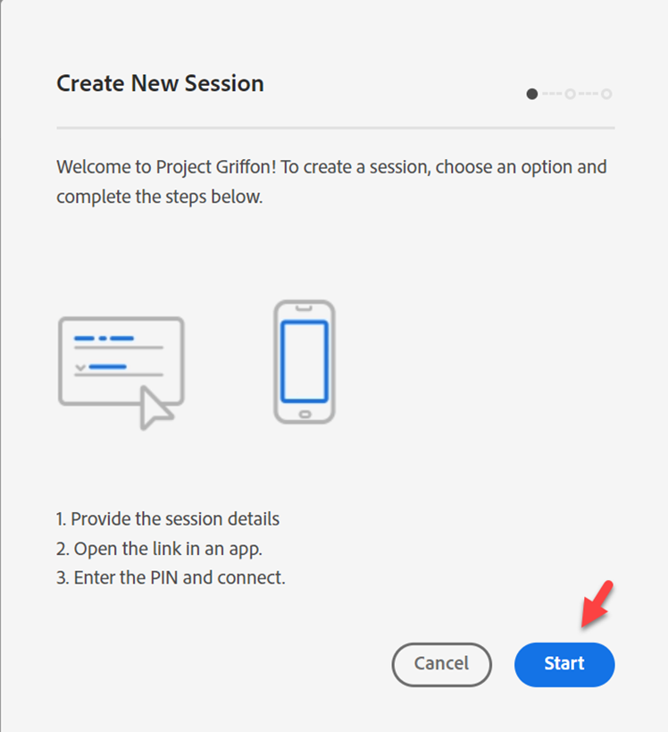
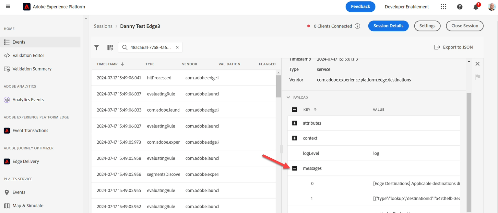

# Monitorice su evento

## Navegar a Assurance

[Adobe Experience Platform Assurance](https://experienceleague.adobe.com/es/docs/experience-platform/assurance/home) es un producto de Adobe Experience Cloud que le ayudará a inspeccionar, probar, simular y validar la forma en que recopila datos en Adobe Experience Platform Edge.

1. Vaya a Adobe Experience Platform -> Assurance -> Crear sesión

   

2. Haz clic en el botón **Iniciar**

## Configuración de una sesión

1. Nombre —> \[Espacio aislado] Sesión de Edge
1. URL —> https\://www\.adobe.com
   - Tenga en cuenta que esta dirección URL se reemplazará con el sitio real del cliente
1. Haga clic en el botón Next

   

4. Copie el vínculo en un lugar al que pueda hacer referencia posteriormente

5. Haga clic en el botón **Listo**

   

6. Vaya a **Configuración**

   

7. Habilite **Transacciones de eventos** y **Edge Delivery** haciendo clic en el botón **+**, luego **Listo**

## Abrir Postman

Vaya a Postman -> Crear Edge de eventos web (sin autenticación) -> Encabezados

1. Agregue **x-adobe-aep-validation-token** a los encabezados con el vínculo copiado desde Assurance. Coja **solo el valor ID** después de = en el vínculo que copió de Assurance. p. ej. [https://www.adobe.com/?adb\_validation\_sessionid=](https://www.adobe.com/?adb_validation_sessionid=efa4a9ed-02d8-4647-80fa-f01a5be273d0)[`efa4a9ed-02d8-4647-80fa-f01a5be273d0`](https://www.adobe.com/?adb_validation_sessionid=efa4a9ed-02d8-4647-80fa-f01a5be273d0)
1. Solo usaríamos el valor [`efa4a9ed-02d8-4647-80fa-f01a5be273d0`](https://www.adobe.com/?adb_validation_sessionid=efa4a9ed-02d8-4647-80fa-f01a5be273d0), no la dirección URL completa

   

3. En Postman, guarde y ejecute la solicitud **Crear Edge de eventos web (sin autenticación)**

## Ver registros de Assurance

Vuelva a Assurance y verá que se muestran muchos eventos. Filtre solo a tipos de eventos relevantes colocando el ID de flujo de datos en la búsqueda

Seleccione un evento y abra cualquier mensaje si es necesario en el carril derecho.

Tipos de eventos que buscar:

- hitReceived (muestra la carga útil recibida por Edge)
- Regla de evaluación (si configura SSF, muestra las reglas que se evalúan)
- fireDestinations (a qué destinos se envió esto)
- segmentsDiscovered (cumple los requisitos para cualquier segmento de Edge)
- com.adobe.experience\_platform.edge\_segmentation/response (con qué segmentos respondió)

Explore estos y vea cómo Assurance interpreta cada paso.
