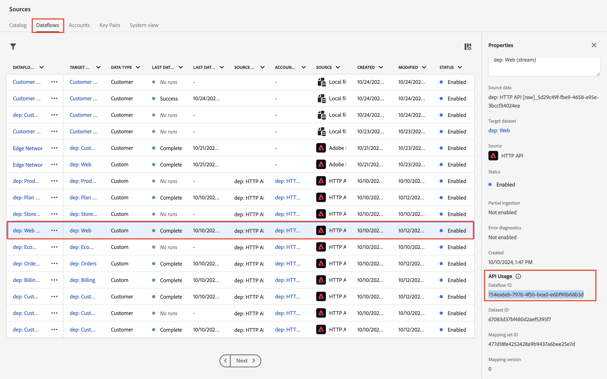
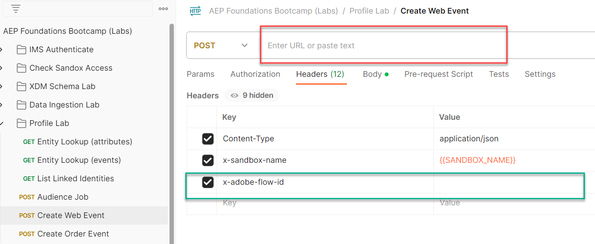

# Enviar evento web a Hub

## Abrir Postman

Inicie postman en el equipo y vaya a la siguiente llamada de API:

1. **Barra lateral izquierda de Postman** —> `Collections`
1. **Colección** —> `AEP Foundations Bootcamps (labs)`
1. **Carpeta** —> laboratorio de perfiles
1. **Solicitud de API** —> `Create Web Event`


## Modificar solicitud de API

Para crear la solicitud de API de ejemplo, debe rellenar los siguientes fragmentos en el cuerpo de la solicitud de API.

Comience por recopilar los siguientes valores:


## Buscar extremo de flujo continuo de cuenta

1. Vaya a **Orígenes** en el carril izquierdo y, a continuación, haga clic en **Cuentas** en la barra de navegación superior
1. Busque **dep: API HTTP \[raw]**, resalte la fila, copie y guarde el valor de **extremo de transmisión** en cualquier lugar al que pueda hacer referencia más adelante

 y copie su extremo de flujo continuo&rbrack;(assets/send-order-event-to-hub-http-api-raw-streaming-endpoint.png &quot;dep: HTTP API \[raw]&quot;)

## Buscar ID de flujo de datos web

1. Haga clic en la cuenta **HTTP API \[raw]**
1. Busque y seleccione la fila de flujo de datos llamada **dep: Web (flujo)**
1. En el carril derecho, copie y guarde los valores de **ID de flujo de datos** en algún lugar al que pueda hacer referencia posteriormente

>[!NOTE]
>
>Haga clic en un espacio vacío de la fila.  NO haga clic en los enlaces azules!



## Crear solicitud de API final

Copie los valores guardados en los pasos anteriores en los lugares resaltados a continuación.

- **Rojo** —> `Streaming Endpoint URL`
- **Verde** —> `Dataflow ID`

La solicitud de API final debería tener un aspecto similar al siguiente cuando se complete

&#x200B;> [!CAUTION]
>
>NO EJECUTAR AÚN.



## Ejecución de la API

1. Para guardar la llamada de API, haz clic en el botón **Guardar**
1. Ejecute la solicitud haciendo clic en el botón **Enviar**

Una llamada correcta debería dar la siguiente respuesta...


## Validate

1. Vaya a su perfil y busque su perfil para ver que el evento se ha introducido en el perfil.  Debería aparecer en segundos.
   1. Utilice el correo electrónico de la llamada para buscar el perfil
1. Según el tiempo transcurrido desde la última vez que se envió un evento, es posible que no cumpla los requisitos para nuevos segmentos. De lo contrario, puede ver estos u otros:
   1. Cualquier evento de Edge (en 15 minutos)
      1. Recuerde: todas las audiencias guardadas con una evaluación de Edge también se evalúan en el concentrador cuando llegan los datos de streaming
   2. dep: cualquier flujo de eventos (en una hora)
1. Es posible que no vea nada en su webhook si no tiene segmentos nuevos.
1. El reenvío de eventos no envía nada.
   1. ¿Por qué? Este evento se ha dirigido al concentrador, no a la Edge, por lo que el evento no aparecerá como nada para que el reenvío de eventos lo envíe, ni en Assurance.
1. Después de al menos 30 minutos, puede incluso comprobar el conjunto de datos con lo siguiente:
   1. Cambie el nombre de la tabla siguiente por el de su zona protegida.  Para encontrarlo, vaya a la lista de conjuntos de datos y filtre en &quot;`dest`&quot;, abra el conjunto de datos y copie el nombre de la tabla en el carril derecho.

```sql
SELECT * FROM profile_export_for_destination_merge_policy_xxx
WHERE extSourceSystemAudit.LASTREFERENCEDDATE >= CURRENT_DATE
AND identitymap['email'][0].ID in ('depche.mode@dep.com')
ORDER BY extSourceSystemAudit.LASTREFERENCEDDATE DESC
LIMIT 10
```
