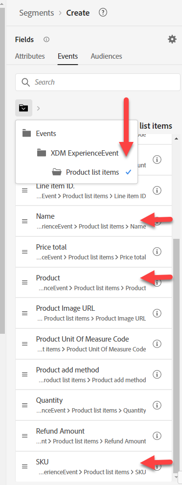

# Generar #1 de audiencia

## Objetivo del laboratorio

Cree una audiencia que solo encuentre perfiles que hayan realizado un pedido de un iPhone 14

## Desglose de la audiencia

Comience creando su primera audiencia. Está compuesto por muchas piezas que necesitamos incorporar. Haga clic en Audiencia en el carril izquierdo y haga clic en el botón Crear audiencia en la parte superior derecha.

Vamos a dividir este caso de uso en partes y resolverlas con varias audiencias. La razón de esto es que estamos tratando de hacer que esto sea una transmisión y dos cosas lo impiden:

1. La cláusula de exclusión &quot;no existe ningún pedido para iPhone 14/Pixel 7&quot;
1. La cláusula de exclusión &quot;sin iPhone 14/Pixel 7 activo&quot;. Vamos a repasar las ramificaciones de esto al final.

## Parte 1: Descubrimiento

La primera parte de nuestra audiencia es buscar &quot;no existe ningún pedido para un iPhone 14&quot;. Imagine que somos un nuevo experto en marketing para AEP y que no diseñamos el esquema. Busque &quot;Pedido&quot; en la pestaña Eventos del carril izquierdo

Se obtienen muchos objetos relacionados con un pedido

- Atributos: por ejemplo, ID de pedido, Fecha de pedido
- Carpetas: por ejemplo, Pedido, Detalles de pedido de planificación
- Tipos de evento: por ejemplo, pedido realizado, pedido enviado, etc.

>[!NOTE]
>
>&#x200B;* No hay &quot;i&quot; para la &quot;carpeta&quot; de pedidos. Aunque nuestra descripción se haya rellenado, no la tiene y esto puede ser una fuente de confusión para su experto en marketing, ya que puede intentar usarla o querer saber qué es.
>&#x200B;* La &quot;i&quot; de las tarjetas de eventos solo repite el tipo, ya que Tipo de evento es un campo, no muchos.
>&#x200B;* Los datos de resumen solo mostrarán si el valor está presente en más del 2 % de los perfiles combinados. Esto también genera cualquier autocompletar al filtrar en una cadena.

Utilice la tarjeta Tipo de evento de orden realizado y arrástrela al lienzo.

&#x200B;> [!TIP]
>
>**Opcional:**
>
>Cada evento tiene un tipo de evento.  Podemos filtrar por el Tipo de evento en lugar de utilizar una tarjeta de tipo de evento.
>
>Recuerde volver a cuando ampliamos el Tipo de evento de esquema de pedido. Hemos añadido los valores que ahora vemos en la lista desplegable.  Estos mismos valores aparecen como tarjetas de Tipo de evento
>
>Si lo desea, puede utilizar cualquiera de los dos métodos.
>
>En una audiencia nueva, vaya al evento de experiencia XDM y arrastre el tipo de evento.
>
>
>
>El filtrado con tarjetas de Tipo de evento es igual que el filtrado con el Campo de tipo de evento
>
>
>
>Ventaja de utilizar tarjetas de tipo de evento:
>
>- Muestra el nombre del tipo de evento en la audiencia, lo que facilita y agiliza su comprensión
>- Es rápido y requiere menos pasos
>
>Ventaja de utilizar el campo Tipo de evento:
>
>- Permite seleccionar varios tipos de eventos (por ejemplo, &quot;Pedido recogido&quot; o &quot;Pedido entregado&quot;) si se desea incluir varios tipos en un mismo criterio
>- Admite distinción de mayúsculas y minúsculas

>[!NOTE]
>
>Hay algunas opciones a tener en cuenta para &quot;No existe ningún pedido&quot;.  Estamos eligiendo un enfoque simple, pero hay cosas en las que pensar en el mundo real:
>
>- Pedido realizado pero recogido o enviado
>- Pedido realizado pero cancelado
>- Varios pedidos realizados pero uno cancelado

Nuestro experto en marketing sabe, gracias a su formación, que se ha cargado más de una fuente de datos:

- Pedidos (capturados por el sistema de pedidos en todos los canales)
- Web (seguimiento del lado del cliente de en qué hacen clic las personas, incluidos los pedidos realizados en el sitio)
- Comercio electrónico (capturado por el sistema de comercio electrónico del sitio)

¿Qué fuente debemos utilizar? Todos representan lógicamente el mismo evento &quot;Pedido realizado&quot;. Pero están almacenados físicamente en diferentes sistemas. ¿Cómo sabemos qué usar? La mejor manera es ver las descripciones de cada objeto de esquema y cada campo que desee conocer.

>[!NOTE]
>
>Las descripciones deben tener información relevante para ayudar a tomar estas decisiones, como:
>
>1. ¿De dónde provienen los datos?
>2. ¿Qué contiene o no contiene?
>3. ¿Qué es la latencia?
>4. ¿Se ha designado algún sistema como &quot;fuente de verdad&quot;?
>5. ¿Hay algún matiz que debamos tener en cuenta?

Para nosotros, queremos usar Pedido realizado, pero tenga en cuenta que, según nuestro caso de uso, podríamos haber tenido los siguientes requisitos, que pueden influir en la fuente de la que extraemos:

- Compras in situ en los últimos 30 minutos
- Pedidos realizados y no cancelados
- Pedidos recogidos en el plazo de 1 día desde que están listos

>[!TIP]
>
>Ejercicio de reflexión opcional, imaginemos que hemos colocado un único pedido en nuestro sitio hoy (recuerde que el pedido está registrado por los tres sistemas):
>
>1. ¿Cuántos eventos se contarán para los pedidos realizados hoy?
>2. ¿Cuántos pedidos se realizaron desde la perspectiva de los clientes?
>3. ¿Cuántos eventos se contarán si filtramos en Método de envío = de un día para otro (suponiendo que elijan esto)?
>4. ¿Cómo se debe abordar esto (Audiencia o Modelo de datos)?

Después de realizar algún análisis, vamos a ir con `Orders Event of Event Type=”order. placed”`. Queremos asegurarnos de que nuestra audiencia esté usando la fuente de verdad en el equilibrio de velocidad (los datos web se transmiten con cada clic mientras el pedido pasa por algún procesamiento antes de enviarse). Además, en el futuro, es posible que queramos excluir a aquellos que cancelaron y que podrían hacerse a través de cualquier canal.

## Parte 2: Creación de la audiencia

Activar Mostrar esquema completo

Aproveche lo que ha empezado.  Haga clic en la tarjeta Colocado, luego **borre el elemento &quot;colocado&quot; de la búsqueda** en el carril izquierdo y explore en profundidad:

Evento de experiencia XDM -> Carpeta de elementos de lista de productos

>[!WARNING]
>
>Una confusión común para su experto en marketing sería utilizar el dispositivo en lugar del producto aquí (ya que filtraremos en iPhone). De nuevo, otra razón para las buenas descripciones.

Estamos buscando algo que podamos filtrar y que pueda tener iPhone. Observe que tenemos tres opciones

- Nombre
- Producto
- SKU

Todos ellos podrían ser buenos candidatos, pero no lo sabemos.  Haga clic en la &quot;i&quot; para obtener más detalles sobre cada uno.

>[!NOTE]
>
>Puede cambiar las descripciones de cualquier campo OOTB. Actualice o incluso oculte los campos que no se utilizan para reducir la confusión de los usuarios. Es posible que estas descripciones de OOTB no tengan sentido en su sector o negocio.
>
>Una buena descripción puede incluso contener ejemplos
>
>- Nombre Descripción = El nombre para mostrar del producto tal como se presenta al usuario en esta vista de producto. Por ejemplo: iPhone 14, Píxel 7
>- Descripción de SKU = SKU (código de referencia), el identificador único de un producto definido por el proveedor. Por ejemplo: iP14, Pix7
>- Descripción del producto = El identificador XDM del producto en sí. Por ejemplo: 123, 456

Active la opción &quot;Mostrar solo campos con datos&quot;

>[!NOTE]
>
>**Esquema observable**
>
>Esto es solo lo que contienen datos los campos.  Es una forma para que las aplicaciones creadas en AEP excluyan del uso de campos que son efectivamente inútiles.
>
>**Esquema XDM completo**
>
>Estos son todos los campos del esquema de unión, independientemente de si se han cargado datos en ellos.

Cuando active &quot;mostrar solo campos con datos&quot;, verá que los campos que estaba pensando en utilizar desaparecen.

Desglose hasta XDM ExperienceEvent > Elementos de lista de productos > Profundidad > Modelo

El modelo tiene este aspecto, pero no tiene ninguna descripción.

Arrástrela a la Tarjeta de evento colocado.

Añadir iPhone 14

Sobre el evento Colocado, cambie &quot;En cualquier momento&quot; a &quot;Hoy&quot;

>[!NOTE]
>
>Filtramos hoy porque no nos importan los pedidos realizados hace una semana, un mes o un año.  Además, en la siguiente sección se tratará una retrospectiva más larga.  En algún momento, el pedido se convierte en &quot;*propio*&quot; y crearemos un segmento para ello.

Proporcione una descripción

Cambiar método de evaluación a **Transmisión**

**Guardar audiencia** como &quot;*Pedido realizado en iPhone 14*&quot;

Haga clic en el botón azul **Activar audiencia** al destino

Seleccione el destino **Streaming DEP Webhook** y haga clic en Siguiente

No cambie la asignación, haga clic en Next y Finish

>[!NOTE]
>
>**Contenedores**
>
>Observe que cuando filtramos Nombre en la lista de productos, se agregaron algunos contenedores automáticamente. El motivo es que los elementos de la lista de productos son del tipo de datos Array. Al filtrar en una matriz, se crea un contenedor (denominado Elementos de lista de productos en nuestro ejemplo).
>
>
>
>
>
>Los contenedores son una forma de hacer referencia a una variable Event o a un elemento Array. Puede leer más sobre la ramificación de esto en este blog, pero, por simplicidad, esto le permite especificar si un solo elemento de la matriz cumple ambas condiciones o si la condición se puede propagar entre dos elementos.
>
>[https://experienceleaguecommunities.adobe.com/t5/adobe-experience-platform-blogs/how-exactly-do-containers-work-in-aep-segmentation-a-deeper-look/ba-p/458780?profile.language=es](https://experienceleaguecommunities.adobe.com/t5/adobe-experience-platform-blogs/how-exactly-do-containers-work-in-aep-segmentation-a-deeper-look/ba-p/458780?profile.language=es)

>[!WARNING]
>
>**Filtros de tiempo**
>
>Aunque no se especifica nada en los requisitos, esta audiencia tiene un problema que debemos volver atrás y aclarar con el negocio.
>
>Los requisitos no tenían filtro de tiempo. Lo que esto significa es que si alguien hace un año o cinco años hizo un pedido, calificaría para esto. Intente incorporar siempre un método para asegurarse de que no cae en esta trampa o de que tiene que actualizar siempre las audiencias a medida que sale la nueva versión.
>
>Si cambiamos el filtro de tiempo que hemos añadido, ¿hasta dónde podemos retroceder antes de que un segmento de Edge se convierta en flujo continuo o incluso en lote?

>[!CAUTION]
>
>**¿El producto está almacenado en dos lugares?**
>
>Tenga en cuenta que la convención de nomenclatura de rutas y la descripción son diferentes. Compárelo con la audiencia anterior
>
>- Perfil individual de XDM > Dep > Productos activos > Propiedades de ID de producto > Nombre de producto
>  - Descripción: Nombre del producto.
>- ExperienceEvent de XDM > Lista de productos > Profundidad > Modelo
>  - Descripción: Nombre para mostrar del producto tal como se presenta al usuario en esta vista de producto.
>
>Cuando empezamos a almacenar el mismo valor en diferentes lugares por diferentes motivos y propósitos, tenemos que pensar en las ramificaciones para nuestros usuarios y en cómo el perfil los combinará (y cómo una política de combinación resolverá este conflicto si es necesario).
>
>Nuestras descripciones actuales hacen que sea difícil para el experto en marketing saber cuál utilizar
