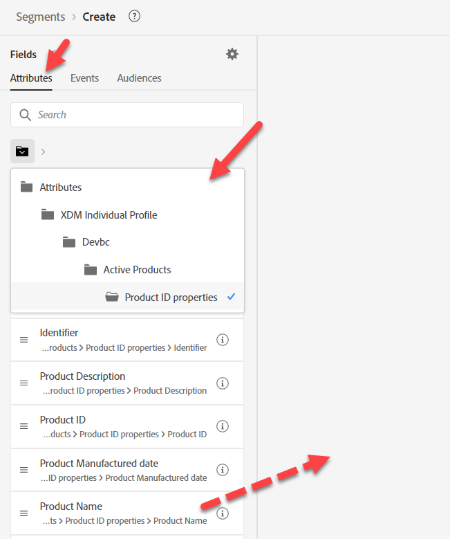
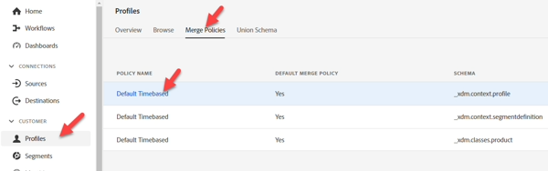

# Generar #2 de audiencia

## Objetivo del laboratorio

Cree una audiencia que encuentre todos los perfiles sin una línea activa que sea un iPhone 14

## Tareas de análisis

Esta audiencia es &quot;aquellos que no tienen un iPhone 14 activo&quot;

- ¿Cómo sabemos que alguien no &quot;tiene un iPhone 14 activo&quot;?  Ideas:
  - Incluir a los que compraron un iPhone 14
  - Incluir a los que tienen datos de facturación para un iPhone 14
  - Incluya a aquellos que tengan datos web procedentes de un iPhone 14
  - ¿Algún otro?

Al final, esto se reduce a una elección de negocio sobre a quién quieren comercializar. En nuestro caso, la compañía ha considerado esto tan importante que construimos un esquema que define Active Lines, así que utilícelo.

>[!NOTE]
>
>Dado que Líneas activas es una matriz almacenada en un Perfil, se selecciona el propietario de la cuenta frente a cada propietario individual del dispositivo. Asegúrese de que el equipo de marketing esté al tanto de esto y lo desee. De lo contrario, es posible que desee un enfoque diferente.

## Crear una audiencia nueva (posee iPhone 14)

1. En la pestaña Atributos del carril izquierdo, vaya a Nombre del producto (o búsquelo).
   - Perfil individual de XDM —> \&lt;nombre de inquilino> —> Productos activos —> Propiedades de ID de producto —> Nombre de producto
1. Arrastre el nombre del producto al lienzo

## Guardar la audiencia

1. Escriba iPhone 14 (mantenga como evaluación por lotes)
1. Proporcione una descripción
1. Guardar audiencia como &quot;*es propietario de iPhone 14*&quot;
   - Siga los mismos pasos anteriores para el Pixel 7 (si tiene tiempo).

>[!TIP]
>
>**Pensamiento secundario: &quot;¿no podríamos filtrar por los Eventos en lugar de tener otro campo en el almacén de perfiles de la misma manera?&quot;**
>
>Sí, podríamos, pero tenemos que entrar en algunos matices comerciales y técnicos que hacen que las Audiencias sean complejas e introducen algunos desafíos:
>
>1. Si utilizamos el evento de compra:
>   1. ¿Qué pasa si no nos compraron, pero tienen una línea activa?
>   1. ¿Qué pasa si compraron hace 2 años, mi regla tiene que mirar atrás N número de años y solo mantuvimos 1 año de Eventos en Perfil?
>1. El Evento de facturación parece un ajuste mejor:
>   1. Pero ahora los datos tienen hasta un mes de antigüedad.
>   1. ¿Qué sucede si el último Evento de facturación fue hace 2 años?, esto podría incluir personas que no son clientes
>   1. ¿Qué sucede si falla la carga de datos? El recuento puede caer a cero si solo miro hacia atrás un mes para excluir datos antiguos
>   1. ¿Registramos siquiera el equipo para un evento de facturación? No, por lo que tendríamos que cambiar nuestra fuente de datos
>
>Al final, tendremos que hacer algunas concesiones para esta audiencia. Si sigue pensando en usar Eventos para esta regla, lea este blog sobre esta regla: https\://experienceleaguecommunities.adobe.com/t5/adobe-experience-platform-blogs/how-to-capture-latest-experience-event-in-adobe-experience/ba-p/430941

>[!NOTE]
>
>**Habilitando una política de combinación para Edge**
>
>Asegúrese de que la política de combinación esté configurada para Audiencias de Edge. Vaya a Políticas de combinación y edite la política de combinación predeterminada para \_xdm.context.profile.  Active la política de combinación activa en Edge y guarde.
>
>
>
>
>
>

## Reconstruir la audiencia

Marketing entró hoy y nos dio un requisito para tener este Streaming y, por desgracia, la forma en que tenemos esto construido es por lotes. Solucione esto:

1. Abra la audiencia &quot;*Es propietario de iPhone 14*&quot; y cambie el nombre a &quot;*Es propietario del lote de iPhone 14*&quot;.

   >[!WARNING]
   >
   >Hoy en día no podemos cambiar el Método de evaluación en la IU. También se deben eliminar todas las audiencias que hagan referencia a esta audiencia. Tenga esto en cuenta al decidir la estrategia de creación de segmentos dentro de los segmentos.

2. Crear una audiencia nueva. Añada la audiencia &quot;Posee el lote de audiencias de iPhone 14&quot; al lienzo y haga clic en Convertir en reglas.

   

   

3. Actualice la descripción, el nombre y el método de evaluación a Streaming en la esquina inferior derecha, luego haga clic en el icono de la carpeta junto al método de evaluación. Debería ver lo siguiente:

   

   Aunque no es obvio, la razón de esto es que estamos utilizando el nombre del producto en un esquema de búsqueda

   >[!NOTE]
   >
   >Cada vez que utilizamos una búsqueda, nuestro método de evaluación se ve obligado a procesar por lotes.
   >
   >Esto se puede saber si se mira la ruta y tiene &quot;propiedades&quot; en cualquier lugar
   >
   >

4. Reemplace el valor existente para que el nombre del producto ahora provenga del esquema Perfil individual de XDM

   Reemplace la siguiente ruta:

   - Perfil individual de XDM > Dep > Productos activos > Propiedades de ID de producto > Nombre de producto

   Añada la nueva ruta:

   - Perfil individual de XDM > Profundidad > Productos activos > Modelo

   

   

5. Cambie el Método de evaluación a Streaming y haga clic en el icono de la carpeta

   

6. Proporcione una descripción para la nueva audiencia apta para streaming.

   - Guardar la audiencia como audiencia &quot;*es propietaria de iPhone 14*&quot;.
   - Haga clic en el botón azul **Activar audiencia** al destino

   

7. Seleccione el destino **Streaming DEP Webhook** y haga clic en **Siguiente**

8. Haga clic en **Siguiente** y **Finalizar**

>[!NOTE]
>
>Consideraciones sobre por qué puede seleccionar Lote frente a Streaming o Edge:
>
>Últimas protecciones: [https://experienceleague.adobe.com/docs/experience-platform/profile/guardrails.html?lang=en](https://experienceleague.adobe.com/docs/experience-platform/profile/guardrails.html?lang=es)

>[!TIP]
>
>**Laboratorio de desafío opcional**
>
>¿Terminaste temprano?
>
>Cree una audiencia de &quot;Fidelidad de dispositivos Apple&quot; en una familia.  Todas las personas del plan tienen el mismo tipo de dispositivo (Apple).
