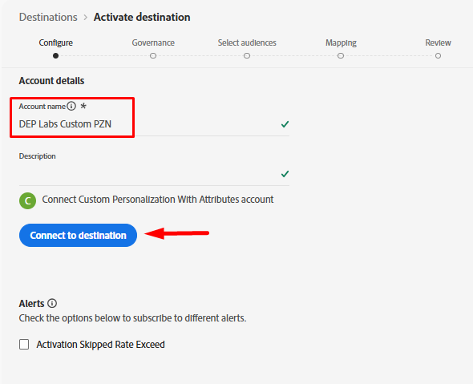

# Configuración del destino personalizado de Personalization

Usar un [destino personalizado de Personalization](https://experienceleague.adobe.com/es/docs/experience-platform/destinations/catalog/personalization/custom-personalization) es una forma de hacer que las audiencias estén disponibles en Edge para que las use un tercero, normalmente mediante la API del servidor de red, para usarlas en Personalización.

Este laboratorio configura el destino de Personalization personalizado para que podamos enviar atributos de perfil a Edge.

## Examinar catálogo de destino

>[!NOTE]
>
>Para personalizar usando Adobe Target, usaríamos [Adobe Target Destination.](https://experienceleague.adobe.com/es/docs/experience-platform/destinations/catalog/personalization/adobe-target-v2) El comportamiento es idéntico al de Personalization personalizado.

1. En el carril izquierdo, haga clic en **Destinos**
1. En el carril superior, haga clic en **Catálogo**
1. A continuación, seleccione la categoría de **Personalization**
1. En medio de la pantalla debería ver el destino titulado **Personalization personalizado con atributos.** Haz clic en el botón **Configurar** de esa tarjeta.

## Configurar destino

### Configurar cuenta

Asigne un nombre a su cuenta `DEP Labs Custom PZN` y haga clic en el botón **Conectar con destino**

### Añadir detalles de destino

Rellene los siguientes detalles de destino:

1. Nombre -> **Destino Edge**
1. Alias de integración -> **edgeAlias**
1. ID de secuencia de datos -> *seleccione el nombre de secuencia de datos que creó anteriormente*
1. Cuando termine, haga clic en el botón **Siguiente**

>[!CAUTION]
>
>Una vez que haga clic en Siguiente, no podrá cambiar **Name** ni **Integration alias**.  Estos elementos aparecerán más adelante en las respuestas de Edge Network

### Seleccionar política de gobernanza

Seleccione **Personalization** en el sitio y haga clic en el botón **Crear**

>[!NOTE]
>
>Aunque este paso es opcional, se recomienda encarecidamente que cualquier destino que cree tenga una política de gobernanza asignada para evitar la activación errónea de perfiles

Cuando termine, debería ver esta pantalla indicando su éxito.

## Activar destino

### Seleccionar audiencias

Seleccione el destino que acaba de crear haciendo clic en la fila para resaltarla y luego haga clic en el botón **Siguiente**

Seleccione **Todas las audiencias** y haga clic en **Siguiente**

### Asignación

Agregue una **nueva asignación** de la siguiente manera:

| Campo de Source | Campo de destino |
| ---------------------- | ------------ |
| \_tenantName.plan.name | Nombre del plan |

&#x200B;> [!NOTE]
>
>Recuerde reemplazar **\_tenantName** con su nombre de inquilino

>[!NOTE]
>
>El campo de destino permite proporcionar un nombre descriptivo que puede ser diferente al nombre XDM

Cuando termine, la pantalla debería parecerse a la imagen siguiente.  A continuación, puede hacer clic en el siguiente **botón**

>[!NOTE]
>
>Dado que los atributos de perfil pueden contener datos confidenciales, todas las llamadas a la API de Edge Network Server [1 deben realizarse en un contexto autenticado para recuperar el atributo una vez que se encuentre en Edge.](https://experienceleague.adobe.com/es/docs/experience-platform/edge-network-server-api/overview)

### Revisar

En la última pantalla, puede revisar los detalles de la configuración y, a continuación, hacer clic en el botón Finish.

>[!NOTE]
>
>Este es el punto donde [Aplicación automática](https://experienceleague.adobe.com/es/docs/experience-platform/data-governance/enforcement/auto-enforcement) comprobará tus [Políticas de uso de datos](https://experienceleague.adobe.com/es/docs/experience-platform/data-governance/policies/overview). Comprobará las acciones de marketing con las reglas creadas y se producirán errores.
