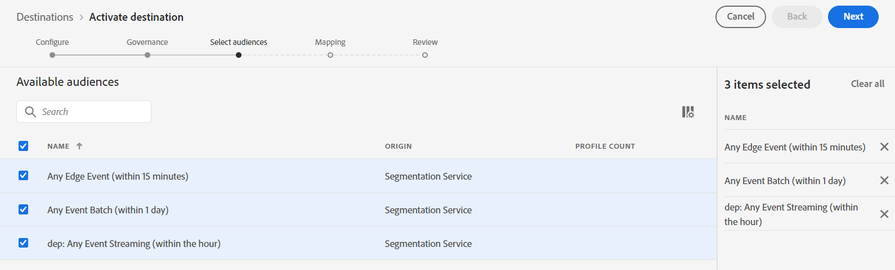
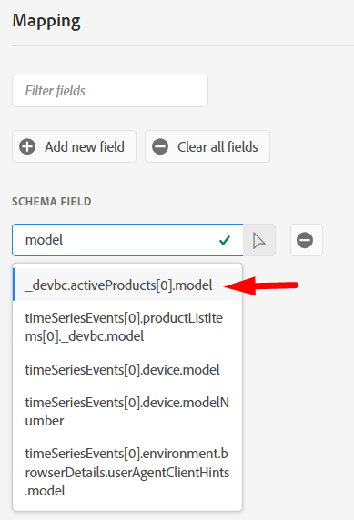

# Configuración del destino de flujo continuo

>[!NOTE]
>
>Pase al siguiente paso si ya ha configurado el destino de flujo continuo.

## Obtener URL del webhook

>[!NOTE]
>
>Vamos a usar un webhook aquí para que podamos ver si los datos han llegado al destino al que los estamos enviando. En un escenario real, iniciaríamos sesión en ese destino y usaríamos sus herramientas para ver lo que ha llegado.

1. Abra el siguiente vínculo en una nueva pestaña del explorador -> [https://webhook.site](https://webhook.site/)
1. Copie la dirección URL única que ve y guárdela en un lugar seguro

## Configuración del destino de API HTTP

>[!NOTE]
>
>Estamos utilizando un destino de streaming como proxy para enviar estos datos a un tercero (por ejemplo, Facebook). En una situación real, se utilizaría un destino de Facebook en lugar de un destino de API HTTP para enviar datos a Facebook.

En la IU de Experience Platform, vaya al catálogo de destinos haciendo lo siguiente

1. Haz clic en **Destinos** en el carril izquierdo
1. Haz clic en **Catálogo** en el carril superior
1. En el cuadro de búsqueda, escriba **http**
1. Haga clic en el botón **Configurar** para configurar el destino de la API HTTP

>[!NOTE]
>
>Está utilizando el destino de flujo continuo de la API HTTP para los laboratorios para demostrar cómo funcionaría un conector de flujo del mundo real.

## Configurar

1. Tipo de conexión **Ninguno**
1. Haz clic en **Conectar con destino**

   

   >[!NOTE]
   >
   >Normalmente, agregaremos cualquier credencial de autenticación en esta etapa, pero no se requiere ninguna para este webhook.

1. Complete los detalles de configuración del destino de la siguiente manera:

- **Nombre** -> `Streaming DEP Webhook - [Your Initials]`
- **Descripción** -> `[your webhook endpoint you copied above]`
- **Punto final** -> ` [your webhook endpoint you copied above]`
- **Parámetros de consulta** -> `leave blank`
- **Encabezados** -> `leave blank`
- Incluir nombres de segmento -> activar
- Incluir marcas de hora de segmento -> activar

Cuando termine, asegúrese de que la configuración coincida con lo que ve a continuación.  Si le parece bien, haga clic en el botón **Siguiente** en la esquina superior derecha para continuar con el siguiente paso

>[!CAUTION]
>
>Los parámetros de extremo, encabezado y consulta no se pueden cambiar en la interfaz de usuario una vez guardados

## Definir gobernanza

1. Seleccione **Segmentación entre sitios** de las acciones de marketing
1. Cuando termine, haga clic en el botón **Siguiente** para continuar con el paso siguiente

>[!NOTE]
>
>Puede obtener más información sobre las políticas de gobernanza en Experience League
>
>[https://experienceleague.adobe.com/docs/experience-platform/data-governance/policies/overview.html?lang=en#core-actions](https://experienceleague.adobe.com/docs/experience-platform/data-governance/policies/overview.html?lang=en#core-actions)

## Seleccionar audiencias

1. Seleccionar todas las audiencias
1. Cuando termine, haga clic en el botón **Siguiente** para continuar con el paso siguiente

## Agregar asignaciones

>[!NOTE]
>
>Aquí se agrega un campo del perfil. Si ese campo no tiene datos, es posible que no veamos nada pasado al destino. Varias actualizaciones a lo largo del tiempo en distintos perfiles y eventos a veces pueden hacer que el destino realice déclencheur varias veces y envíe varias cargas útiles.

1. Haga clic en **Agregar nuevo campo** para agregar un campo al esquema
1. Escriba **model** en el cuadro de entrada del campo de esquema y seleccione el campo **\_dep.activeProducts\[0].model** de la lista de campos que aparece
1. Cambie **\[0]** a **\[\*]** en el nombre de campo.  El campo final debería mostrarse como **\_dep.activeProducts\[\*].model**
1. Cuando termine, haga clic en el botón **Siguiente** para continuar con el paso siguiente

>[!NOTE]
>
>Se trata de asignar un campo en Perfil, no en Evento de experiencia. Aunque enviamos perfiles a un destino según la calificación de audiencia, tenemos que tener en cuenta lo que está ocurriendo.
>
>1. Llega un evento
>2. La audiencia califica el perfil según las reglas
>3. La calificación se almacena en el perfil
>4. El destino recibe una notificación cuando el perfil se ha clasificado
>5. El destino envía el perfil. Esto significa que, cuando el destino va a enviar el perfil, ya no tiene conocimiento del evento que activó la evaluación de audiencia.

## Paso Revisar

Valide que el destino final tenga buen aspecto y, a continuación, haga clic en el botón **Finalizar**

>[!NOTE]
>
>El destino ahora está configurado y a la espera de las clasificaciones de segmentos de todos los segmentos añadidos en función de sus velocidades de evaluación:
>
>- Edge
>- Transmitir
>- Lote

>[!NOTE]
>
>Al configurar inicialmente un destino, es importante recordar lo siguiente:
>
>- Cualquier relleno (perfil cualificado existente) tarda hasta 2 horas en activarse
>- Una audiencia recién agregada tarda hasta 20 minutos en empezar a activarse
