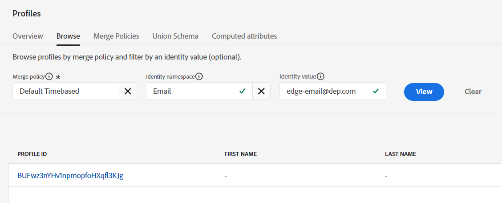

# Envío de un evento de Edge

Ahora que todo está configurado, envíe un evento a Edge para ver cómo funciona todo. Para ello, utilice Postman para enviar un evento web al conjunto de datos que ha creado. Esto envía un evento **sin token de OAuth** para simular una vista de página que llega de la web a Edge.  Asegúrese de tener Postman abierto en el equipo para realizar este laboratorio.

>[!NOTE]
>
>Como no pasa un token autenticado, no se devuelve ningún atributo.

## Expectativas del laboratorio

1. Evento de experiencia para visitar Edge
1. Configuración de flujo de datos para utilizar el servicio de reenvío de eventos
1. Reenvío de eventos para enviar el evento al webhook
1. Configuración de flujo de datos para utilizar el servicio AEP
   1. Audiencia de Edge para ejecutar
   2. Enviar evento al concentrador
1. Respuesta de Postman para incluir la audiencia de Edge (pero sin atributos)
1. Almacén de perfiles para recibir un evento y agregar un fragmento de perfil de evento
1. Almacén de identidades para agregar una relación
1. Conjunto de datos para recibir datos y almacenarlos en Data Lake
1. Audiencias de streaming para evaluar y almacenar resultados en el perfil en el concentrador
1. Destinos personalizados de Personalization para devolver &quot;entradas&quot; de audiencias de streaming a Edge
1. HTTP API Destinations para enviar cualquier &quot;entrada&quot; de audiencias de streaming al webhook
1. Finalmente, los destinos de la API HTTP envían las &quot;salidas&quot; de las audiencias de streaming al webhook
1. Finalmente, Destinos de Personalization personalizados para enviar cualquier &quot;salida&quot; de Audiencias de streaming a Edge


## Navegar hasta la llamada

1. **Barra lateral izquierda de Postman** -> Colecciones
1. **Colección** -> Bootcamp de AEP Foundations (Labs)
1. **Carpeta** -> laboratorio de perfiles
1. **Solicitud de API** -> Crear Edge de evento web (sin autenticación)


## Modificar solicitud de API

Si ya lo ha hecho, puede saltar a Ejecutar la API.

Antes de poder ejecutar la solicitud de API, debe añadir información adicional a la solicitud. Comience por recopilar los siguientes valores:

## Recopile el ID de secuencia de datos

1. En el carril izquierdo, haga clic en **Datastreams** (bajo el encabezado de Recopilación de datos)
1. Seleccione su secuencia de datos y copie el valor **ID de secuencia de datos**


## Actualizar parámetro de consulta de Postman

1. En la propia solicitud, haga clic en **Params**
1. Actualice **Value** con el ID de secuencia de datos del paso anterior
1. Haga clic en el botón **Guardar** para guardar la actualización
1. Cambiar el correo electrónico a su correo electrónico


## Ejecución de la API

Ejecute la solicitud haciendo clic en el botón **Enviar**.


Lo que debería ver en la respuesta son estas cosas principales:

- Una respuesta 200 OK significa que Edge Network envió y aceptó correctamente los datos
- En la respuesta de carga útil también debería ver lo siguiente:
  - el destinationId del destino personalizado de Personalization que configuró
  - el nombre de alias de ese destino (el suyo se llamó customPersonalization)
  - cualquiera de los segmentos para los que el perfil está cualificado y que existen en el perímetro de

>[!NOTE]
>
>Los segmentos por lotes y de flujo continuo no se mostrarán hasta que se evalúen primero en el concentrador

>[!NOTE]
>
>Si enviara a server.adobedc.net con un token de portador, también vería el atributo configurado en el destino personalizado de Personalization

## Errores que pueden producirse

A continuación se muestra un ejemplo de un error que puede encontrar. Esto significa que la evaluación de la segmentación de Edge aún no está disponible para evaluar los datos que se envían a la red Edge.

```none
"errors": [
        {
            "type": "https://ns.adobe.com/aep/errors/EXEG-0203-502",
            "status": 502,
            "title": "The service call has failed.",
            "detail": "An error occurred while calling the 'com.adobe.experience_platform.edge_segmentation' service for this request. Try again.",
            "report": {
                "eventIndex": 0
            }
        }
    ]
```

## Validar el reenvío de eventos

En webhook.site debe ver inmediatamente el mismo cuerpo de carga útil que envió a través de su solicitud de Postman.


>[!NOTE]
>
>Observe que la carga útil ha agregado la información de búsqueda geográfica que solicitó al configurar el conjunto de datos que utilizó en la configuración de Edge

## Búsqueda del perfil

En Adobe Experience Platform, busque el perfil que acaba de enviar desde el evento que acaba de enviar a Edge Network.  Vaya a Perfiles -> Examinar para realizar la búsqueda con la siguiente información:

- Política de combinación -> Basada en tiempo predeterminado
- Área de nombres de identidad -> Correo electrónico
- Valor de identidad -> edge-email\@dep.com


1. Haga clic en **Ver** para buscar el perfil
1. Haga clic en **ID de perfil** para abrir el perfil




3. Haz clic en **Eventos** en la barra de navegación superior y podrás ver el evento que acabas de enviar


4. Valide que el perfil se haya clasificado para las audiencias mediante la revisión de la pestaña Pertenencia a la audiencia en la barra de navegación superior.  Debería ver lo siguiente:

- Cualquier evento de Edge (en los últimos 15 minutos)
- Cualquier flujo de eventos (en la última hora)
- En #1 de casos de uso, también debe ver las audiencias de:
  - Visitó la página de iPhone 14, pero no es de su propiedad ni la ha solicitado
  - Página de iPhone 14 visitada


## Validar activación de destino de flujo continuo

Revise su webhook para ver si el destino de streaming que configuró ha activado algún segmento.  Aparecerán en \~5 minutos.


>[!NOTE]
>
>Los destinos de streaming pueden enviar otra carga útil de calificación de segmentos si las dos identidades aún no se han vinculado.

Si ECID y el correo electrónico aún no se han vinculado, unos minutos después de eso, puede aparecer otra carga útil con los mismos valores, excepto identityMap, que ahora tendrá dos identidades (correo electrónico y ecid)

Con el tiempo, debería comenzar a recibir más cargas útiles en el webhook para el estado &quot;saliente&quot;.


## Interpretación de todas las comprobaciones

1. Compruebe si hay respuestas de 200 en Postman (carga útil con formato correcto)
1. Compruebe si el webhook tiene el evento (reenvío de eventos configurado correctamente)
1. Compruebe si el perfil tiene los eventos (servicio de AEP correctamente configurado, evento recibido y procesado en el concentrador)
1. Compruebe si el perfil tiene dos identidades (el gráfico de identidad se ha vinculado en el concentrador)
1. Compruebe si el perfil cumple los requisitos para las audiencias (audiencia definida correctamente)
1. Compruebe si el webhook recibió las audiencias de streaming (destino de API HTTP configurado correctamente)
1. Compruebe si la respuesta de Postman incluye segmentos (Destino de Personalization personalizado configurado correctamente)
1. Compruebe si Data Lake tiene registros de envío (cualificación de audiencias y destino de flujo correctamente configurados y enviados). Consulte A Continuación.

## &quot;Registro&quot; de lago de datos de destinos

Después de al menos 60 minutos, puede comprobar si el conjunto de datos tiene el evento que ha enviado. Para ello, realice la siguiente consulta mediante el servicio de consultas.

Cambie el nombre de la tabla siguiente por el de su zona protegida. Para encontrarlo, vaya a la lista de conjuntos de datos y filtre en &quot;`dest`&quot;, abra el conjunto de datos y copie el nombre de la tabla en el carril derecho.

```sql
SELECT * FROM profile_export_for_destination_merge_policy_xxx
WHERE extSourceSystemAudit.LASTREFERENCEDDATE >= CURRENT_DATE
AND identitymap['email'][0].ID in ('edge-email@dep.com')
ORDER BY extSourceSystemAudit.LASTREFERENCEDDATE DESC
LIMIT 10
```
