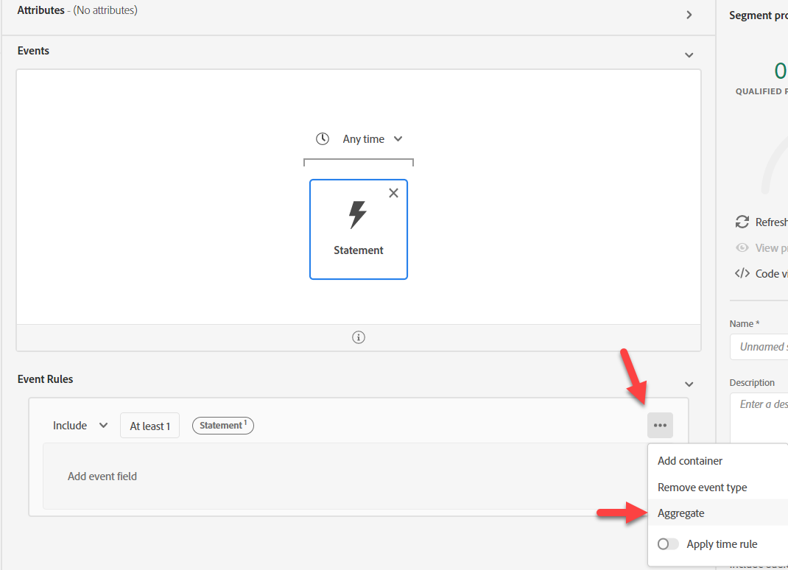
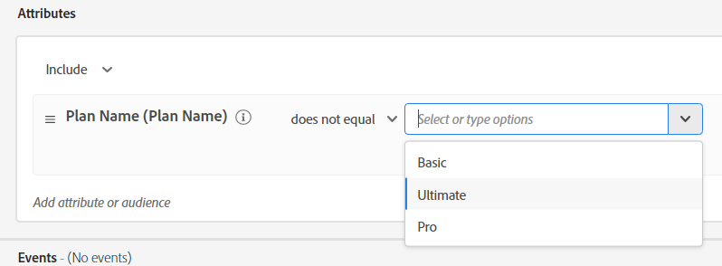

# Opción #1: uso de Audiencias para agregar

Los agregados de audiencias permiten agregar eventos en la regla Audiencia. Pero ya que solo podemos hacer un agregado a la vez, necesitamos dividir los dos de nuestro caso de uso.

## Audience #1: uso de datos de facturación en los últimos 6 meses > 140 GB

En esta compilación de audiencia, usted determina el uso total de datos de facturación en los últimos 6 meses > 140 gb. Para ello, realice lo siguiente:

1. Crear una audiencia nueva.  Utilice la tarjeta Evento de extracto de facturación.

>[!NOTE]
>
>Una buena estructura de tipos de eventos facilita el uso y la comprensión de los usuarios.  Dedique tiempo a desarrollar un enfoque estandarizado en todos los esquemas.
>
>Ayuda con errores ortográficos.
>
>Siempre puede recurrir al campo Tipo de evento y escribir las cosas manualmente.

&#x200B;2. Haga clic en la elipse en la parte inferior derecha de las reglas y seleccione Aggregate. Haga clic en Seleccionar un atributo y escriba Uso. Seleccione el campo Uso de datos de facturación.

&#x200B;3. Cambie el valor de Equals a Greater than y el valor a 140.

&#x200B;4. Cambie el tiempo encima de la tarjeta Evento de Cualquier momento a En el último y el valor a 6 y los días a meses

&#x200B;5. Proporcione una descripción y guarde los cambios.

&#x200B;6. Asigne a la audiencia el nombre &quot;*Suma de uso de facturación > 140 GB (últimos 6 meses)*&quot;

>[!NOTE]
>
>Las audiencias agregadas solo se pueden guardar como lotes

>[!NOTE]
>
>Existen dos formas de utilizar los acumulados en Audiences.
>
>- Suma/Recuento/Mín/Máx/Promedio (como hicimos arriba)
>- Solo cuenta (cuenta cada evento como 1)
>
>
>
>Ambos se pueden usar juntos si se desea
>
>

## Audience #2: promedio móvil de 6 meses uso de datos mensual de >= 20 GB

1. No haga clic en el hipervínculo, sino que seleccione la fila en la interfaz de usuario de la lista de audiencias para que resalte la que acabamos de crear. Una vez resaltado, haga clic en Copiar.

&#x200B;2. Haga clic en el botón Copiar y edítelo.  Haga clic en la tarjeta Evento y cambie la Suma a Promedio. Cambie mayor que a mayor o igual que y el valor a 20. Copie el pseudocódigo en la descripción.

&#x200B;3. Asigne a la audiencia el nombre &quot;*Uso de facturación promedio > 20 GB (últimos 6 meses)*&quot;

## Audience #3: no tiene un plan de teléfono definitivo

1. Crear una audiencia nueva
1. En Atributos, busque Nombre del plan
1. Añadir Nombre Del Plan (Nombre Del Plan)
1. Seleccione Ultimate.  Cambiar a no es igual a

>[!NOTE]
>
>¿Recuerdas nuestro Pre-Trabajo? Utiliza un campo en la dimensión de búsqueda:
>
>Perfil individual de XDM > Devbc > Detalles del plan > Propiedades del ID del plan > **Nombre del plan (Nombre del plan)**

&#x200B;5. Haga clic en Audiencias —> Experience Platform. Arrastre Suma de uso de facturación > 140 GB y Promedio de uso de facturación >= 20 GB junto a Nombre del plan.

&#x200B;6. Copie el pseudocódigo en la descripción

&#x200B;7. Marque esto puede ser Streaming. **No puede ser Streaming**. Realice algunos cambios:

>[!NOTE]
>
>Cualquier uso de un conjunto de datos de búsqueda crea una audiencia de varias entidades que se evalúa en lote.  Se ha utilizado un campo en la audiencia:
>
>Perfil individual de XDM > Devbc > Detalles del plan > Propiedades del ID del plan > Nombre del plan (Nombre del plan)

&#x200B;8. Reemplazar **Nombre de plan (Nombre de plan)** por: Perfil individual de XDM > Devbc > Detalles de plan > **Nombre de plan**

>[!NOTE]
>
>Recuerde que el paso Desnormalizar LID añade el nombre del plan al perfil. Esto le permite hacer referencia a él en una audiencia. Como resultado, esto elimina una unión a la búsqueda y le permite realizar el método de evaluación de Streaming.
>
>La compensación aquí es que hemos trasladado esta lógica al flujo ascendente para que preincorpore los datos en lugar de durante la evaluación de Audiencia.
>
>Ahora también tenemos que actualizar cualquier perfil si cambia el nombre del plan.
>
>Sin embargo, el beneficio es que ahora podemos reaccionar en tiempo real.

&#x200B;9. Compruebe que ahora puede guardarlo como Flujo continuo. Guardar audiencia como &quot;*Uso de datos de facturación alto pero sin plan de Ultimate*&quot;

&#x200B;> [!NOTE]
>
>Aunque este método de evaluación es de streaming, basa la calificación de audiencia en dos audiencias por lotes.

>[!NOTE]
>
>Este método funcionará, pero ahora tenemos una Audiencia de streaming (tiempo real), con Audiencias por lotes (que se ejecutará una vez cada 24 horas). Si esto funciona para nuestros casos de uso y cargas de datos, entonces esta es una buena opción (por ejemplo, tal vez nuestros datos de facturación se carguen diariamente o mensualmente, lo cual es muy probable, pero no todos los casos de uso serán como este). Si no es así, un enfoque común es acumular los datos antes de enviarlos a AEP. Consulte otra opción si necesita un enfoque más en tiempo real.
