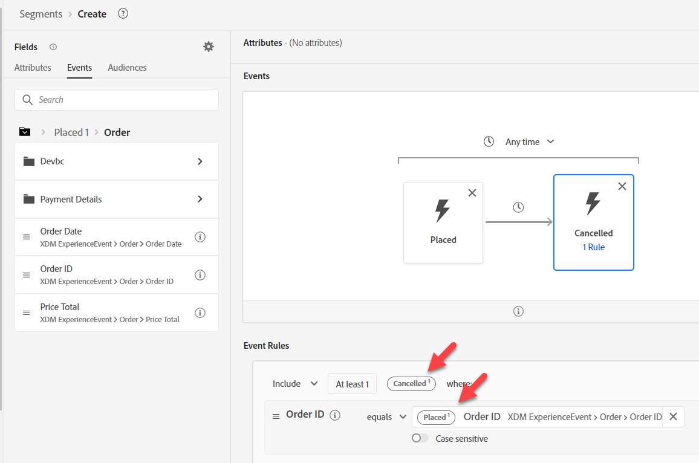

# #3 de casos de uso de compilación

## Crear la audiencia

1. Crear una audiencia nueva
1. Añadir el evento de orden realizado al lienzo
1. Añada el evento de pedidos cancelados a la derecha del evento de pedidos realizados
1. Cambie el tiempo a dentro de una semana

>[!NOTE]
>
>**Campo de tipo de evento**
>
>Podríamos haber usado:
>
>- Cualquier evento filtrado por Tipo de evento=order.placement
>- Cualquier evento filtrado por Tipo de evento=order.canceled

>[!NOTE]
>
>**Hora**
>
>El motor de audiencia solo utiliza la marca de tiempo para interpretar el orden de los eventos. Por lo tanto, si tiene varios campos de fecha y hora en el Evento, tenga en cuenta que el campo Marca de tiempo es el que se utiliza.

## Configuración del evento cancelado

Busque ID de pedido y arrastre el campo al evento de pedido cancelado.

>[!NOTE]
>
>Se ha añadido un filtro para el ID de pedido con el fin de garantizar que el pedido realizado sea el mismo que el pedido cancelado

Borre cualquier búsqueda y haga clic en **Colocado** en **Examinar variables**

Desglose hasta ID de pedido y, a continuación, arrastre el ratón para añadir un operando de comparación

>[!WARNING]
>
>**No usar la búsqueda en una variable**
>
>No mantendrá el contexto de la variable

El resultado final debe ser el que se muestra a continuación

>[!NOTE]
>
>**Contenedores**
>
>Se utiliza el contenedor de variables para garantizar que el pedido cancelado sea el mismo pedido que se realizó
>
>Anteriormente se utilizaba un contenedor para aislar un elemento en una matriz. Aquí se utiliza Contenedores para hacer referencia a un Evento específico en un criterio de filtro dentro de otro Evento.
>
>El evento de pedidos cancelados garantiza que su propio ID de pedido sea el mismo que el ID de pedido realizado
>
>¿De qué otra manera podríamos usar esto?
>
>- La comparación de un SKU de producto para una vista de página es el SKU de producto adquirido
>- La comparación de un envío con la ciudad es diferente a la de la factura con la ciudad
>- Debería ser posible comparar dos campos cualquiera del mismo tipo de datos aunque los eventos puedan provenir de esquemas diferentes
>
>https\://experienceleaguecommunities.adobe.com/t5/adobe-experience-platform-blogs/how-accuracy-do-contenedores-work-in-aep-segmentation-a-deep-look/ba-p/458780

>[!NOTE]
>
>**Nombres de contenedor**
>
>Los contenedores heredarán el nombre de su variable de su contexto.
>
>p.ej. Si utiliza la tarjeta Cualquier evento, el nombre de contenedor será Any1

## Guarde la audiencia

1. Proporcione una descripción. Establezca el método de evaluación como Lote.
1. Guarde la audiencia como &quot;*Pedido realizado y pedido cancelado en una semana*&quot;

>[!TIP]
>
>**Laboratorio de desafío opcional**
>
>¿Terminaste temprano? Pruebe esto...
>
>Nos gustaría comenzar una nueva campaña para Abandonar carro.  Cree una audiencia para el carro de compras abandonado, pero asegúrese de que no comencemos a segmentar personas durante una hora.
>
>
>
>¿Todavía tienes tiempo? Pruebe esto...
>
>El negocio pasó por una fusión y adquirió dos nuevas unidades de negocio para:
>
>- ISP
>- Cable
>
>¿Cómo puede ser necesario modificar los esquemas para incluirlos?
