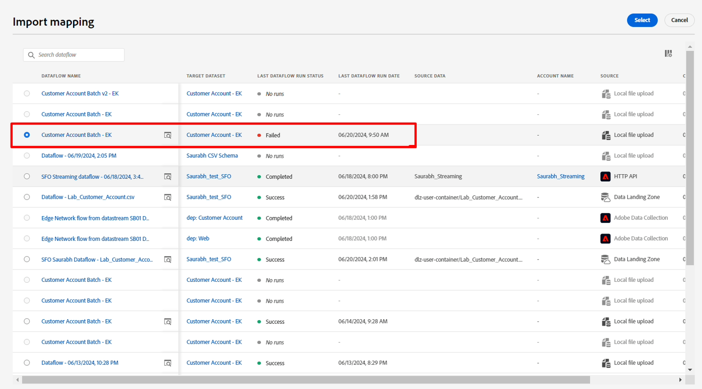

# Crear un nuevo flujo de datos

## Navegar a orígenes

1. En la interfaz de usuario de Adobe Experience Platform, vaya a la siguiente ubicación:\
   **Fuentes** -> **Catálogo** -> **Sistema local**
1. Siguiente clic en el botón **Agregar datos** para la tarjeta **Carga de archivos locales**

## Configuración del flujo de datos

1. En la pantalla de detalles de flujo de datos, elija **Conjunto de datos existente**.
1. Utilice el conjunto de datos que creó anteriormente con el nombre **Cuenta de cliente - \&lt;Sus iniciales>**
1. Asegúrese de tener activada la opción **Conjunto de datos del perfil**.
(Si no lo activa, el Almacenamiento de perfiles no podrá supervisar los nuevos datos que entren en este conjunto de datos y, por lo tanto, no ingerirá estos datos en el Perfil)
1. Asegúrese de que tiene activada la opción **Habilitar ingesta parcial**
(Si no activa esta opción, puede producirse un error en toda la ingesta si solo uno de los registros contiene un error).
1. Establezca el nombre del flujo de datos como **Lote de cuenta de cliente v2 - \&lt;Sus iniciales>**
1. Activar todas las alertas **Inicio/Éxito/Error del flujo de datos de origen**
1. Si todo parece correcto, haga clic en el botón **Siguiente** en la esquina superior derecha de la pantalla para continuar con el siguiente paso.

## Cargar archivo de muestra

1. Arrastre y suelte o cargue el archivo **Lab\_Customer\_Account.csv** en la interfaz de usuario.  Cuando termine, la pantalla debería tener el aspecto siguiente.

## Importar asignaciones

En la pantalla de asignación, en lugar de volver a configurar todas las asignaciones, puede importar las que haya creado anteriormente.

1. Haz clic en el botón **Importar asignación**
1. Seleccione el flujo de datos que tiene la asignación creada anteriormente

>[!NOTE]
>
>La importación de asignaciones es una forma útil de reutilizar asignaciones de otros flujos de datos y reducir la cantidad de trabajo de asignación que debe realizar
