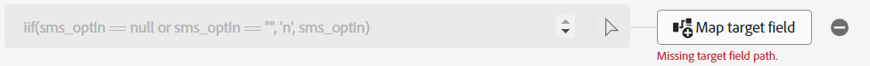

# Campos calculados

## Información general

El campo sms\_optIn es un campo obligatorio en el esquema de cuenta del cliente. El problema es que el campo sms\_optIn de nuestra fuente de flujo continuo puede enviar valores *null*, por lo que se necesita un campo calculado para solucionarlo; de lo contrario, estos registros se omiten de la ingesta, lo que es una pérdida.


## Crear campo calculado

1. Cree un campo calculado haciendo clic en el icono **Nuevo tipo de campo** y, a continuación, seleccione **Agregar campo calculado**. Para todos los valores que faltan, se supone que no se ha dado el consentimiento y se marca como **&quot;n&quot;**. Tenga en cuenta que los campos calculados aparecen en la columna izquierda, ya que la transformación a través de un campo calculado es la entrada para esta nueva asignación.

   


1. En el cuadro de diálogo Crear campo calculado agregue la siguiente expresión y haga clic en **Vista previa**

   ```none
   iif(sms_optIn == null or sms_optIn == "", 'n', sms_optIn)
   ```

   


1. Debería ver una marca de verificación verde en la esquina superior derecha del cuadro negro que indica la validez de la expresión y la vista previa de datos solo debería mostrar **&quot;n&quot;** o **&quot;y&quot;** como valores. Si todo parece correcto, haga clic en **Guardar**.


## Asignar a destino

Se agrega un nuevo campo a la pantalla de asignación, pero con una ruta de campo de destino no asignada.



1. Haga clic en **Asignar campo de destino** para el nuevo campo calculado que ha creado
1. En el panel derecho, ahora verá el panel de esquema de destinatario abierto. Escriba **sms** en el cuadro de búsqueda
1. Seleccione el campo **val**

   


   La asignación final debería tener un aspecto similar al siguiente:

   


1. Valide la asignación para asegurarse de que tiene buen aspecto


>[!NOTE]
>
>Las filas sin un valor SMS válido se rechazan durante la ingesta. Si la ingesta parcial no está habilitada, el error de ingesta con esta fila falla en la ingesta del lote o archivo completo en nuestro caso. Con la ingesta parcial habilitada, las filas con campos obligatorios con valores que faltan se rechazan, pero se incorporan otras filas.


## Gestión de cumpleaños

Es necesario separar el día, el mes y el año de nacimiento en campos separados, de modo que algunos de ellos no puedan utilizarse en actividades posteriores. Debe crear dos campos calculados para resolver esto.

### Crear asignación para día y mes de nacimiento

1. Añada un nuevo campo calculado para capturar los perfiles de día y mes de nacimiento
1. Utilice el siguiente código para el campo calculado:

   >[!NOTE]
   >
   >En lugar de copiar el código anterior, intente comprender lo que está sucediendo ejecutando los fragmentos de código por separado para ver cómo se ha creado para crear campos calculados más complejos en una sola línea, ya que no se permite multilínea. Pruebe lo siguiente:
   >
   >1. `date(birth_Date,"M/d/yyyy")`
   >2. `date_part("day", date(birth_Date,"M/d/yyyy")).toString()`
   >3. `date_part("month", date(birth_Date,"M/d/yyyy")).toString()`
   >4. `concat(date_part("month", date(birth_Date,"M/d/yyyy")).toString(),`
   >   `"-", date_part("day", date(birth_Date,"M/d/yyyy")).toString())`


1. Haga clic en preview y debería ver el siguiente resultado. Si todo parece correcto, haga clic en **Guardar**

   


1. Asigne el campo calculado a **person.birthDayAndMonth**

1. Validación de la asignación


### Crear asignación para año de nacimiento

1. Cree un nuevo campo calculado para capturar el año de nacimiento del perfil con el código siguiente

   ```none
   date_part("yyyy",date(birth_Date,"M/d/yyyy"))
   ```

1. Asigne el campo calculado a la ubicación de destino de **person.birthYear**

1. Validación de la asignación

>[!NOTE]
>
>Observe que las fechas están en formato **MM/DD/AAAA**, pero los datos de **birth\_Date** de la muestra se presentan como dígitos simples o dobles para el día y el mes. Para que funcione la función **date**, debe especificar el formato de entrada de datos como **M/d/aaaa** para que pueda contabilizar de 1 a 2 dígitos para el mes y el día. Sin esta especificación de formato de entrada de fecha, la validación de estas asignaciones falla.
