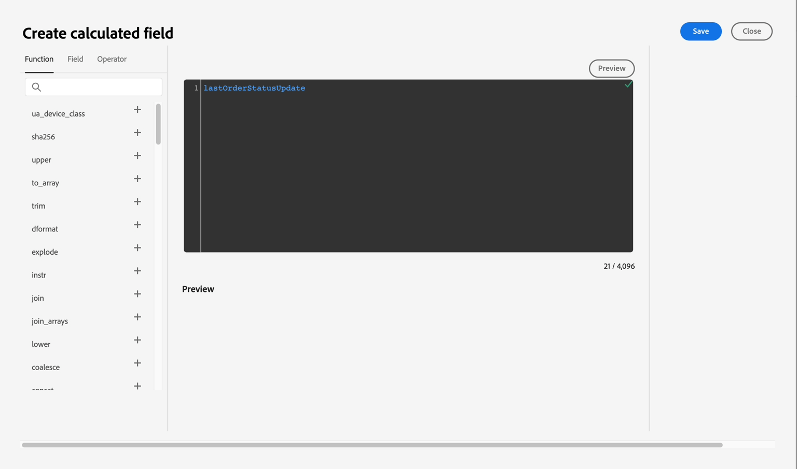
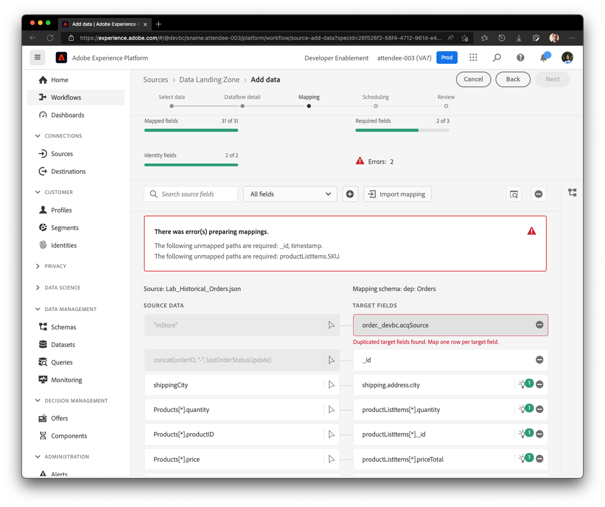

# Asignaciones iniciales

Al igual que en el ejercicio anterior, debe verificar la asignación y, en algunos casos, modificarla.

## Verificar recomendaciones de ML

1. En el paso Asignación, las recomendaciones XML asignan automáticamente la mayoría de los atributos. Sin embargo, también verá varios errores. La pantalla inicial puede tener un aspecto similar al siguiente.


>[!NOTE]
>
>Dado que asignamos un conjunto de datos de evento de experiencia por primera vez, tenga en cuenta que **\_id** y **timestamp** nunca se recomiendan ni se asignan de forma predeterminada para los eventos de experiencia. Debe asegurarse manualmente de que estén asignados correctamente.

## Asignar campos \_id, timestamp y order.\_devbc.acqSource

1. Para asignar **\_id,**, escriba la siguiente expresión de campo calculado y haga clic en Vista previa

   ```none
   concat(orderID, "-", lastOrderStatusUpdate)
   ```

   

   

1. Asegúrese de que el campo **timestamp** del esquema de destino esté asignado al siguiente campo calculado:

   ```none
   lastOrderStatusUpdate
   ```

   

   

1. Asigne la expresión de campo calculado **&quot;inStore&quot;** a **order.\_devbc.acqSource**


## Gestión de asignaciones duplicadas

Si la pantalla de asignación se queja ahora de que hay una asignación duplicada como **orderStatus** asignada a **order.\_devbc.acqSource,** haga clic en el icono &quot;-&quot; para quitar la asignación.

>[!NOTE]
>
>Recuerde que no se pueden asignar varios campos de entrada al mismo campo de salida, ya que esto hace que la asignación sea ambigua. Sin embargo, un solo campo de entrada se puede asignar a varios campos de salida en el esquema XDM.




