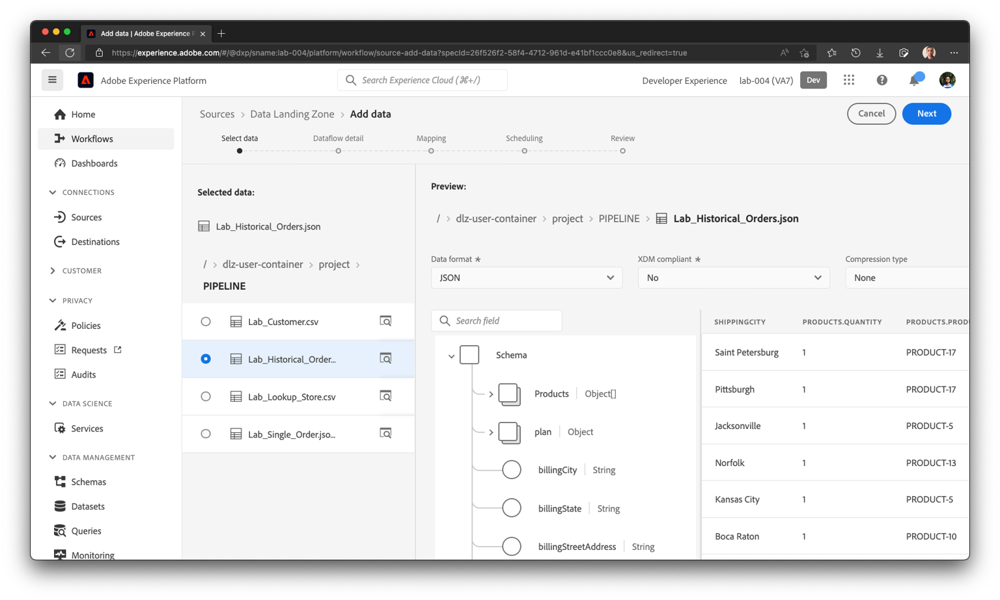
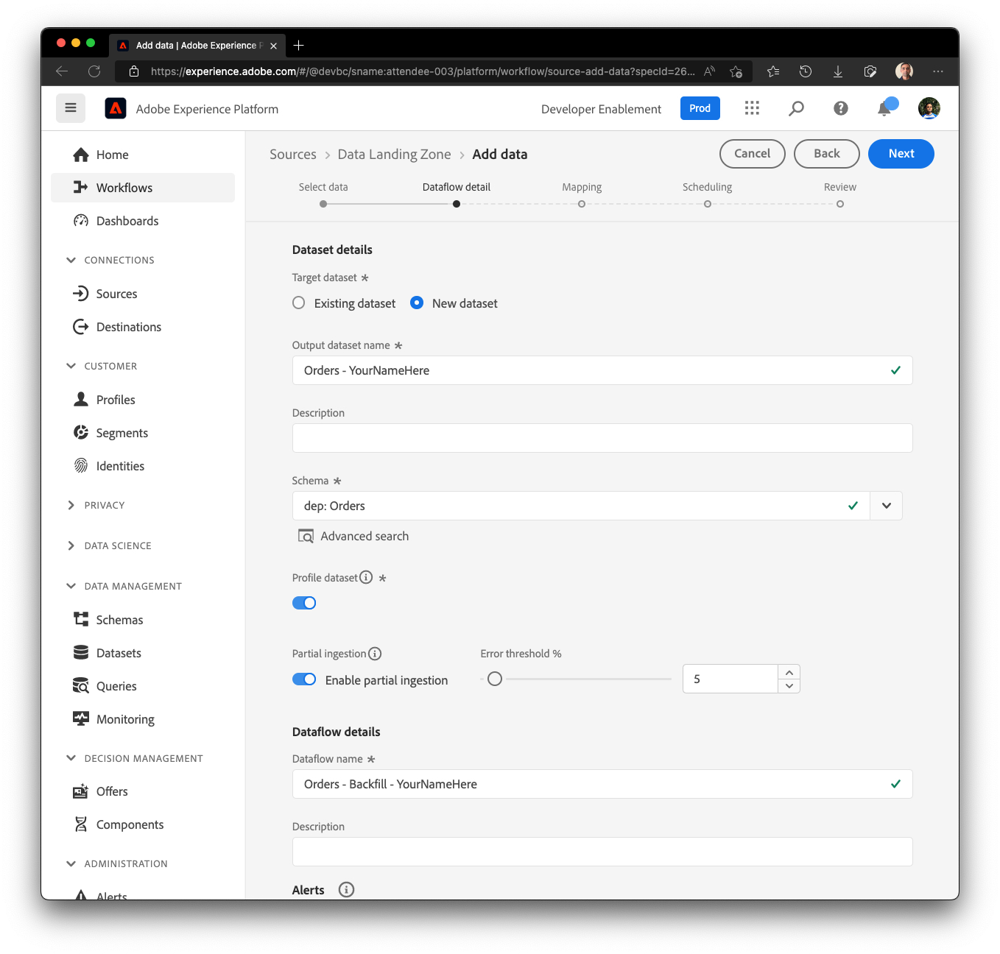

# Configuración del origen

## Cargar archivo de muestra

Debe cargar un archivo de datos de muestra en la zona de aterrizaje de datos a través del Explorador de almacenamiento de Azure para poder utilizarlo durante el laboratorio.  Para ello, haga lo siguiente:

1. Descargar los [archivos de ejemplo](../../../sample-files.md)
1. Arrastre y suelte o cargue el archivo **Lab\_Historical\_Orders.json** en la zona de aterrizaje de datos que guardó desde arriba.

Cuando se cargue, la pantalla debería parecerse a la captura de pantalla siguiente.

## Navegar a orígenes

1. Vaya a Adobe Experience Platform y vaya a: **Orígenes** -> **Catálogo** -> **Almacenamiento en la nube**
1. Haz clic en **Configuración** / **Agregar datos** para la zona de aterrizaje de datos

>[!NOTE]
>
>Verá **Agregar datos** como la acción predeterminada si ya configuró una conexión del laboratorio de ingesta por lotes anterior

## Previsualización del archivo

1. Seleccione el archivo **Lab\_Historical\_Orders.json** y previsualice su contenido
1. Haga clic en **Siguiente** en la esquina superior derecha de la pantalla para continuar con el paso siguiente

## Configuración del flujo de datos

1. En la pantalla de detalles de flujo de datos, elija **Nuevo conjunto de datos**
1. Asigne un nombre al conjunto de datos de salida como **Pedidos - YourNameHere**
1. Seleccione el nombre de esquema **dep: Orders**
1. Active la casilla de verificación **Conjunto de datos del perfil**
(Si no lo activa, el Almacenamiento de perfiles no puede supervisar los nuevos datos que entran en este conjunto de datos y, por lo tanto, no ingiere estos datos en el Perfil)
1. Activar **Habilitar la ingesta parcial**
(Si no activa esta opción, la ingesta puede fallar si uno de los registros tiene errores).
1. Establezca el nombre del flujo de datos como **Pedidos - Relleno - YourNameHere**
1. Activar todas las alertas **Inicio/Éxito/Error del flujo de datos de origen**

>[!CAUTION]
>
>Asegúrese de haber **habilitado** su conjunto de datos tanto para la ingesta parcial como para la de perfil.

Haga clic en **Siguiente** en la esquina superior derecha de la pantalla para continuar con el paso siguiente
