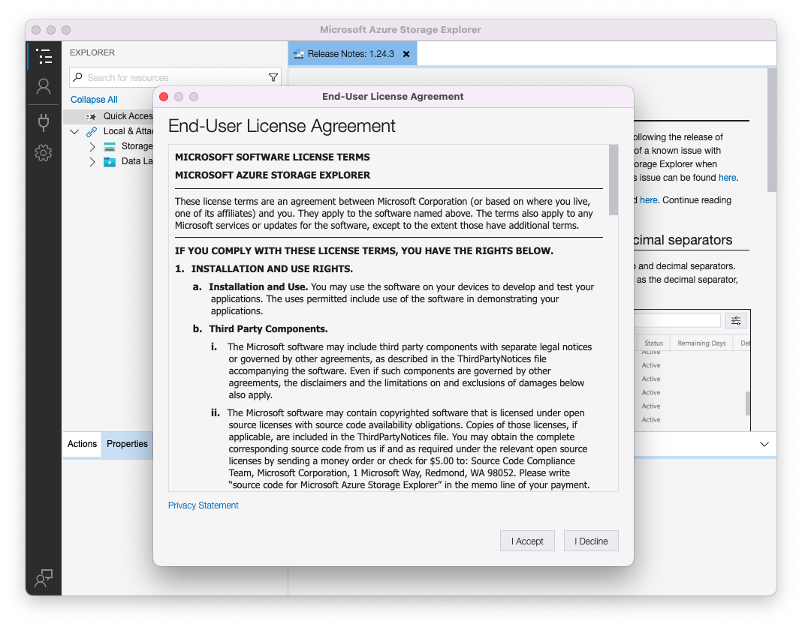
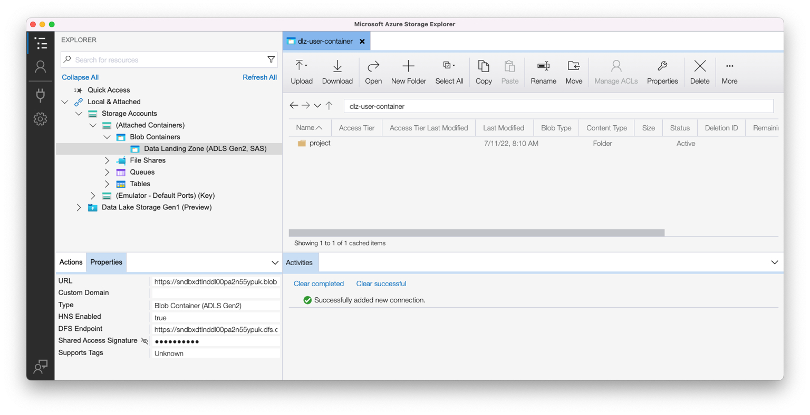

# Uso de la zona de aterrizaje de datos

## Prerrequisitos

Si no ha descargado el Explorador de almacenamiento de Azure, hágalo ahora, ya que es un requisito para este laboratorio.  Puede encontrar la descarga en el siguiente enlace:

[Descargar el Explorador de almacenamiento de Azure](https://azure.microsoft.com/en-us/blog/microsoft-azure-data-lake-storage-adls-in-storage-explorer-public-preview/)

1. Instalación de la aplicación
1. Al iniciar por primera vez, acepte el Contrato de licencia de usuario final

## Configuración del Explorador de almacenamiento de Azure con Experience Platform

1. Abra el Explorador de almacenamiento de Azure, haga clic en el **icono Seleccionar recurso** y, a continuación, seleccione **Contenedor o directorio ADLS Gen 2**

1. Seleccione **URL de firma de acceso compartido (SAS)** y haga clic en **Siguiente**

1. Escriba el nombre para mostrar como **Zona de aterrizaje de datos**

>[!NOTE]
>
>No puede continuar en este paso hasta que proporcione la dirección URL de SAS.  Esto se obtiene de Experience Platform, que se ve en el siguiente paso.

1. Vaya a Adobe Experience Platform y desplácese hasta la zona de aterrizaje de datos haciendo lo siguiente:

- Vaya a **Orígenes -> Catálogo**
- Seleccione **Almacenamiento en la nube** en los orígenes
- A continuación, busque la tarjeta **Zona de aterrizaje de datos**
- Haga clic en la tarjeta de la zona de aterrizaje de datos y, a continuación, haga clic en **Ver credenciales** en el carril derecho

1. Copie **SASUri** del modal que se muestra.

Vuelva al Explorador de almacenamiento de Azure y pegue el valor **SASUri** en el **contenedor de blobs o en la URL de SAS de directorio** que dejó en blanco en el paso anterior

1. Haga clic en **Siguiente** para continuar

1. En la pantalla Resumen, haz clic en **Conectar**

Ahora debería ver una pantalla similar a la siguiente

> [!TIP]
>
>¡Felicidades!  Ha configurado correctamente el Explorador de almacenamiento de Azure
