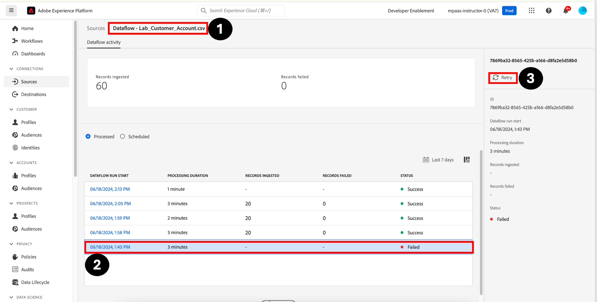

# Reintento de un flujo de datos fallido

Para reintentar un flujo de trabajo, haga lo siguiente:

1. Vaya a **Fuentes -> Flujos de datos -> \[Nombre del flujo de datos] -> \[Error al ejecutar]**
1. Resalte la ejecución del flujo de datos que no haya podido mostrar el carril derecho.
1. Haz clic en **Reintentar**. El reintento realizará la copia de los datos asociados con la ejecución fallida y ahora le aplicará las nuevas reglas de asignación

>[!NOTE]
>
>Tenga en cuenta que cuando vuelve a intentar un flujo de datos fallido, se crea y ejecuta un nuevo flujo de datos. Aparecerá en la parte superior de la lista de flujos de datos
