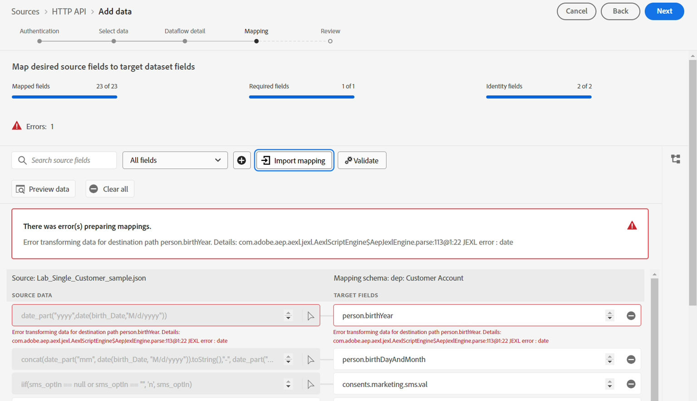

# Configurar asignación

> [!NOTE]
>
>Siga esta sección únicamente si ha completado correctamente el laboratorio de ingesta por lotes.  De lo contrario, siga los [datos de asignación](../batch-ingestion/mapping-data/overview.md) pasos que se encontraron en el laboratorio de ingesta por lotes.

## Importar conjunto de asignaciones

Si ha completado el laboratorio de ingesta por lotes, puede volver a utilizar el conjunto de asignaciones que creó allí 😄🎉

Siga estos pasos:

1. Haga clic en el botón **Importar asignación** de la pantalla de asignación

1. Elija el flujo de datos que ha creado en la sección Ingesta por lotes y selecciónelo.  Debe tener un nombre como **Lote de cuenta de cliente v2 - \&lt;sus iniciales>.**

Después de la importación, verá que aparecen errores.  Esto se debe a que el formato de fecha utilizado para el campo birth\_Date en el archivo de muestra ha cambiado.

- Archivo de muestra por lotes utilizado -> mm/dd/aaaa
- Transmitir archivo de muestra utilizado -> aaaa-mm-dd

Los campos calculados que usan las funciones **date** deberán actualizarse para tener en cuenta el cambio en el formato de fecha usado.

## Actualizar campos calculados

Actualice cada campo calculado simplemente haciendo clic en el icono de flecha situado junto a cada campo calculado y, a continuación, valide las asignaciones

| Campo de destino | Nuevo campo calculado |
| ----------------------- | ----------------------------------------------------------------------------------------------------------------------------------- |
| person.birthYear | date\_part(&quot;yyyy&quot;,date(birth\_Date,&quot;yyyy-M-d&quot;)) |
| person.birthDayAndMonth | concat(fecha\_part(&quot;mm&quot;, fecha(nacimiento\_Fecha, &quot;aaaa-M-d&quot;)).toString(), &quot;-&quot;, fecha\_part(&quot;dd&quot;, fecha(nacimiento\_Fecha, &quot;aaaa-M-d&quot;)).toString()) |
