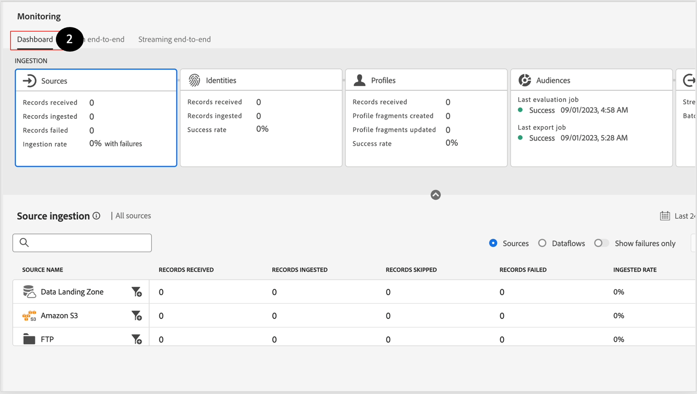

# Supervisión y depuración de errores

>[!NOTE]
>
>La monitorización de la ingesta de transmisión se produce en el nivel de flujo de datos, lo que significa que, cuando lo está viendo en la interfaz de usuario, está viendo el lago de datos.  Esto significa que verá que los lotes aparecen (el procesamiento de microlotes fuera de la canalización de flujo) aproximadamente cada 60 minutos.  Por lo tanto, si no ve sus datos en el Perfil del cliente en tiempo real, debe esperar hasta 60 minutos para diagnosticar el problema.

## Ver tablero de monitorización

1. Vaya a **Monitorización->Transmisión de extremo a extremo** y busque su **flujo de datos**:

1. Es posible que desee obtener una vista previa de la pestaña **panel** para ver las métricas de canalización pertenecientes a los flujos de trabajo de ingesta por lotes.

>[!NOTE]
>
>Esta pantalla de monitorización le permite ver el estado de las distintas ejecuciones del flujo de datos.  Tenga en cuenta las distintas métricas disponibles en el panel superior.  Estas métricas pueden ser extremadamente útiles para comprender el estado de la canalización de datos dentro de Experience Platform

## Depuración de errores

1. Si el flujo de datos tenía errores porque no siguió las instrucciones, verá lo siguiente.

1. Si hace clic en Errores, se obtiene la siguiente pantalla:

>[!NOTE]
>
>Un microlote exitoso puede tardar más de 15 minutos, ya que puede necesitar tiempo para escribir los registros en el lago de datos.

1. Analice el mensaje de error, identifique los **campos de origen/destino,** y busque el código:

- **INGESTA XXXX**: se trata de un error grave debido a problemas de formato o a daños en los datos, es decir, que no sigue un formato regex.
- **DCVS XXXX**: este error se ve con `required` campos. Si los valores no existen o están asignados incorrectamente (no dentro de la lista de enumeración), estas filas se omiten.
- **ASIGNADOR XXXX**: estas son advertencias y no se omiten filas. Pero es posible que los valores se hayan &quot;anulado&quot;, por lo que debe asegurarse de que no afecten a las actividades posteriores.

1. Para recuperarse de los errores, debe ir a **Orígenes->Flujos de datos->Nombre de flujo de datos->Actualizar flujo de datos** y corregir las asignaciones.

&#x200B;> [!NOTE]
>
>Debe volver a cargar el archivo de muestra JSON eliminándolo primero y volviéndolo a añadir para que el asignador se actualice ahora con una copia nueva para la validación.

