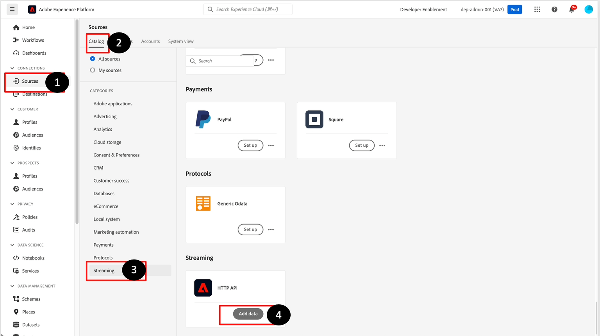

# Configuración del origen

## Navegar a fuentes de flujo continuo

1. Vaya a la interfaz de usuario de Adobe Experience Platform y luego a **Orígenes**
1. Haz clic en **Catálogo** en la barra de navegación superior
1. Seleccione **Transmisión** de la lista de orígenes (asegúrese de que el botón de opción Todos los orígenes esté seleccionado)
1. Haga clic en **Configuración** / **Agregar datos** para la API HTTP

## Crear cuenta de API HTTP

Lo primero que debe hacer es crear una cuenta nueva. Esta cuenta contiene los detalles sobre cómo se gestiona la autenticación y si los datos que se transmiten en son compatibles con XDM (es decir, ya coinciden con la estructura del esquema XDM subyacente)

Realice las siguientes tareas:

1. Seleccione **Nueva cuenta** y agregue los siguientes detalles:
   - Nombre de cuenta -> `Streaming Ingestion - <Your Initials>`
1. Deje desactivado el conmutador **Habilitar autenticación**
1. Deje la casilla de verificación de **XDM compatible** sin marcar
1. Haga clic en el botón **Conectar con el origen** para continuar

>[!CAUTION]
>
>NO active **Habilitar autenticación** ni marque la casilla de **compatibilidad con XDM**. Esto rompe el laboratorio

La pantalla debería tener un aspecto similar al siguiente:

Ahora debería ver una casilla verde con el mensaje &quot;Conectado&quot;. Haga clic en el botón **Siguiente** en la esquina superior derecha para seguir configurando el flujo de datos:

## Cargar datos de muestra

>[!NOTE]
>
>Si aún no lo ha hecho, asegúrese de descargar los [archivos de muestra](../sample-files.md)

1. En la sección del esquema de datos de Source de la pantalla, cargue el archivo JSON **Lab\_Single\_Customer\_sample.json** de su sistema de archivos local que descargó del laboratorio anterior.
1. Una vez cargado el archivo, aparece una vista previa de la siguiente manera. Haga clic en el botón **Siguiente** en la esquina superior derecha para continuar. Observe cómo el campo birth_Date tiene un formato AAAA-MM-DD diferente al formato MM/DD/AAAA que vio en el laboratorio de ingesta por lotes anteriormente.

>[!NOTE]
>
>El archivo de muestra JSON contiene un único registro para diseñar y validar la canalización. Si desea desplazarse, debe hacer clic en los nodos XDM para que los nodos se desplacen.

## Configuración de detalles de flujo de datos

En esta pantalla, está creando un flujo de datos específico que aprovecha la cuenta de la API HTTP configurada.  Puede tener muchos flujos de datos por cuenta.  En este caso, debe crear un flujo de datos para transmitir los datos de cuenta de cliente. Un flujo de datos requiere una asociación entre una cuenta de origen, un conjunto de datos con esquema asociado y detalles de configuración.

Siga estos pasos:

1. Cree un nuevo conjunto de datos y asígnele el nombre -> `Customer Account Stream - <Your Initials>`
1. Elija el **esquema** como ->`dep: Customer Account`
1. Asegúrese de que la opción **Conjunto de datos del perfil** esté **habilitada**.  Si no es **habilitarlo**.
1. Actualizar **nombre de flujo de datos** de esta manera:
   - `Customer Account Stream - <Your Initials>`
1. Haga clic en el botón **Siguiente** para continuar

>[!NOTE]
>
>Si no habilita el conjunto de datos para Perfil, solo se incluirán las secuencias de datos en el lago de datos. Los eventos de flujo continuo no se ven en el perfil ni en el gráfico de identidad.
