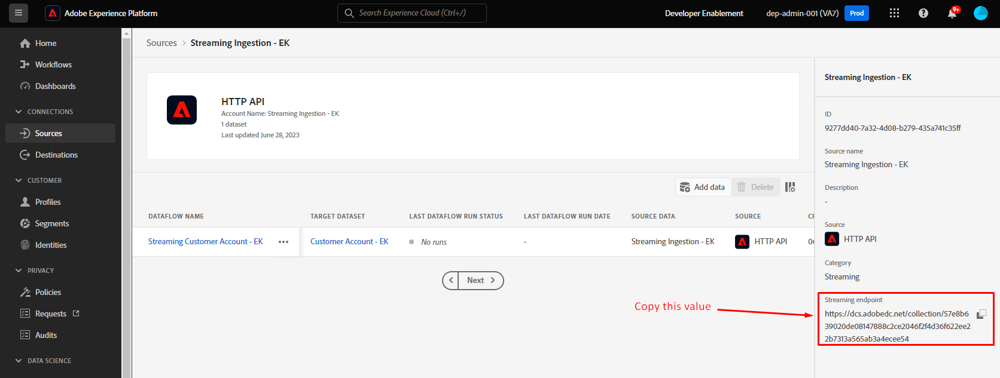

# Transmitir un perfil

## Resumen de API

Es importante comprender la estructura de la API al transmitir datos a Adobe Experience Platform en formato sin procesar para que pueda volver a crearlos fácilmente independientemente del flujo de datos que cree.  A continuación se muestra un ejemplo de la estructura básica de la llamada a mediante cURL

**Solicitud de muestra (datos sin procesar)**

```curl
curl --location '' \
--header 'Content-Type: application/json' \
--header 'x-adobe-flow-id:  <dataflow-id>;' \
--header 'Authorization: Bearer XXX;' \
--data '{
    "customer_id": "202208240125",
    "firstName": "",
    "lastName": "",
    "email": "",
    "createDate": "1660096899",
    "modifyDate": "2022-08-09T22:01:40Z",
    "birth_Date": "1991-06-12",
    "mobile_phone": "888-888-8888",
    "email_optIn": "y",
    "sms_optIn": "n",
    "shipping_street_address": "1901 W Madison St",
    "shipping_city": "Chicago",
    "shipping_state": "IL",
    "shipping_zip_code": "60612",
    "billing_street_address": "1901 W Madison St",
    "billing_city": "Chicago",
    "billing_state": "IL",
    "billing_zip_code": "60612",
    "plan_id": "m1",
    "plan_name": "basic",
    "account_create_date": "Created on 2022-04-20T22:19:03Z",
    "account_end_date": "2022-01-20T13:15:32Z",
    "source": "inStore"
}'
```


Algunos elementos importantes que se deben tener en cuenta en la solicitud anterior:

| Elementos clave | Requerido | Descripción |
| --------------------------- | -------- | ------------------------------------------------------------------------------------------------------------------------------------------------------------------------------------------- |
| URL de solicitud (es decir, ubicación) | - | Dirección URL de la cuenta de origen de la API HTTP que creó a la que apuntarán los datos de flujo continuo. **Siempre es del tipo POST** |
| Encabezado &quot;Content-Type&quot; | * | Siempre se establece en `application/json`, ya que los datos que envía están en formato JSON |
| Encabezado &quot;x-adobe-flow-id&quot; | - | Establezca en el ID del flujo de datos creado desde el conector de origen |
| Encabezado &quot;Autorización&quot; | * | Valor opcional, pero muy recomendable por motivos de seguridad. Este es el mismo(a) `access_token` que generó durante los laboratorios [Postman Setup](../../postman-setup/environment-file.md) |
| Contenido del cuerpo | - | Contiene los datos reales que desea enviar a Adobe Experience Platform |

>[!NOTE]
>
>El contenido del cuerpo siempre debe estar en formato JSON y coincidir con la carga útil de muestra proporcionada durante el diseño del flujo de datos


## Recopilar valores necesarios

Antes de poder transmitir datos, debe recopilar algunos de los valores necesarios enumerados arriba (es decir, específicamente los valores de &quot;encabezado&quot; de la dirección URL del extremo de transmisión y el contenido del cuerpo).

Siga estos pasos:

1. Copie el valor **Extremo de streaming** y guárdelo en el equipo local (suponiendo que no haya salido del paso de la sección anterior). Si se ha alejado, puede encontrarlo en Orígenes->Cuentas.

   >[!NOTE]
   >
   >Si se ha alejado, puede llegar a esta página haciendo lo siguiente:
   >
   >- Haz clic en **Fuentes** en el carril izquierdo
   >- Asegúrese de que está en la ficha **Cuentas** y haga clic en la cuenta que creó con el título **Ingesta de transmisión - \&lt;Sus iniciales>**

   >[!NOTE]
   >
   >Si no ve este valor, asegúrese de que no ha seleccionado la fila de flujo de datos haciendo clic en ella.  NO HAGA CLIC EN LOS VÍNCULOS AZULES

   


1. Seleccione la fila del flujo de datos haciendo clic en cualquier lugar de la misma evitando los vínculos azules. Copie el **ID de flujo de datos** y guárdelo en un lugar seguro


## Actualice la solicitud de API

Cambie a la aplicación de Postman y actualice la solicitud Crear cuenta de cliente con la información que acaba de recopilar.

1. Abra Postman y vaya al **Laboratorio de ingesta de datos -> Crear cuenta de cliente** y abra la solicitud de API

   


1. Copie y pegue el valor **Extremo de streaming** que guardó anteriormente en la dirección URL de la solicitud

   


1. Copie y pegue el valor de ID de flujo de datos que guardó anteriormente en el valor del encabezado **x-adobe-flow-id**

   


1. En el cuerpo de la solicitud, actualice los siguientes atributos:

   - **firstName** -> Su nombre
   - **lastName** -> su apellido
   - **correo electrónico** -> su dirección de correo electrónico
   - **fecha_nacimiento** -> AAAA-MM-DD

   **5. Guardar** su solicitud

1. Haga clic en el botón **Enviar** para ejecutar la solicitud de flujo en su perfil de cuenta de cliente

   


1. Debe recibir una respuesta `200 OK` que indique que Adobe Experience Platform la recibió correctamente

Ejemplo de respuesta 200 OK

```none
{
    "inletId": "57e8b639020de08147888c2ce2046f2f4d36f622ee22b7313a565ab3a4ecee54",
    "xactionId": "1688068236344:7186:152",
    "flowId": "7d1d1a20-3df2-43fb-8bd8-2856bb3ea6a4",
    "receivedTimeMs": 1688068236344
}
```

>[!NOTE]
>
>Observe **xactionId** en la respuesta.  Si alguna vez se produce un error en el que no ve un registro ingerido, esto siempre debe proporcionarse como parte de un ticket de asistencia al cliente, ya que es una viñeta de seguimiento utilizada por nuestros equipos de asistencia para depurar cualquier problema de entorno

>[!TIP]
>
>¡Felicidades!  Ha transmitido correctamente un registro de perfil a Adobe Experience Platform
