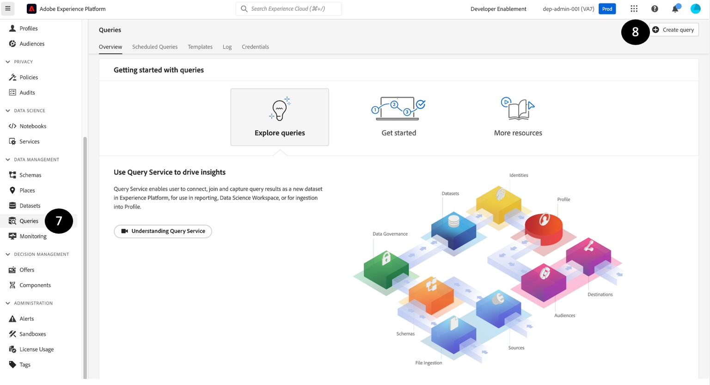

# Verificación y validación

## Previsualización del conjunto de datos

1. Haga clic en **Conjuntos de datos**
1. **Busque** y **haga clic** en el nombre del conjunto de datos que ha creado.


1. Haga clic en **Vista previa del conjunto de datos** en la esquina superior derecha


1. **Verificar** y **validar** los mismos registros que ha ingerido al hacer clic en el panel izquierdo que muestra la jerarquía de esquema.


>[!NOTE]
>
>**Vista previa del conjunto de datos** solo mostrará las primeras filas del conjunto de datos. Los objetos de matriz no son visibles.


## Query dataset

1. **Cerrar** la vista previa
1. En la pantalla Conjunto de datos, haga clic en el icono Copiar de **Nombre de tabla**. En la pantalla de ejemplo siguiente, el nombre de tabla es `customer_account_sm`


1. Vaya a la sección **Consultas**

1. Haz clic en **Crear consulta**




1. Activar o desactivar **Editor de consultas mejorado**


1. Copie y pegue la siguiente consulta SQL en **Editor**. Recuerde reemplazar `<table_name>` con el valor que obtuvo en el paso 2.

```sql
SELECT * FROM <table_name>
```


1. Presione el botón **Reproducir**.

1. **Vista previa** de los resultados.

1. Ejecute también la siguiente consulta SQL para recuperar el esquema XDM junto con los datos:

```sql
SELECT to_json(shippingAddress) FROM <table_name>
```


1. Para tener acceso a los datos del `postalCode` **nodo**, puede escribir:

```sql
SELECT shippingAddress.postalCode FROM <table_name>
```

>[!TIP]
>
>¡Felicidades!  Ha ingerido y creado correctamente un conjunto de muestras de perfiles de clientes en tiempo real
