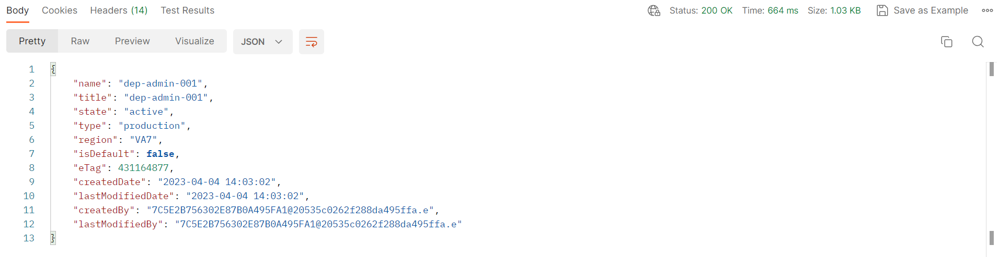

# Acceso a zona protegida

Antes de continuar, compruebe que su acceso sea legítimo. Siga estos pasos:

1. Abra la carpeta `Check Sandbox Access` y haga clic en la llamada `Retrieve Your Sandbox`
1. A continuación, en la esquina superior derecha de Postman, verá un cuadro desplegable Entorno.  Asegúrese de seleccionar el entorno `AEP Bootcamp`
1. Ejecute la llamada haciendo clic en el botón `Send`

Una respuesta correcta tiene este aspecto:

>[!NOTE]
>
>El valor **name** debe coincidir con la variable sandbox\_name de su entorno de Postman

>[!TIP]
>
>¡Felicidades!  Está listo para empezar a usar las API de Experience Platform
