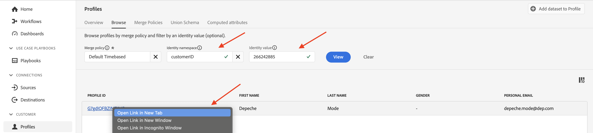

# Combinar políticas

## ¿Qué pasa?

Las políticas de combinación se ven en el Visor de perfiles cada vez que se busca un perfil (probablemente no se haya dado cuenta de que ha hecho algo)

Una política de combinación hace dos cosas:

1. Proporciona las instrucciones para ensamblar los fragmentos dentro del almacén de perfiles (es decir, la vinculación de identidad). Hay dos opciones:
   - Utilice el gráfico de identidad (es decir, el servicio de identidad)
   - No utilice el gráfico de identidad (es decir, confíe solo en la identidad proporcionada para encontrar fragmentos de perfil almacenados de forma similar)
1. Indica al servicio de perfil cómo resolver conflictos de campos dentro de los conjuntos de datos basados en la clase XDM Individual Profile cuando un campo puede provenir de varios conjuntos de datos (es decir, del método Merge). Hay dos opciones:
   - Prioridad de marca de tiempo: utilice el registro más reciente de todos los conjuntos de datos como el conjunto de datos verdadero y permita que todos los demás registros rellenen los huecos en orden de reciente a más antiguo
   - Prioridad de conjuntos de datos: elija qué conjuntos de datos de perfil individual XDM se pueden utilizar para formar el perfil y en qué orden ensamblarlos

>[!NOTE]
>
>Cuando se elige el método de combinación de Prioridad de conjuntos de datos, puede elegir qué conjuntos de datos de Perfil individual XDM y Evento de experiencia XDM pueden utilizarse en la formación del perfil.
>
>El método de combinación Marca de tiempo prioridad SIEMPRE utiliza todos los conjuntos de datos

>[!WARNING]
>
>Cada zona protegida requiere al menos una política de combinación marcada como **predeterminada** para que la segmentación y el perfil funcionen

>[!NOTE]
>
>Muchas veces diseñamos para que no tengamos que utilizar una política de combinación personalizada que utilice la prioridad del conjunto de datos.
>
>- En lugar de tener varios conjuntos de datos que registren el mismo campo, les damos nombres únicos, por ejemplo:
>  - Nombre - CRM
>  - Nombre - Fidelidad
>  - Nombre: formulario web
>- Esto permite a un experto en marketing elegir qué fuente de datos+campo utilizar en lugar de que el sistema elija uno automáticamente en función de un conjunto de reglas que puede que no entiendan y posiblemente eligiendo campos del perfil de un origen y otros campos de otro sin comprender que esto está ocurriendo.
>- Para nuestro modelo de datos no es necesario resolver ningún conflicto de campos, por lo que no se necesita una política de combinación personalizada

Para comprender mejor cómo funcionan las políticas de combinación con el gráfico de identidad, debe crear uno que no utilice el gráfico de identidad para la vinculación de ID.

## Crear una política de combinación sin unión

Cree una política de combinación que no utilice el gráfico de ID para poder ver su comportamiento con la formación del perfil.

## Crear

1. Haz clic en **Perfiles** en el carril izquierdo
1. Haz clic en **Políticas de combinación** en la barra de navegación superior
1. Haz clic en **Crear política de combinación** cerca del extremo derecho de la pantalla

## Configurar

Ahora debe configurar las políticas de combinación.  Introduzca la siguiente información:

| Configuración | Valor |
| --------------------------- | --------------- |
| Nombre | Sin vinculación de ID |
| Vinculación de ID | Ninguno |
| Política de combinación predeterminada | Desactivado |
| Política de combinación activa en Edge | Desactivado |

Cuando termine, haga clic en **Siguiente**

## Seleccionar conjuntos de datos de perfil

1. Para el método Merge, seleccione **Marca de tiempo solicitada**
1. Haga clic en **Siguiente**

## Seleccionar conjuntos de datos de Experience Event

Recuerde que si selecciona la marca de tiempo solicitada para el método de combinación, estará diciendo al servicio de perfil que todos los conjuntos de datos basados en la clase XDM Individual Profile y Experience Event participan en la formación del perfil.

Por lo tanto, simplemente puede hacer clic en **Siguiente**, ya que no hay nada que hacer en este paso.

## Revisar

En el último paso puede ver una previsualización de la configuración que ha elegido y perfiles de muestra que muestran la política de combinación en acción.

Haga clic en el botón **Finalizar** para crear la política de combinación

## Métodos de combinación en acción

Recuerde que el gráfico de identidad del perfil, Depeche Mode, se parecía a la siguiente captura de pantalla. Para comprender cómo funciona el servicio de perfil, es mejor ignorar el uso de este gráfico de identidad durante el proceso de ensamblado.

## Comparar mediante correo electrónico

Continúe y abra el visor de perfiles siguiendo los pasos siguientes:

1. Haga clic en **Perfiles** en el carril izquierdo y, a continuación, en la barra de navegación superior, seleccione **Examinar**
1. Seleccione el área de nombres de identidad de **Correo electrónico**
1. Escriba el valor de identidad de **depeche.mode\@dep.com**
1. Haz clic en el botón **Ver** para buscar el perfil
1. Haga clic en el **vínculo** al perfil para ver los detalles del perfil

   

   Realice otra búsqueda del perfil Modo Depeche, pero esta vez con la política de combinación **Sin vinculación de ID**.

1. Haga clic con el botón derecho en **Perfiles** en el carril izquierdo y, a continuación, seleccione **abrir en una nueva pestaña**
1. En la barra de navegación superior, seleccione **Examinar**
1. Seleccione la política de combinación de **Sin vinculación de ID**
1. Seleccione el área de nombres de identidad de **Correo electrónico**
1. Escriba el valor de identidad de **depeche.mode\@dep.com**
1. Haz clic en el botón **Ver** para buscar el perfil
1. Haga clic en el **vínculo** al perfil para ver los detalles del perfil

Al comparar ambas vistas del perfil debería notar que son muy diferentes. Faltan algunos atributos e identidades en la versión que usa la política de combinación **Sin vinculación de ID**.

Si observa los eventos de cada perfil verá que el perfil que utiliza la política de combinación **Sin vinculación de ID** solo contiene un evento, mientras que la otra versión contiene todos los eventos.

El evento único de la versión sin vinculación de ID del perfil se debe a que ese evento se almacena con la identidad principal de &quot;personalEmail.address&quot;.

>[!NOTE]
>
>Recuerde que cuando se utiliza un método de combinación que no utiliza el perfil del gráfico de identidades, solo se basará en la identidad proporcionada para encontrar fragmentos de perfil almacenados de forma similar.

## Comparar con customerID

Puede ver los distintos fragmentos del perfil Modo profundo utilizando algunas de las otras identidades del gráfico.  Intente buscar el mismo perfil de nuevo con la política de combinación sin vinculación de ID, pero esta vez con el área de nombres customerID y el valor proporcionados a continuación:

| Área de nombres de identidad | Valor |
| ------------------ | --------- |
| customerID | 266242885 |

**Preguntas que hacerse**

Pregunta: ¿Nota algo sobre los atributos? No hay ninguno, ¿por qué?

Respuesta: Ha cargado atributos utilizando el correo electrónico como identidad principal

Pregunta: ¿Nota algo sobre los eventos?

Respuesta: Los únicos eventos que se muestran son los que tienen customerID como identidad principal

## Comparar con GAID

Intente volver a buscar el mismo perfil con la política de combinación sin vinculación de ID, pero esta vez utilice el área de nombres y el valor GAID que se proporcionan a continuación:

| Área de nombres | Valor |
| --------- | ----------- |
| GAID | 266242-9013 |

**Pregunta para hacerse**

Pregunta: No se han encontrado perfiles. ¿Qué está pasando? ¿Por qué no se encuentran perfiles? Respuesta: No hay fragmentos de perfil almacenados que utilicen ese valor GAID como identidad principal

## Perfil + Identidad

Sinopsis rápida:

- El almacén de perfiles contiene fragmentos de perfil almacenados mediante la identidad principal
- El gráfico de identidad contiene las relaciones entre dos (2) o más identidades basadas en personas

Cuando se utiliza el gráfico de identidad con el almacén de perfiles, se puede considerar como una forma de dar instrucciones para encontrar los fragmentos de perfil adecuados y tratar cada valor de identidad en el gráfico de identidad como identidades principales.

Sin el gráfico de identidad, el almacén de perfiles solo puede recuperar fragmentos de perfil mediante un único identificador (es decir, identidad principal)

>[!TIP]
>
>**Tengan tiempo adicional y deseen experimentar...:**
>
>- Busque otros perfiles en la interfaz de usuario que conozca que tengan dos identidades
>- Ver cómo se almacenan algunos eventos en un fragmento pero no en otro
>- Ver cómo se almacenan algunos atributos de perfil en un fragmento pero no en otro
>- Vaya a un perfil que ya haya buscado y vuelva a buscarlo con la política de combinación **Sin vinculación de ID**.  Observe la diferencia
