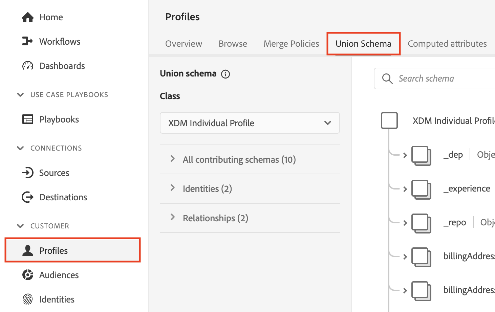
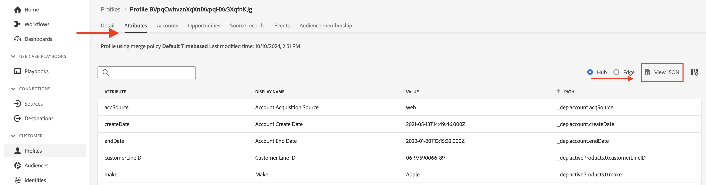
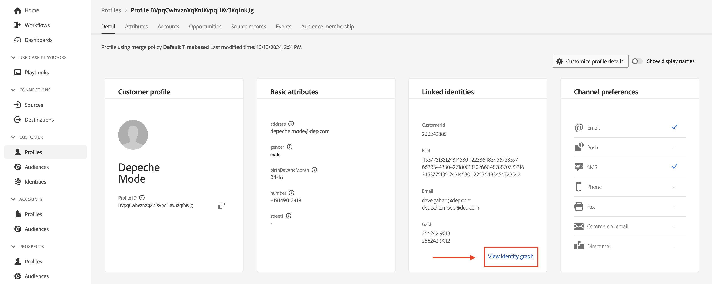
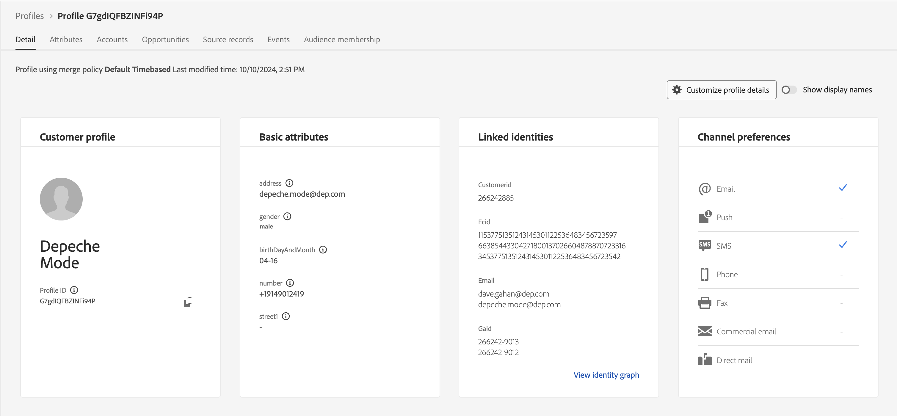

# Conceptos básicos del perfil

## Esquema de unión de perfiles

Recuerde que la vista de cualquier perfil del cliente en tiempo real se crea utilizando los esquemas definidos y habilitados para el perfil. Esto es lo que Adobe denomina Esquema de unión del perfil.

Puede ver el esquema de unión del perfil haciendo lo siguiente:

1. Haz clic en **Perfiles** en el carril izquierdo
1. Haga clic en **Esquema de unión** en la barra de navegación superior



>[!NOTE]
>
>Recuerde que el perfil crea una vista de unión para cada clase XDM. Utilice esta vista para ver qué esquemas contribuyeron a qué clase, las identidades dentro de cada clase y cualquier relación.

Revise el esquema de unión para la clase de perfil individual XDM y expanda el área de nombres de inquilino. Aquí debería ver una serie de elementos procedentes de varios esquemas definidos en **LID Methodology** y **XDM Modeling Labs.**


Haga clic en el objeto **account** y observe lo que aparece en el carril derecho de la pantalla. Ahora puede ver los detalles alrededor del objeto, qué esquema(s) y conjunto(s) de datos contribuyeron a su formación y otra información relevante.


>[!NOTE]
>
>El esquema de unión es una buena herramienta para comprender por qué existen ciertos elementos dentro de un perfil y de dónde proceden.
>
>Tenga en cuenta que el esquema de unión es observable, lo que significa que el perfil solo muestra campos que contienen datos al ver un perfil de cliente en tiempo real


## Búsqueda de perfiles

1. Haga clic en **Perfiles** en el carril izquierdo y, a continuación, en la barra de navegación superior, seleccione **Examinar**
1. Seleccione el área de nombres de identidad de **Correo electrónico**
1. Escriba el valor de identidad de **depeche.mode\@dep.com**
1. Haz clic en el botón **Ver** para buscar el perfil
1. Haga clic en el **vínculo** al perfil para ver los detalles del perfil

")


¡Deberías ver esto ahora!


Tómese un minuto para explorar el perfil, Modo Depeche, mirando cada pestaña en la barra de navegación superior. Estas son las pestañas que utilizará:

- Detalle: muestra tarjetas personalizadas que muestran varios aspectos del perfil determinado
- Atributos: muestra todos los atributos asociados para el perfil determinado procedentes del esquema de unión
- Eventos: muestra todos los eventos asociados para el perfil determinado procedentes del esquema de unión
- Pertenencia a la audiencia: muestra las audiencias a las que pertenece actualmente el perfil

## Ver atributos

Vaya a la pestaña **Atributos** y haga clic en **Ver JSON**



Consulte cómo aparecen los campos procedentes de los grupos de campos que ha añadido al esquema de cuenta de cliente.

- Busque el nodo principal denominado **entity**
- Observe el objeto secundario **billingAddress** (procede del grupo de campos Datos de contacto personal)

```json
"billingAddress": {
  "postalCode": "11355",
  "city": "New York City",
  "state": "NY",
  "street1": "108 Ruskin Terrace"
}
```

Compare esto con lo que tiene el esquema de unión de perfiles y debería encender lo que observable significa 😄

```json
"billingAddress": {
    "_repo": {
        "createDate": "datetime",
        "modifyDate": "datetime",
    },
    "_schema": {
        "description": "string",
        "elevation": "double",
        "latitude": "double",
        "longitude": "double"
    },
    "_id": "string",
    "city": "string",
    "country": "string",
    "countryCode": "string",
    "createdByBatchID": "string",
    "dmaID": "integer",
    "label": "string",
    "lastVerifiedDate": "date",
    "modifiedByBatchID": "string",
    "msaID": "string",
    "postOfficeBox": "string",
    "postalCode": "string",
    "primary": "boolean"
    "region": "string",
    "repositoryCreatedBy": "string",
    "repositoryLastModifiedBy": "string",
    "state": "string",
    "stateProvince": "string",
    "status": "string",
    "statusReason": "string"
    "street1": "string",
    "street2": "string",
    "street3": "string",
    "street4": "string"
}
```

>[!NOTE]
>
>Un esquema observable significa literalmente mostrar solo los campos donde existen datos y ocultar los campos que no contienen datos.  Muy diferente a la base de datos relacional tradicional!


Siguiente búsqueda del objeto **consentimientos** (proveniente del grupo de campos Detalles de consentimiento y preferencia)

```json
"consents":{
   "marketing":{
      "sms":{
         "val":"y"
      },
      "email":{
         "val":"y"
      }
   }
}
```


Desplácese hacia abajo hasta el espacio de nombres del inquilino **\_devbc** y busque el objeto **plan** (que procede de un grupo de campos creado a medida llamado &#39;dep: Detalles del plan&#39;)

```json
"plan": {
    "planID": "m3",
    "type": "mobile",
    "name": "pro"
}
```


Observe el objeto **aggregates** que definió para el caso de uso de ampliación de venta. Estos campos también se encuentran en el espacio de nombres de inquilino \_devbc. Provienen de un esquema diferente (profundo: Agregados del cliente) y de un grupo de campos personalizados (profundo: Agregados)

```json
"aggregates":{
   "rollingSixMonthAvgMonthlyDataUsage":30,
   "rollingSixMonthTotalDataUsage":200
}
```

## Ver mapa de identidad

También puede ver las identidades asociadas de un perfil tal como están almacenadas en un objeto basado en asignaciones denominado **identityMap.** Busque **identityMap** cerca de la parte inferior del documento JSON.

Es una representación de todas las identidades que ha pasado, independientemente de si ha utilizado el campo identityMap o ha marcado un campo con un descriptor de identidad.

```json
"identityMap": {
  "ecid": [{
          "id": "34537751351243145301122536487445728054"
      },
      {
          "id": "66385443304271800137026604878870723316"
      },
      {
          "id": "34537751351243145301122536483456723542"
      }
  ],
  "email": [{
          "id": "dave.gahan@dep.com"
      },
      {
          "id": "depeche.mode@dep.com"
      }
  ],
  "customerid": [{
      "id": "266242885"
  }],
  "gaid": [{
          "id": "266242-9013"
      },
      {
          "id": "266242-9012"
      }
  ]
}
```

>[!NOTE]
>
>Tenga en cuenta que no hay referencia al concepto de &quot;identidad principal&quot; dentro del identityMap. La razón de esto es doble:
>
>1. El identityMap que ve en los atributos de perfil se crea para cada perfil con el gráfico del servicio de ID\*
>2. El gráfico de identidad solo se preocupa por las relaciones entre identidades. Cada identidad se trata de la misma manera. A está relacionado con B y no importa si fue a través de una identidad principal, identidad de la persona, etc.
>
>*\* Si no se usa ningún gráfico de identidad, el identityMap está compuesto únicamente por la identidad solicitada en la búsqueda*

>[!NOTE]
>
>Cuando creó el esquema de cuenta de cliente solo tenía un campo de correo electrónico marcado como identidad (es decir, personalEmail.address). ¿Se ha dado cuenta de que el identityMap tiene dos direcciones de correo electrónico?
>
>¿Qué está pasando?
>
>- Identity Graph registra constantemente nuevas relaciones y los valores dentro de esas relaciones a medida que los datos fluyen a su servicio
>- El comportamiento del perfil es sobrescribir los valores de campo existentes con nuevos valores a medida que se incorporan los datos en su servicio
>- Cuando marca un campo con un descriptor de identidad, sigue siendo un campo para Perfil


## Gráfico de identidad

Vaya de nuevo a la pestaña **Detail** en la barra de navegación superior y haga clic en el vínculo **View Identity graph** que se encuentra en la parte inferior de la tarjeta **Linked identities**



Ahora debería ver esta pantalla.


La vista anterior es el gráfico de identidad del perfil Depeche Mode y se divide en tres (3) áreas clave:

**Visualizador de gráficos de identidad**: muestra las identidades y sus relaciones asociadas dentro del clúster de identidad de perfiles

**Detalles del gráfico de identidad**: proporciona detalles específicos sobre las áreas de nombres, los valores y las fuentes de datos del gráfico de identidad general que crearon todas las relaciones que se ven dentro del visualizador de gráfico de identidad

**Detalles de identidad seleccionados**: muestra información detallada sobre la identidad seleccionada junto con los últimos cinco (5) lotes en los que se procesó esa identidad en una relación

>[!NOTE]
>
>El visor de gráficos de identidad muestra tanto las relaciones entre todas las identidades como la información sobre la última vez que se vio la relación de identidad y desde qué conjunto de datos


Vea el gráfico de identidad del modo profundo utilizando la identidad customerID en su lugar.  Realice las siguientes acciones:

1. Copie y guarde el **customerID** en algún lugar.
1. Cambie el valor del área de nombres en el cuadro Área de nombres de identidad a **customerID**
1. Pegue el valor **customerID** que guardó desde el paso anterior
1. Haga clic en el botón **Ver** para ver el gráfico de identidades que contiene esta identidad con el nuevo valor de identidad


>[!NOTE]
>
>Observe cómo ve exactamente el mismo gráfico de identidad. Cualquier identidad que utilice de este gráfico siempre resultará en el mismo resultado


## Cambio de identidades

Vuelva al Visor de perfiles y busque ahora Modo profundo con el customerID

1. Cambiar el área de nombres de identidad a **customerID**
1. Actualice el valor Identity utilizando el valor customerID guardado en la última sección
1. Haga clic en el botón **Ver**


Debería ver el mismo perfil que acaba de ver anteriormente.



>[!NOTE]
>
>El gráfico de identidad garantiza que cualquier identidad que utilice tenga el mismo perfil al combinar los distintos fragmentos de perfil
