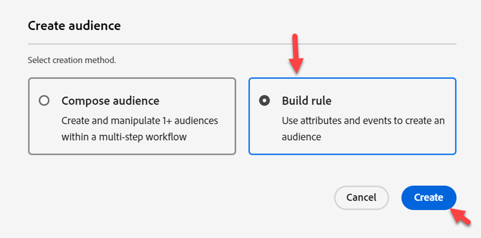

# Crear audiencia de Edge

Esta audiencia se utilizará para clasificar a alguien cuando una carga útil (por ejemplo, la vista de página) proviene del cliente (por ejemplo, Web SDK) a Edge.

>[!NOTE]
>
>En general, evaluamos una audiencia en Edge para que podamos revertirla y utilizarla en Personalization. Si no utilizamos Personalization en Edge, solo podemos hacer que la audiencia se evalúe como Transmisión en el concentrador.

## Crear audiencia

1. En el carril izquierdo, haga clic en Audiencias
1. A continuación, haga clic en Crear audiencia en la esquina superior derecha de la pantalla
1. A continuación, haga clic en Generar regla

## Convertir audiencia en reglas

1. Vaya a **Audiencias** y haga clic en la carpeta **Experience Platform**
1. Arrastre y suelte la audiencia denominada **dep: Cualquier flujo de eventos (dentro de la hora)** en el lienzo

1. Convierta la audiencia a un conjunto de reglas en el lienzo haciendo clic en el **icono** que se muestra a continuación y, a continuación, haga clic en **Convertir**

## Actualización de reglas de eventos

Realice los siguientes cambios en las reglas de evento (puede que necesite expandir el evento para verlo)

1. En última instancia
1. 15
1. Minutes

## Publicar segmento

1. Actualizar el nombre del segmento a **Any Event Edge (en 15 minutos)**
1. Actualizar el método de evaluación a Edge
1. Publicación del segmento

## Crear segmento evaluado por lotes

Repita los mismos pasos que acaba de realizar para el segmento de Edge que ha creado, pero utilice la siguiente información en su lugar:

>[!NOTE]
>
>Se creará una audiencia por lotes para que pueda ver que, aunque se pase un evento a Edge, las audiencias guardadas como evaluación por lotes no se evalúan de forma de flujo continuo.

Reglas de evento:

- En última instancia
- 1
- Día

Detalles del segmento:

- Nombre -> **Cualquier lote de eventos (en 1 día)**
- Método de evaluación -> Lote
