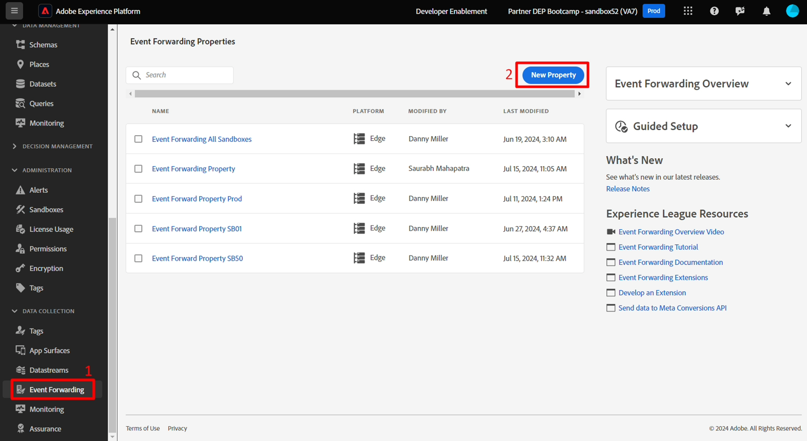
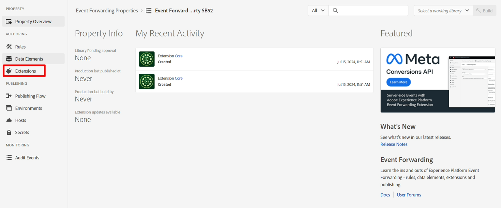
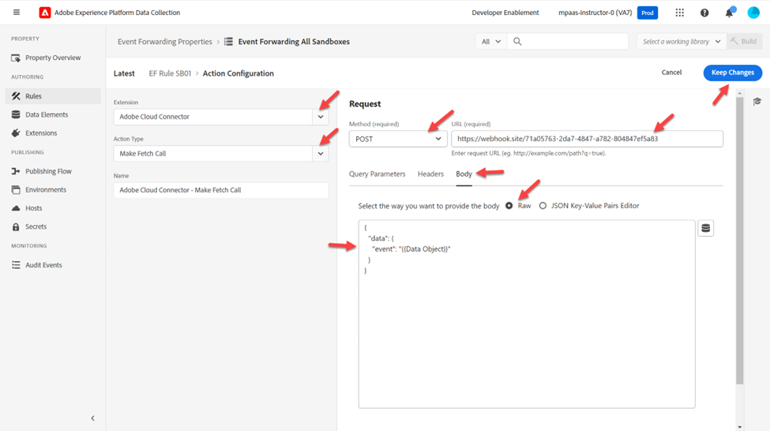

# Crear propiedad

Normalmente, queremos reenviar un evento de experiencia a un tercero (aunque no tiene por qué serlo). Esto se utiliza generalmente cuando se necesita una copia de un evento en tiempo real para notificar a un tercero en circunstancias específicas (por ejemplo, notificar a Google, Meta o TikTok una compra).

>[!NOTE]
>
>Recordatorio: una propiedad contiene todas las extensiones, elementos de datos y reglas necesarias para decidir qué se reenvía y hacia dónde

1. En el carril izquierdo, haga clic en Reenvío de eventos
2. A continuación, haga clic en Nueva propiedad

   

3. Actualice el nombre de la propiedad mediante la fórmula siguiente: `Event Forward Property SB + [sandbox number]`. El nombre final tendría este aspecto: **Propiedad de reenvío de eventos SB01**

4. Haga clic en **Guardar** cuando haya terminado


## Instalar extensión

1. Haga clic en la propiedad de reenvío de eventos que acaba de crear

   


2. Debería ver una pantalla como la siguiente.  Haz clic en **Extensiones**.

   


3. Instale la extensión Adobe Cloud Connector haciendo lo siguiente:

4. Haz clic en **Catálogo** en la barra de navegación superior
5. Haga clic en la tarjeta **Conector de Adobe Cloud**
6. En el carril derecho, haga clic en el botón **Instalar**


Después de hacer clic en Instalar, debe ver la extensión debajo de Extensiones instaladas para su propiedad, como se muestra a continuación


## Crear elemento de datos

>[!NOTE]
>
>Un elemento de datos hace referencia al evento entrante y puede analizarlo en varios componentes individuales si es necesario

1. En el carril izquierdo, haga clic en **Elementos de datos**


   


2. Haga clic en el botón **Crear nuevo elemento de datos**

   


3. Configure el nuevo elemento de datos con la siguiente información:

   | Tipo de elemento | Valor para configurar |
   | ----------------- | ------------------ |
   | Nombre | Objeto de datos |
   | Extensión | Núcleo |
   | Tipo de elemento de datos | Código personalizado |

   


4. Haga clic en el botón **Abrir editor** para agregar el siguiente código personalizado:

   


5. Agregue código personalizado al editor como tal y guárdelo

   ```none
   var xdm = arc?.event || '';
   return xdm;
   ```

   

   >[!NOTE]
   >
   >Esto captura todo el objeto xdm sin hacer ninguna traducción a la carga útil.  Si es necesario, podríamos analizar cada fragmento individual dentro del objeto XDM (por ejemplo, nombre de página, cantidad de compra) en un elemento de datos por campo.  La razón para hacerlo podría ser si hay una transformación de la estructura a una estructura diferente


6. Haga clic en el botón **Guardar** para guardar el elemento de datos.


Cuando haya terminado, debería ver la siguiente pantalla que confirma que se ha agregado el elemento de datos:


## Creación de reglas

>[!NOTE]
>
>Una regla contiene:
>
>1. Condiciones sobre qué reenviar
>2. Acciones que pueden transformar la carga útil y definir adónde enviarla


1. En el carril izquierdo, haga clic en **Reglas**

   


2. Luego haz clic en **Crear nueva regla**

   


3. Actualice el nombre de la regla con la fórmula siguiente: `"EF Rule SB" + [your sandbox number]` (es decir, la regla EF SB01). Puede encontrar el número de la zona protegida en la parte superior derecha de la ventana del explorador, como se muestra a continuación\...

   

4. Haga clic en **Guardar** cuando haya terminado

   >[!NOTE]
   >
   >Asegúrese de que el nombre de la regla sigue el patrón de fórmula de `"EF Rule SB" + [sandbox number]`

   


5. Añada una acción a la regla haciendo clic en el signo (+) para añadir una nueva acción


## Obtener URL del webhook (para usar en acción)

>[!NOTE]
>
>Este laboratorio utiliza un webhook para que puedas ver si los datos han llegado al destino al que los estás enviando. En un escenario del mundo real, debería iniciar sesión en ese destino y utilizar sus herramientas para ver lo que ha llegado.


1. Abra el siguiente vínculo en una nueva pestaña del explorador -> [https://webhook.site](https://webhook.site/)
2. Copie la dirección URL única que ve y guárdela en un lugar seguro

   


3. Configure la acción con la siguiente información:

| Configuración | Valor |
| ----------- | ------------------------------------------------------------------------------------------------------------------------------------------------------------------- |
| Extensión | Conector de Adobe Cloud |
| Tipo de acción | Hacer llamada de recuperación |
| Método | Publicar |
| URL | Utilice la misma URL de webhook que utilizó al configurar el destino de streaming. Puede encontrarlo abriendo una nueva pestaña en el navegador y navegando hasta Destinos -> Examinar |
| Cuerpo | Raw |
| Datos del cuerpo | \{ &quot;data&quot;: \{ &quot;event&quot;: &quot;\{\{Data Object\}\}&quot; } } |

>[!NOTE]
>
>Aquí se hace referencia al \{\{Data Object\}\} que es el elemento de datos que ha creado anteriormente. En este caso, el requisito del sistema descendente era que deseara envolver el evento en un objeto de datos con un objeto de evento. Puede poner cualquier formato aquí.
>
>Si hubiéramos dividido \{\{Data Object\}\} en varios campos (por ejemplo, nombre de página, compra, etc.), podríamos transformar la estructura JSON colocando cada campo en el lugar deseado, lo que nos daría más control sobre la coincidencia del destino.


Cuando termine, valide la pantalla que se parece a la que se muestra a continuación y haga clic en **Conservar cambios**




&#x200B;4. Cuando termine, debería ver la acción agregada a la regla. Haga clic en **Guardar** para continuar.


>[!WARNING]
>
>Al enviar un evento de experiencia, está enviando el evento, no el perfil, ni ninguno de sus atributos, incluidas las cualificaciones de audiencia (aunque se trate de una audiencia de Edge).
>
>Esto sucede por motivos de velocidad.


## Publicación de los cambios

1. En el carril izquierdo, haga clic en **Flujo de publicación**

   


2. Haga clic en el botón **Agregar biblioteca**

   


3. Configure la biblioteca con la siguiente información:

   - Nombre -> **Biblioteca EF**
   - Entorno -> **Desarrollo**
   - Haz clic en **Añadir todos los recursos modificados**


   Cuando termine, la pantalla debería ser similar a la de abajo.  Si todo parece correcto, haga clic en el botón **Guardar y generar en desarrollo**

   


4. Luego debería ver que la compilación de desarrollo se vuelve verde indicando que está lista para usarse


