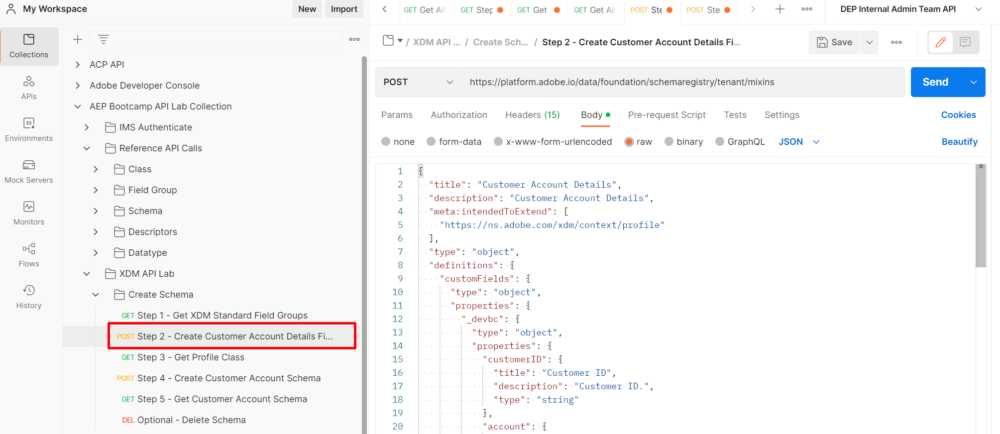
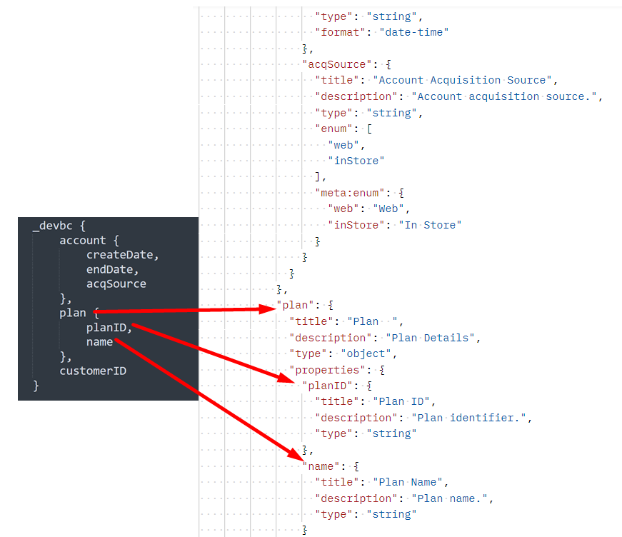

# Crear grupos de campos personalizados

## Estructura del grupo de campos

Un grupo de campos siempre está compuesto por los siguientes campos. Esto se ve en la solicitud de en el siguiente paso.

| Valores requeridos | Descripción |
| --------------------------- | ---------------------------------------------------------------------------------------------------------------------------------------------------------------------------------------------- |
| title | El nombre del grupo de campos que desea crear en el registro de esquema. Observe que el nombre DEBE SER ÚNICO. |
| description | Breve descripción sobre el propósito del grupo de campos |
| type | Siempre es un objeto |
| meta\:intendedToExtend | Define con qué clases se puede utilizar el grupo de campos. Siempre se hace referencia a las clases por su valor `$id` |
| allOf | Describe los recursos que se pueden incluir en el grupo de campos. Para los campos definidos personalizados la ruta siempre es `#/definitions/customFields` |
| definitions.customFields... | Esta es la estructura de esquema JSON predeterminada necesaria para crear grupos de campos personalizados. Debe coincidir con el `allOf` de arriba |
| \&lt;TENANT\_NAME> | El nombre del inquilino (es decir, un nombre único) se crea durante el proceso de aprovisionamiento. Esto garantiza que las personalizaciones realizadas no entren en conflicto con los cambios existentes o futuros del Registro del esquema de Adobe |

## Crear grupo de campos Detalles de cuenta de cliente

1. Haga clic en la llamada de API `Step 2 - Create Customer Account Details Field Group` de la solicitud en la carpeta `XDM Schema Lab -> Create Schema`

Revise el cuerpo de la solicitud antes de ejecutarla. Tenga en cuenta que los campos obligatorios mencionados en la sección Estructura del grupo de campos aparecen así:

>[!NOTE]
>
>Observe cómo en la imagen de la derecha encima de `allOf` se hace referencia a la ruta de &quot;/definitions/customFields&quot;.  Debe coincidir con la estructura definida en el esquema (imagen de la izquierda), ya que indica al sistema XDM dónde localizar los objetos creados personalizados.
>
>

Observe también cómo cada campo específico de la hoja de asignación se corrobora dentro de la estructura JSON de XDM.

2. Actualice `title` y `description` para el grupo de campos con el siguiente formato: `Customer Account Details - Sandbox <your number here>`

3. Ejecute haciendo clic en el botón `Send`.  Debería ver una respuesta similar a la captura de pantalla siguiente.

4. Copie el valor `$id` del grupo de campos Detalles de cuenta de cliente recién creado.

>[!WARNING]
>
>No continúe hasta que haya guardado `$id` en algún lugar.  Se requerirá más adelante para crear el esquema de cuenta de cliente
>
>
