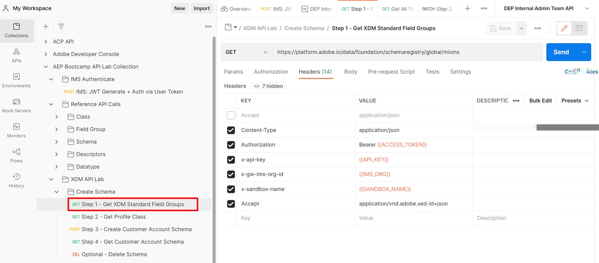

# Obtener grupos de campos estándar

>[!NOTE]
>
>Anteriormente, se hacía referencia a **&quot;Grupo de campos&quot;** como **&quot;Mixin&quot;**, por lo que estos términos se pueden usar indistintamente en todas las solicitudes y guías de API.

## Solicitar grupos de campos estándar XDM

1. Haga clic en la llamada de API `Step 1 - Get XDM Standard Field Groups` en la carpeta `XDM Schema Lab -> Create Schema`
1. Ejecute la llamada haciendo clic en el botón `Send`

**Solicitud**

>[!NOTE]
>
>Tenga en cuenta el uso del valor `global` en la siguiente dirección URL de solicitudes:
>
>https\://platform.adobe.io/data/foundation/schemaregistry/**global**/mixins
>
>`global` se usa para solicitar solo componentes estándar de XDM (grupo de campos/mezcla en este caso). Existen dos tipos de propietarios en el registro XDM de Experience Platform: Adobe e Inquilino (es decir, personalizado).
>
>- Los objetos creados por Adobe siempre utilizan la palabra `global` en cualquier solicitud de búsqueda o lista XDM
>- Los objetos creados por el inquilino (es decir, personalizados) siempre utilizan la palabra `tenant` en cualquier lista XDM o llamada de búsqueda

**Respuesta**

## Identificación de grupos de campos estándar XDM necesarios

Un esquema siempre está compuesto por uno o más grupos de campos y una clase.  Para el esquema Perfil individual de Connection 5G, busque los grupos de campos XDM estándar necesarios para el esquema.

- Datos demográficos
- Datos personales de contacto
- Detalles de consentimiento y preferencia

1. Busque el grupo de campos `Demographic Details` en la respuesta de la llamada
1. Copie el `$id` del grupo de campos y guárdelo en algún lugar para referencia futura
1. Repita los pasos 1 y 2 para los otros dos grupos de campos enumerados arriba

>[!WARNING]
>
>No continúe hasta que haya guardado los tres (3) `$ids` en algún lugar.  Se necesitarán más adelante para crear el esquema de cuenta de cliente
