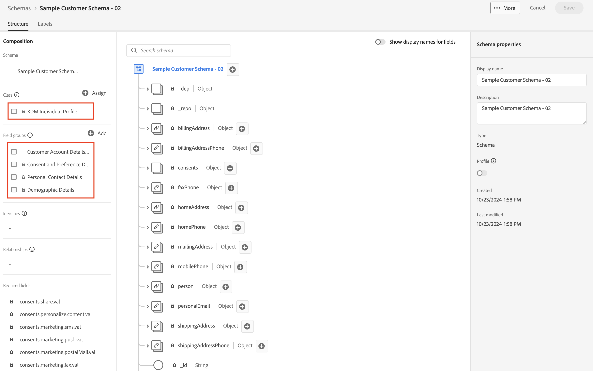
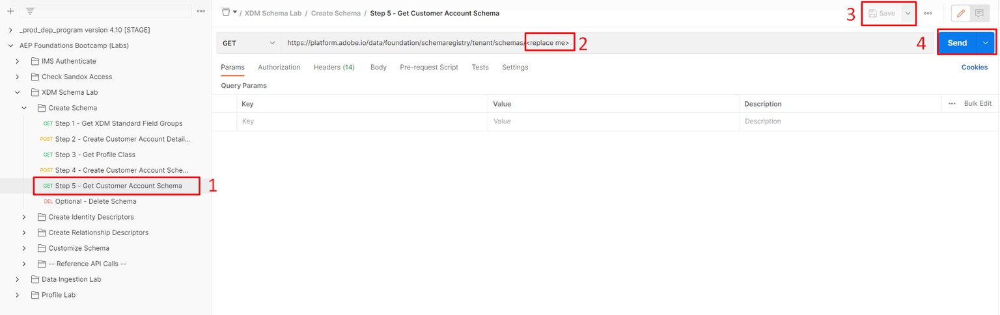

# Ver esquema

## Ver a través de la IU

1. Abra el explorador y vuelva a la sección `Schema -> Browse`.

>[!NOTE]
>
>Actualice la interfaz de usuario para verla, ya que acaba de crearla y debe volver a consultar el registro de esquema

2. Buscar el esquema `Sample Customer Schema - <your sandbox number>`

3. Observe que la clase requerida y los grupos de campos asociados se agregan al esquema

## Ver mediante la API

1. Seleccione la API `Step 5 - Get Customer Account Schema` haciendo clic en ella.
1. En la dirección URL de la solicitud, reemplace `<replace me>` por el `$meta:altId` que guardó de la sección anterior (Crear el esquema) hasta el final de la llamada, como se muestra a continuación
1. Guarde las ediciones que ha realizado en la solicitud
1. Ejecute la solicitud haciendo clic en el botón `Send`

Ejemplo de su solicitud final después de agregar `$meta:altId`

Si ha recibido una respuesta `200 OK`, debería poder examinar el esquema que ha creado a través de la vista de la estructura JSON de XDM

