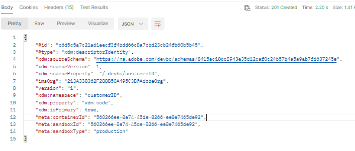

# Crear identidad principal

1. Haga clic en la solicitud de API `Step 1 - Create Primary Identity for Customer Account Schema` en la carpeta `XDM Schema Lab -> Create Identity Descriptors`

   

   >[!CAUTION]
   >
   >Aún no ejecute la solicitud


1. Actualice el valor `xdm:sourceSchema` en el cuerpo de la solicitud utilizando el `$id` que guardó desde el paso de laboratorio [Crear esquema](../build-schema/create-schema.md)

1. Actualizar el valor `xdm:isPrimary` en el cuerpo de la solicitud a `true`

   SOLO EJEMPLO

   ```json
   {
     "@type": "xdm:descriptorIdentity",
     "xdm:sourceSchema": "https://ns.adobe.com/devbc/schemas/8415ac18dd8943e35d12caf0c24b57b4a5a9ab7fd637245e",
     "xdm:sourceVersion": 1,
     "xdm:sourceProperty": "/_devbc/customerID",
     "xdm:namespace": "customerID",
     "xdm:property": "xdm:code",
     "xdm:isPrimary": true
   }
   ```

   >[!NOTE]
   >
   >Recuerde actualizar el nombre de inquilino anterior (\_devbc) con el suyo propio


1. Guarde la solicitud antes de seguir utilizando el botón `Save`

1. Ejecute la API al hacer clic en el botón `Send`. Ahora verá una respuesta `201 Created` como se muestra a continuación



>[!SUCCESS]
>
>¡Felicidades!  Ha creado un descriptor de identidad principal en el esquema
