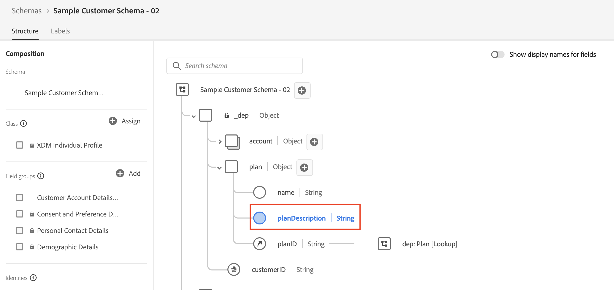
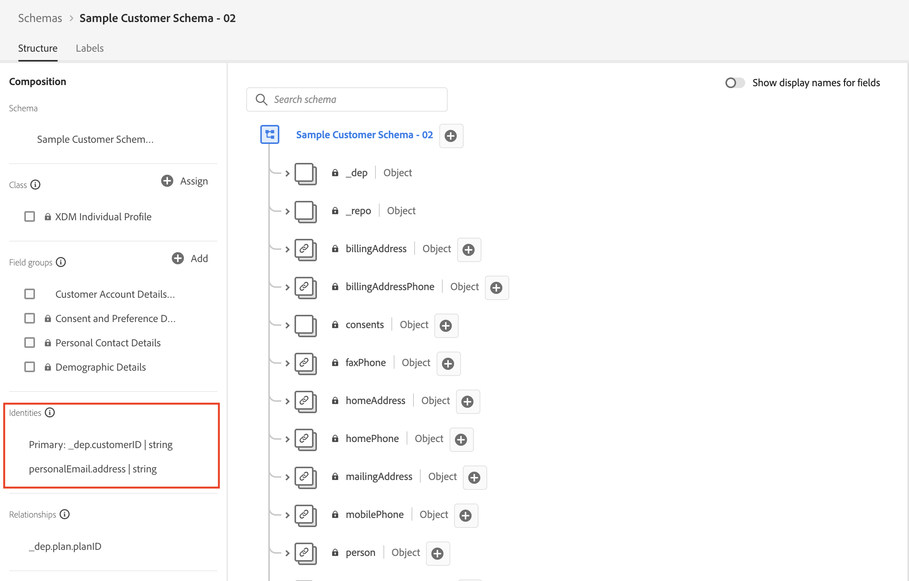

# Resumen

El siguiente vídeo resume cómo ha creado los descriptores de esquema, identidades y relaciones a través de llamadas de API y muestra cómo se utiliza el parche JSON para modificar un esquema.

>[!VIDEO](https://video.tv.adobe.com/v/3459564/?quality=12&learn=on)

>[!TIP]
>
>¡Lo primero es felicitarlo! Crear cosas a través de API no es fácil, pero comprender cómo funciona le ayudará a comprender el sistema en su conjunto. ¡Felicidades!

## Se creó el esquema de cuenta de cliente

Ha creado el esquema por `$ref` tanto los grupos de campos creados por Adobe como su propio grupo de campos creado a medida (es decir, el inquilino).  También `$ref` la clase a la que el esquema debe representar (es decir, XDM Individual Profile)

## El parche JSON cambió el esquema de la cuenta del cliente

Se ha utilizado el método de parche JSON para modificar el esquema de cuenta de cliente y añadir un nuevo campo al objeto de plan. Hizo esto aplicando parches al grupo de campos personalizados `$ref` denominado `Customer Account Details` que definió en [Crear grupos de campos personalizados](build-schema/create-custom-field-groups.md), en lugar de aplicar parches al esquema en sí.

## Campos de identidad marcados

En este paso realizó dos de las mismas llamadas de `POST` para crear `Identity Descriptors` para los campos `_devbc.customerID` y `personalEmail.address` dentro del esquema de cuenta de cliente.

1. El campo `_devbc.customerID` se estableció como la identidad **principal**
1. El campo `personalEmail.address` estaba **no establecido** como principal

## Relación de búsqueda creada

El último paso fue crear la relación entre los esquemas Cuenta del cliente y Plan del XDM ERD en el laboratorio Paper.  Esto requería que creara un descriptor de relación (es decir, cómo relacionar el esquema `Customer Account` con el esquema `dep: Plan [Lookup]`) y un descriptor de identidad de referencia en el esquema de cuenta de cliente.

>[!NOTE]
>
>El descriptor `referenceIdentity` indica al perfil del cliente en tiempo real qué campo del esquema `Customer Account` coincide con qué área de nombres de identidad. Recuerde que cuando defina un esquema de búsqueda debe marcar un campo como identidad principal y asignarle un área de nombres con un tipo de `non-person`.
