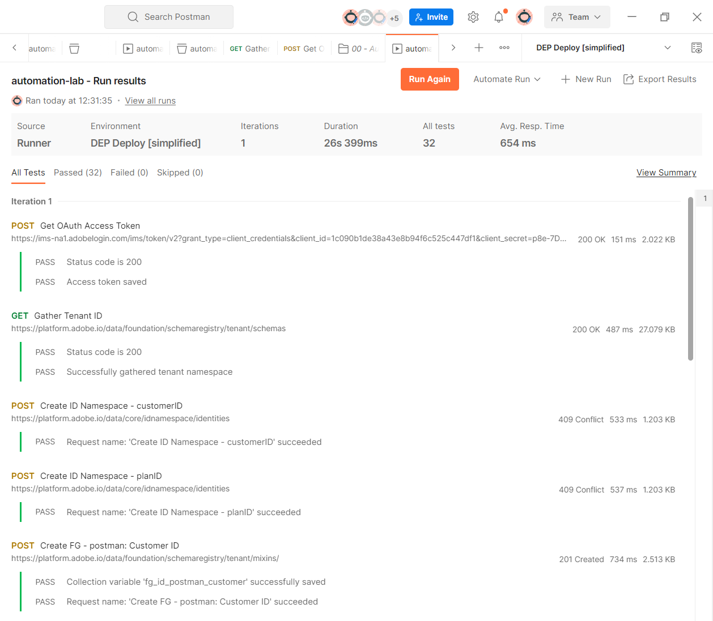

# Automatización con API

## Introducción

Para ver cómo puede automatizar las implementaciones mediante API, ejecute una carpeta de API que cree los siguientes objetos:

- Cuenta de cliente y esquema(s) \[Consulta] de plan
- Grupos de campos que componen los esquemas anteriores
- Descriptores de identidad necesarios para el perfil
- Descriptores de relación y referencia necesarios para crear las relaciones entre la cuenta del cliente y el plan \[Consulta]
- Dos conjuntos de datos que coinciden con cada esquema creado

## Ejecutar la carpeta

1. En Postman, vaya a la carpeta **Automatización con API** dentro de la carpeta **XDM Schema Lab**

1. Haz clic en la carpeta **Automatización con API** y en el área de trabajo haz clic en el botón **Ejecutar**

>[!NOTE]
>
>El botón de ejecución se encuentra en la parte superior derecha de su espacio de trabajo de Postman

1. Debe aparecer una nueva ventana que muestre todas las llamadas de API en la carpeta. Establece **Delay** en **500ms** y luego haz clic en el botón **Ejecutar**.

1. Verá que las llamadas de API comienzan a ejecutarse en orden y, cuando se completen, verá 32 pruebas superadas.

1. Vaya a la interfaz de usuario de Experience Platform y debería ver dos esquemas y dos conjuntos de datos creados y habilitados para el perfil con el prefijo **postman:**

&#x200B;> [!TIP]
>
>¡Felicidades!  Acaba de automatizar la implementación de áreas de nombres de identidad, grupos de campos, esquemas, descriptores de identidad/relación y de habilitar un esquema para el perfil y generar un conjunto de datos utilizando el esquema
