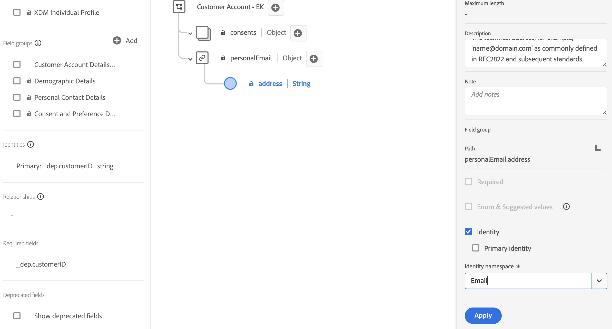

# Configurar para el perfil

## Información general

Para utilizar un esquema para el perfil del cliente en tiempo real, primero debe asegurarse de que está configurado correctamente. Esto significa tomar lo que identificó durante el laboratorio de LID como identidades principales/personales, identidades de relación, etc. y garantizar que esas configuraciones se realicen en cada esquema. Cuando todo esté hecho, puede &quot;voltear el interruptor&quot; y habilitar un esquema para utilizarlo con el perfil.

Al mirar el XDM en papel Conexión 5G ERD, verá la siguiente información sobre el esquema Cuenta del cliente.  Este es el trabajo que queda por hacer para utilizar el esquema en el Perfil del cliente en tiempo real.

## Marcar el campo de identidad principal

Cada esquema requiere un campo de identidad principal si se va a utilizar con el perfil del cliente en tiempo real. Siga los pasos a continuación para marcar un campo como identidad principal.

1. Abra el esquema **Cuenta de cliente** que creó
1. Seleccione el campo **\_\&lt;tenant-name>.customerID** haciendo clic en el campo del esquema
1. En el carril derecho, marque las casillas de verificación **Identidad** e **Identidad principal**
1. Seleccione el área de nombres **customerID** en la lista desplegable
1. Cuando termine, haga clic en el botón **Aplicar** en el carril derecho y, a continuación, **guarde** los cambios.

>[!NOTE]
>
>Valide que se muestre una huella digital en el campo después de hacer clic en Aplicar como se muestra a continuación
>
>
>
>

>[!NOTE]
>
>Tenga en cuenta también que en el carril izquierdo debería ver los siguientes elementos. Las identidades (principales o no principales) aparecen aquí y las identidades **principales** también están marcadas como campos obligatorios.
>
>
>
>

## Marcar los campos de identidad de la persona

Recuerde que cada esquema que se va a usar con el perfil del cliente en tiempo real **opcionalmente puede contener** otros campos de identidad de persona. Para marcar un campo como identidad de persona, realice las siguientes acciones en el esquema de cuenta de cliente creado anteriormente.

1. Seleccione el campo **personalEmail.address**
1. Marque la casilla **Identidad** que se encuentra en el carril derecho
1. Seleccione el área de nombres de identidad **Email** de la lista desplegable
1. **Aplicar y guardar** sus cambios

>[!NOTE]
>
>Valide que se muestre una huella digital en el campo después de hacer clic en Aplicar

## Creación de la relación de esquema

Para relacionar el esquema del plan con el esquema de la cuenta del cliente como se describe en el ERD, debe definir una relación. Siga los siguientes pasos para crear una relación de esquema entre los esquemas Cuenta de cliente y Planificar (consulta).

### Agregar relación

1. Seleccione el campo **planID** dentro del objeto Plan como se muestra a continuación
1. En el carril derecho, haga clic en el icono **Agregar relación**

### Definir relación

1. En el cuadro de selección Tipo, seleccione la opción **Uno a uno**
1. En el cuadro de selección Esquema de referencia, elija el esquema denominado **dep: Plan \[Lookup]** (creado previamente para usted)
1. Haga clic en **Aplicar** y **Guardar**

![Definición de una relación uno a uno con el esquema profundo: plan [Lookup]](assets/configure-for-profile-define-one-to-one-relationship.png)

### Confirmar relación

Cuando haya terminado, debería ver la relación que creó y mostrarla como se ve en la captura de pantalla siguiente.

## Configurar el esquema para el perfil

El perfil del cliente en tiempo real combina datos de diferentes fuentes para crear una vista completa de cada cliente individual. Si desea que los datos capturados por un esquema participen en este proceso, debe configurar el esquema para utilizarlo en el perfil. Para ello, debe realizar los siguientes pasos:

1. Abra la **cuenta de cliente - \[sus iniciales]** recién creada
1. Haga clic en el título del esquema desde el carril izquierdo
1. Configure su esquema para el perfil alternando **ON** la opción Perfil en el carril derecho
1. En el modal que aparece, haga clic en el botón **Habilitar**
1. ¡No olvides **guardar** tu esquema cuando hayas terminado!

>[!TIP]
>
>¡Felicidades!  Acaba de crear un esquema para utilizarlo con el Perfil del cliente en tiempo real.

## Revisión del esquema de unión de perfiles

Como se mencionó anteriormente, el poder de XDM + el Perfil del cliente en tiempo real es la capacidad de ensamblar una variedad de fragmentos de un individuo y sus comportamientos juntos.  Esto se conoce como la &quot;Vista de unión&quot; del cliente.  En los pasos siguientes, se obtiene una vista previa del aspecto de esta unión para cada clase XDM configurada para el perfil del cliente en tiempo real

1. Vaya a **Perfiles** en el carril izquierdo
1. Seleccione la ficha **Esquema de unión** en el menú superior
1. Seleccione la clase **XDM Individual Profile** en la lista desplegable

Examine la clase de perfil individual de XDM y, a continuación, dedique unos momentos a revisar otras clases, como las clases de ExperienceEvent o Plan de XDM.

>[!NOTE]
>
>Observe que el esquema mostrado es una vista combinada agregada de todos los esquemas habilitados para perfiles de la zona protegida. Los campos similares dentro de la estructura XDM jerárquica se combinan, mientras que los campos con nombres o jerarquías diferentes se añaden a la vista general.

>[!NOTE]
>
>Solo la clase basada en un perfil individual de XDM realiza combinaciones entre campos con nombres similares.
