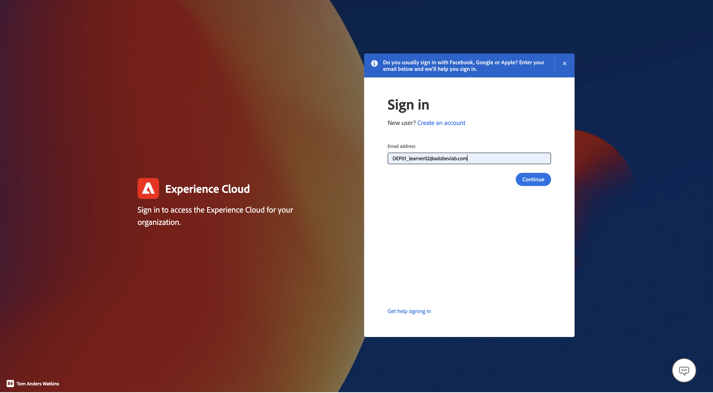

# Inicio de sesión y exploración

## Inicio de sesión mediante IU

1. Vaya a [https://experience.adobe.com](https://experience.adobe.com/) en el explorador.
1. Inicie sesión con la Adobe ID que tiene acceso de desarrollador a su zona protegida, la misma que utilizó para completar la [instalación de Developer Console](../../sandbox-setup/developer-console-setup.md).
1. En la pantalla **Seleccionar una cuenta**, elija la **Cuenta de empresa o escuela**.

## Iniciar Experience Platform

Haga clic en el icono de Experience Platform en el panel de acceso rápido para acceder a su zona protegida de bootcamp

>[!NOTE]
>
>Es posible que no vea esta pantalla y se inicie directamente en Experience Platform.  Si es así, omita este paso.

## Navegar a esquemas

1. Haga clic en la ficha **Esquemas** en el carril izquierdo

1. En la barra de navegación superior, verá las opciones para examinar los esquemas existentes, así como ver los grupos de campos y los tipos de datos que se encuentran actualmente en el registro XDM.

>[!NOTE]
>
>Verá que ya hay esquemas creados previamente en su zona protegida. Estos incluyen esquemas que fueron creados previamente como parte de este bootcamp (tienen el prefijo `dep`), así como esquemas generados por el sistema tanto para Adobe Real-Time CDP como para Adobe Journey Optimizer.

>[!TIP]
>
>¡Empiece a construir algunos esquemas!
