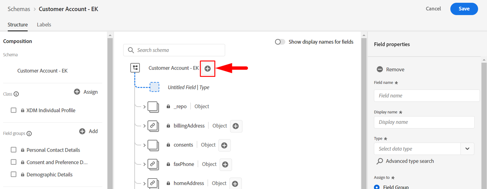
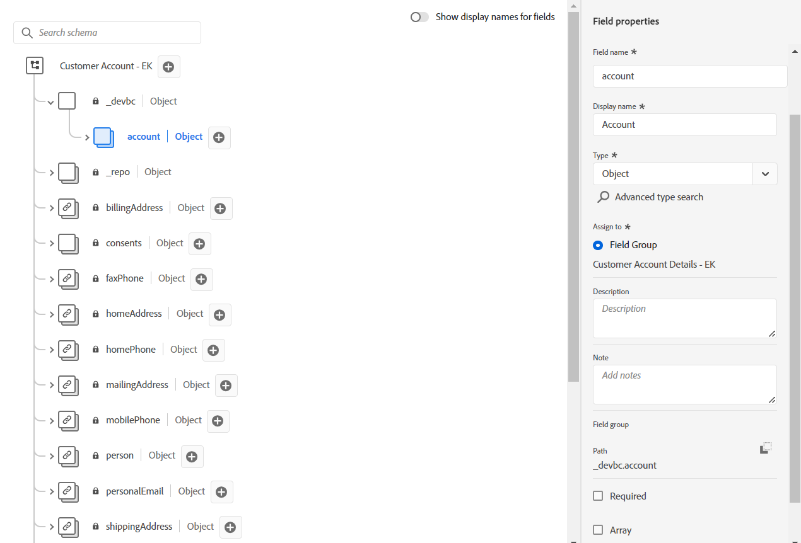
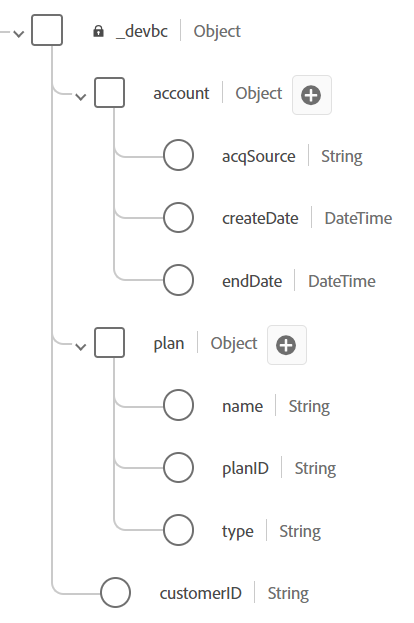

# Objetos personalizados de modelo

## Adición de campos personalizados

Como se explica en la conferencia, no hay grupos de campos o tipos de datos estándar predeterminados que modelen los campos personalizados Cuenta de cliente.  Actualmente, los campos siguientes se consideran personalizados y deben modelarse dentro del esquema XDM.

- \_\&lt;tenant-name>.account.createDate
- \_\&lt;tenant-name>.account.endDate
- \_\&lt;tenant-name>.account.acqSource
- \_\&lt;tenant-name>.plan.planID
- \_\&lt;tenant-name>.plan.name
- \_\&lt;tenant-name>.customerID

>[!NOTE]
>
>Tenga en cuenta que \&lt;tenant-name> será específico del entorno en el que está trabajando

## Creación de objeto de cuenta

1. Agregue un nuevo campo haciendo clic en el botón **+ (agregar)** en la parte superior del esquema

>[!NOTE]
>
>Observe que el carril derecho se abre con algunos campos que puede rellenar

1. Cree el objeto de cuenta utilizando los detalles siguientes. Cuando termine, haga clic en el botón **Aplicar** en el carril derecho para ver el cambio en el espacio de trabajo de esquema

| Nombre de campo | Nombre para mostrar | Tipo | Asignar a un nuevo grupo de campos |
| ---------- | ------------ | -------- | ----------------------------------------------------------------------------------------------------------------------------- |
| *cuenta* | *Cuenta* | *Objeto* | *Detalles de la cuenta del cliente - \[Sus iniciales]* *(escriba esto y seleccione el menú desplegable o pulse Intro)* |

>[!WARNING]
>
>Los nombres de campo deben seguir un caso específico. El motivo es que ya hemos creado previamente el mismo esquema que está creando. Si el caso está desactivado, se producirá un conflicto con las rutas de campo del esquema preexistente en la zona protegida

>[!NOTE]
>
>Observe que el campo personalizado que creó automáticamente se coloca bajo un área de nombres de inquilino, indicada por `_devbc` en la captura de pantalla. El área de nombres del inquilino puede ser diferente. Las áreas de nombres de inquilino se utilizan para diferenciar los objetos personalizados de los estándar de Adobe y garantizar que las futuras adiciones/actualizaciones de los estándares de Adobe no entren en conflicto con los creados a medida.

>[!NOTE]
>
>Observe que el nuevo grupo de campos personalizados aparece en el carril izquierdo debajo de `Field groups` sin icono de candado.  Esto indica que es un grupo de campos creado a medida.

>[!WARNING]
>
>No puede guardar el esquema en este momento. Si lo hace, se produce un error porque no puede crear un objeto vacío en el esquema JSON, ya que no describe cuál es su contenido

1. Añada los campos siguientes que se muestran debajo del objeto Account que acaba de crear.

| Nombre de campo | Nombre para mostrar | Tipo |
| ------------ | ------------- | ---------- |
| *createDate* | *Fecha de creación* | *DateTime* |
| *endDate* | *Fecha de finalización* | *DateTime* |

>[!NOTE]
>
>Observará que al agregar los campos nuevos la opción **Asignar a** ya está completada y hace referencia al grupo de campos que utilizó para el objeto de cuenta.

1. Cuando termine, el objeto de cuenta de esquemas debe tener el aspecto siguiente. **Guarde** su esquema.

1. Agregue otro campo personalizado al objeto de cuenta. Haga clic en el botón **+ (agregar)** situado junto al objeto de cuenta.  Cree el campo siguiente:

| Nombre de campo | Nombre para mostrar | Tipo | Enumeraciones |
| ----------- | ----------------- | -------- | --------------------------------------- |
| *acqSource* | *Source adquirido* | *Cadena* | *web :: Web * *inStore :: En tienda* |

Este campo necesita valores estandarizados, así que usa la opción **Enum &amp; Suggested values** en las propiedades de los campos. Seleccione el botón de opción **Enum** para agregar validación para este campo durante la ingesta, así como etiquetas descriptivas. Agregue los valores de enumeración como se muestra a continuación:

- *web :: web*
- *inStore :: En tienda*

Se han agregado 

>[!NOTE]
>
>El objetivo de Enumeración y valores sugeridos es facilitar la segmentación para el usuario final. Las enumeraciones aplican la validación en el momento de la ingesta de datos, mientras que los valores sugeridos no. Para obtener más información acerca de esta característica, lea más en la documentación aquí -> [https://experienceleague.adobe.com/docs/experience-platform/xdm/ui/fields/enum.html?lang=es#enums-and-suggested-values](https://experienceleague.adobe.com/docs/experience-platform/xdm/ui/fields/enum.html?lang=es#enums-and-suggested-values)

1. Cuando termine, haga clic en el botón **Aplicar** para agregar el nuevo campo al esquema.

1. **Guardar** su esquema

>[!TIP]
>
>Ha creado correctamente su primer objeto personalizado y campos dentro del registro de esquema XDM.

## Creación de objeto de plan

Repita los pasos que ha realizado anteriormente y agregue el objeto **Plan** y los campos asociados. Todos los campos nuevos deben añadirse al grupo de campos Detalles de la cuenta del cliente - \[sus iniciales].

Utilice los metadatos de la tabla siguiente para crear el objeto de plan y sus campos asociados.

| Nombre de campo | Nombre para mostrar | Tipo | Enumeración y valores sugeridos |
| ---------- | -------------- | -------- | ------------------------------------------------------------------------------------- |
| *plan* | *Detalles del plan* | *Objeto* | - |
| *ID de plan* | *ID de plan* | *Cadena* | - |
| *nombre* | *Nombre de plan* | *Cadena* | Enumeración  *básica :: Básica * *última :: Ultimate * *pro :: Pro* |
| *tipo* | *Tipo* | *Cadena* | - |

>[!WARNING]
>
>Asegúrese de añadir los nuevos campos que cree al grupo de campos Detalles de cuenta del cliente: \[sus iniciales].  Una forma rápida de asegurarse de que se añaden automáticamente a ese grupo de campos es seleccionar el grupo de campos en el carril izquierdo antes de añadir un campo personalizado.
>
>
>
>
>
>

Cuando termine, valide el esquema para que coincida con la siguiente captura de pantalla. Si se ve bien **guarda** tu esquema

>[!TIP]
>
>¡Bonito!  Ha agregado su propio objeto personalizado y campos sin ayuda.

## Creación del campo ID de cliente

Agregar el campo **customerID** como este campo es crítico porque servirá como identidad principal para el esquema, así como un campo general para contener datos.

Siga los mismos pasos que anteriormente y utilice la tabla siguiente para hacer referencia a los metadatos del campo.

| Nombre de campo | Nombre para mostrar | Tipo | Grupo de campos |
| ------------ | ------------- | -------- | --------------------------------------------- |
| *customerID* | *ID de cliente* | *Cadena* | *Detalles de la cuenta del cliente - \[Sus iniciales]* |

>[!NOTE]
>
>`customerID` se puede colocar en cualquier lugar del esquema desde una perspectiva jerárquica. En este laboratorio hemos elegido mantenerlo en la raíz y no anidado dentro de uno de los objetos personalizados que creó anteriormente.  Aquí es donde la arquitectura de datos tiene opiniones
>
>😄

El resultado final debería ser similar a la captura de pantalla siguiente cuando haya terminado

## Resultado final del esquema

>[!TIP]
>
>Ha creado su primer esquema XDM. En la siguiente sección configurará el esquema para utilizarlo con el perfil del cliente en tiempo real.
