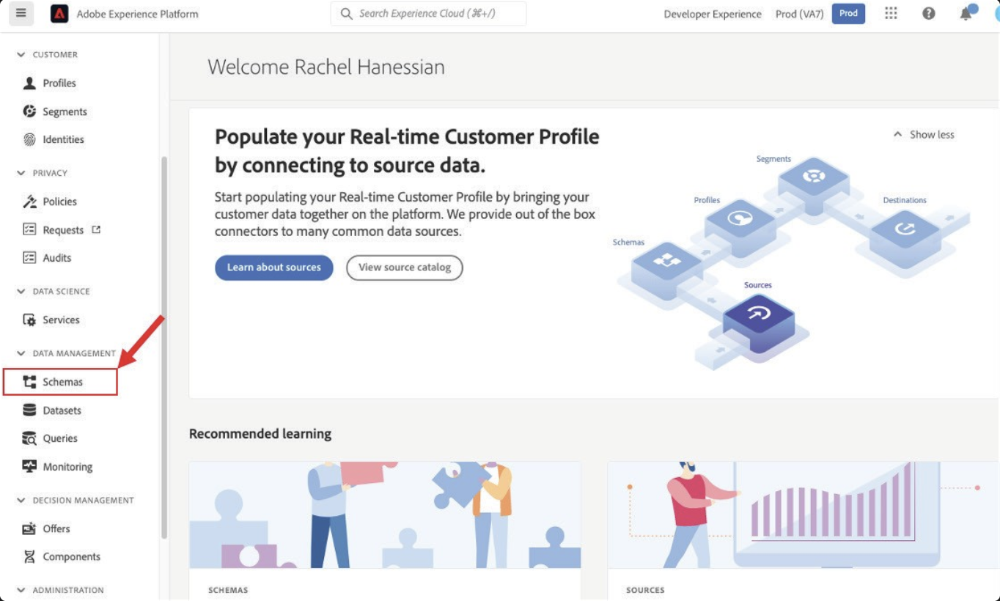
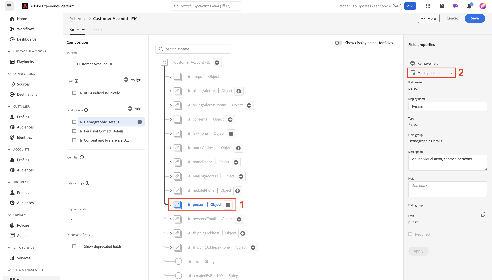
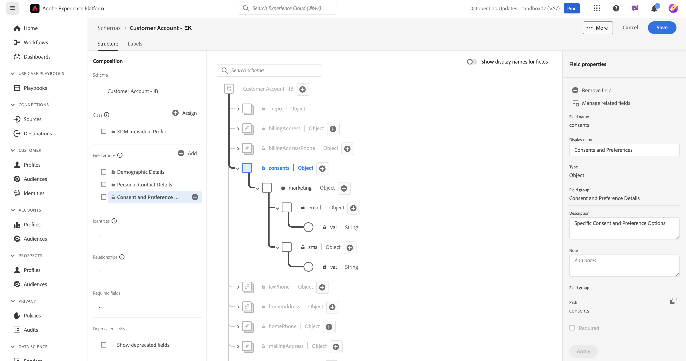

# Objetos estándar del modelo

## Navegar a esquemas

1. Haga clic en la ficha **Esquemas** en el carril izquierdo

   

1. En la barra de navegación superior, verá las opciones para examinar los esquemas existentes, así como ver los grupos de campos y los tipos de datos que se encuentran actualmente en el registro XDM.

>[!NOTE]
>
>Verá que ya hay esquemas creados previamente en su zona protegida. Estos incluyen esquemas que fueron creados previamente como parte de este bootcamp (tienen el prefijo `dep`), así como esquemas generados por el sistema tanto para Adobe Real-Time CDP como para Adobe Journey Optimizer.

## Crear esquema de perfil individual

1. Comience por hacer clic en **Crear esquema**

   

1. Seleccionar **manual**

   

1. Seleccionar **perfil individual**

## Asigne un nombre al esquema

Los esquemas basados en clases de Perfil individual de XDM permiten recopilar atributos sobre un individuo que se vinculan al perfil. La propia clase contiene campos que no se pueden editar, como *modifiedByBatchID*, *PersonID*, etc.

1. Asigne un nombre y una descripción al esquema.
   - **Nombre para mostrar el esquema** —> Cuenta de cliente de *Sus iniciales*
   - **Descripción** —> Este esquema recopila identidades, información de plan, detalles demográficos y detalles de contacto de un individuo.
1. Guarde el esquema con el botón **Finish** de la parte superior derecha.

## Agregar grupo de campos Detalles demográficos

Existen muchos grupos de campos como XDM estándar en Adobe Experience Platform para que los añada al esquema y los personalice.

1. Haga clic en **+ (agregar)** en el carril izquierdo de la sección de grupo de campos.

   

1. Busque **Detalles demográficos** o búsquelo en la lista.

   - Cuando encuentre el grupo de campos, haga clic en la lupa a la derecha del grupo de campos para ver su estructura.  Este paso es una forma útil de previsualizar lo que está a punto de agregar al esquema sin agregarlo.
   - Cerrar la vista previa cuando termine de revisarla

   

   

&#x200B;3. **Marque** la casilla que está junto al grupo de campos y luego haga clic en el botón **Agregar grupos de campos**

## Adición de otros grupos de campos estándar

Debe agregar grupos de campos estándar adicionales al esquema. Repita los pasos anteriores para agregar los dos grupos de campos adicionales al esquema:

- Datos personales de contacto
- Detalles de consentimiento y preferencia

Cuando haya terminado, el esquema se parecerá a la imagen siguiente. ¡Asegúrese de hacer clic en el botón **Guardar** y guardar su trabajo!

>[!NOTE]
>
>Tenga en cuenta que los grupos de campos seleccionados y añadidos ahora aparecen en el esquema y se muestran en el carril izquierdo. Tenga en cuenta que no todos los campos de cada grupo de campos que ha agregado son necesariamente necesarios.  El siguiente paso elimina los campos superfluos.

>[!WARNING]
>
>Asegúrese de guardar el esquema antes de continuar.

## Personalizar grupos de campos estándar

### Grupo de campos Detalles demográficos

El grupo de campos Detalles demográficos ha introducido muchos campos, pero en función del diseño del esquema de la metodología LID, solo necesita los siguientes campos:

- person.name.firstName
- person.name.lastName
- person.birthDayAndMonth
- person.birthYear

Para quitar campos de cualquier grupo de campos estándar de Adobe, use la opción **Administrar campos relacionados**. Administrar campos relacionados permite quitar campos estándar del esquema, por lo que solo permanecen los campos necesarios.

1. Seleccione el objeto **person** en el esquema
1. Haga clic en **Administrar campos relacionados** en el carril derecho

   

1. Expanda el objeto persona haciendo clic en las comillas angulares a la izquierda de la persona y expanda el objeto de nombre completo haciendo clic en las comillas angulares a la izquierda del objeto de nombre. Mantener solo los campos siguientes:

   - person.name.firstName
   - person.name.lastName
   - person.birthDayAndMonth
   - person.birthYear

   Cuando termine, haga clic en el botón **Confirmar** en la esquina superior derecha.

   

   >[!NOTE]
   >
   >Puede hacer clic en la casilla de verificación situada más arriba de **Detalles demográficos** para anular automáticamente la selección de todos los objetos secundarios y, a continuación, volver a seleccionar sólo los que necesite.

1. Cuando termine, debería ver el objeto de persona en el esquema, como se muestra a continuación. Para guardar el esquema, haga clic en el botón **Guardar** si todo se ve bien.

### Grupo de campos Consentimiento y Preferencias

Realice el mismo conjunto de pasos que antes, pero esta vez para el grupo de campos Consentimiento y Preferencias.

1. Haga clic en el nombre del grupo de campos **Consentimiento y preferencias** en el carril izquierdo para resaltar sus campos en el esquema.
1. Seleccione el objeto **consentimientos** y, a continuación, utilice el proceso **Administrar campos relacionados** para quitar los campos que no sean necesarios del objeto de consentimientos. Mantener solo los campos siguientes:

- conents.marketing.email.val
- conents.marketing.sms.val

>[!NOTE]
>
>Asegúrese de tener la opción desactivada para **Mostrar nombres para mostrar para los campos** en la esquina superior derecha del área de trabajo de esquema
>
>

Cuando haya terminado, el esquema final tendrá este aspecto. Asegúrese de hacer clic en **Guardar** antes de continuar.

>[!SUCCESS]
>
>Ahora ha terminado de agregar componentes estándares al esquema. ¡Buen trabajo! Pasemos a crear algunos atributos personalizados para el esquema.
