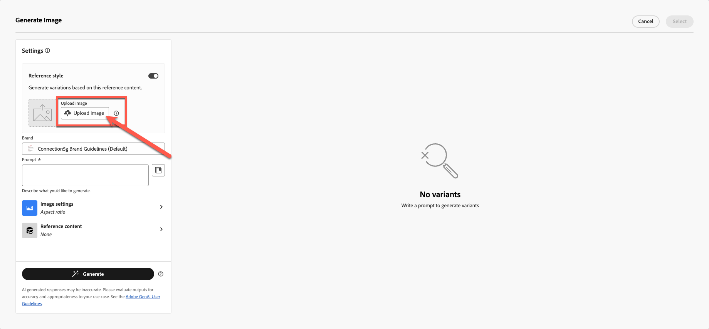

# Asistente de IA y personalización de contenido

**Objetivo:** Aprenda a utilizar el Asistente de IA de Adobe Journey Optimizer para generar líneas de asunto, refinar el texto del correo electrónico, ajustar el tono y crear imágenes de Firefly de marca directamente dentro del diseñador de correo electrónico.

## Objetivos de aprendizaje

Al final de este módulo, deberá ser capaz de:

1. Utilice el asistente de IA para generar líneas de asunto y encabezados previos.
1. Refine el texto, las descripciones, el tono y los mensajes del héroe.
1. Aplique reformulación, resumen y ajustes de tono impulsados por IA.
1. Genere imágenes utilizando Adobe Firefly con ajustes de estilo y marca de referencia.
1. Reemplace los marcadores de posición por las imágenes generadas dentro del diseño de correo electrónico.

## Introducción

El asistente de IA de AJO le ayuda a crear contenido más inteligente y adaptado a la marca.
Puede:

- Generación de líneas de asunto
- Mejorar el texto existente
- Ajuste del tono y la claridad
- Creación de imágenes de marca con Firefly
- Asegúrese de que todo se ajusta a las directrices de Connection 5G

Para este ejercicio, mejora el correo electrónico que ha creado con el asistente de IA.

> [!NOTE]
>
>El Asistente de IA es **no determinista**, lo que significa que puede generar contenido ligeramente diferente cada vez que se usa. Es posible que lo que vea durante la práctica no coincida exactamente con las capturas de pantalla o los ejemplos de esta guía. Está bien: concéntrese en aprender el proceso y los conceptos en lugar de esperar resultados idénticos.

## Crear línea de asunto de correo electrónico con el asistente de IA

1. Vuelva a la campaña haciendo clic en el botón Atrás o edite el correo electrónico que creó en el módulo anterior. En el paso anterior, puedes hacer clic en la ficha **Configuración** a la derecha.
2. Haga clic en Contenedor de correo electrónico > Haga clic en el botón Editar correo electrónico.
3. Haga clic en la pestaña Contenido y, a continuación, en Cuerpo del correo electrónico
4. Seleccione el campo **Asunto**.
5. Haga clic en el **icono del Asistente de IA**. (ver más abajo)

6. Observe que Orientación de marca está seleccionada de forma predeterminada.
7. Introduzca la solicitud:

>Estamos lanzando iPhone 17 y queremos que una línea de asunto sea pegadiza

8. Presione **Generar**.
9. Revise las cuatro variantes generadas.
10. Elija la variante con la mejor puntuación de alineación y haga clic en **Seleccionar**.

> [!NOTE]
>
>Sus resultados pueden ser completamente diferentes de la guía de laboratorio, por lo que no tiene que preocuparse. Seleccione lo que crea que es un título correcto y continúe con el laboratorio.

## Mejora del título y la descripción del héroe

1. Abra el correo electrónico haciendo clic en el botón &quot;Editar cuerpo del correo electrónico&quot;.

2. Haga clic en el encabezado **Product Catchy line**.
3. Abra el Asistente de IA haciendo clic en **Generar y seleccione un texto**

4. Seleccione **Directrices de marca de la conexión 5G** en el menú desplegable.

5. Preguntar:

>*Escriba un titular atrevido y llamativo para el lanzamiento de iPhone 17. Mantener menos de 10 palabras*

6. Haga clic en Configuración de texto para cambiar el tono y la estrategia de comunicación. Cambie la estrategia de comunicación a **FOMO (Miedo a perderse)**, el idioma a **inglés** y el tono a **emocionante**. Utilice una versión más corta reduciendo el número de marcado.

7. Haga clic en el botón **Generar**
8. Revise y seleccione la mejor versión,
9. Si el texto es largo, use el control deslizante para **&quot;texto más corto&quot;** y vuelva a generar el texto.

10. Cuando esté satisfecho con el texto, haga clic en **Seleccionar**

## Mensaje de descripción

Esta vez, probará cómo la IA puede ayudar a encontrar problemas.

1. Seleccione el texto por debajo del cual se crea una plantilla de texto y no tiene significado.

2. Haga clic en el botón Evaluar como se muestra a continuación.

3. El contenido original se selecciona automáticamente con su marca, como se muestra en los pasos 1 y 2 a continuación. Haga clic en el botón **Evaluar** para continuar.

4. Como es de esperar, se observan muchos errores que infringen las directrices de marca. Aunque podrían corregirse con IA, en este caso no se revisan los materiales existentes. En su lugar, los deja tal cual están y crea contenido nuevo desde cero que se ajusta completamente a los estándares de la marca.

5. Utilice el nuevo párrafo que se genera al utilizar IA con el mensaje siguiente. Puede utilizar el mismo método para el texto de la descripción utilizando el indicador siguiente.

Preguntar:

>*Escribe una descripción de producto atractiva para el nuevo iPhone 17. Destaca sus características más impresionantes, como la cámara avanzada, la duración de la batería y el rendimiento. El tono debe ser premium, emocionante y fácil de entender para una audiencia amplia. Manténgalo bajo 3 frases.*

Para ahorrar tiempo, ya se ha creado el texto para usted. Copie y pegue abajo para obtener el texto.

>Descubra la iPhone 17™, que incluye una cámara avanzada para obtener fotografías impresionantes, batería de duración ininterrumpida para seguir adelante y un rendimiento ultrarrápido que le mantiene a la cabeza. No se pierda esta innovadora experiencia.

Su correo electrónico tiene el aspecto del ejemplo que se muestra a continuación.

## Añadir una imagen generada por Firefly

Hasta ahora, hemos probado el asistente de IA en la línea de asunto y el texto. ¿Qué pasa con las imágenes?

Antes de sumergirse en la generación de imágenes de IA, observe qué tipos de experiencias puede crear.

Entendemos que tenemos el año de nacimiento del perfil. Una de las experiencias que podemos hacer es crear un bloque con diferentes variantes. Con Adobe Journey Optimizer, esto es posible y una de las mayores ventajas de tener Adobe Experience Platform como base. Cubriremos la experimentación en nuestro próximo módulo, pero primero, prepare el bloque de abajo.

1. Arrastre un componente **Image** a la columna del lado izquierdo debajo del bloque de la familia de iPhone 17.

2. Haga clic fuera y seleccione el marcador de posición de imagen. (Asegúrese de hacer clic en la imagen; de lo contrario, no verá la opción Firefly).

3. En **Firefly**, haga clic en **Generar y seleccione la imagen**.

## Cargar imagen de referencia

1. Activar **estilo de referencia**.
2. Seleccione **Directriz de marca de Connection 5G** en la selección de la marca

3. Haga clic en Cargar imagen

4. Seleccione reference.jpg en la carpeta del kit de herramientas

5. Agregar mensaje de imagen
   `Portrait-oriented image of a confident man in his early to mid-40s, standing alone at night in a neon-lit urban street, focused on his smartphone. Cinematic cyberpunk-inspired city atmosphere with colorful LED signs, cool blue and warm orange lighting, shallow depth of field, soft bokeh lights in the background. Modern lifestyle, tech-savvy mood, realistic skin tones, high contrast, photorealistic, professional lighting, ultra-detailed`.

## Elegir configuración de imagen

Elija su **configuración de imagen**:

1. Elija la siguiente configuración:
   - **Proporción:** Horizontal (4:3)
   - **Tipo de contenido:** Foto
   - **Color y tono:** Tono fresco
   - **Iluminación:** Iluminación Dramática
1. Pulse el botón **Generar**

## Seleccionar e insertar la imagen generada

1. Revise los resultados de Firefly comprobando todas las imágenes generadas.

2. Haz clic en **Seleccionar** para la imagen elegida que desees.

3. Si se le solicita un modal de carga, haga clic en **Siguiente**.

4. Luego haz clic en **Importar**.

## Finalizar diseño de bloque

Aplique un radio de borde redondeado de 10 para que parezca moderno, si tiene tiempo.

Después de algunas iteraciones y variaciones, se obtiene el diseño final. El diseño final se parece al ejemplo.

En este punto, debería confiar en el uso de la IA para acelerar y aumentar la creación de contenido.

## Resumen

Ha utilizado correctamente el asistente de IA para lo siguiente:

- Generación de líneas de asunto
- Refinar texto a pantalla completa
- Reformular párrafos
- Cambiar el tono de los mensajes
- Creación de imágenes de Firefly con marca mediante un estilo de referencia
- Inserción de imágenes generadas en el correo electrónico

Ya está listo para el siguiente módulo: **Personalization y experimentación de contenido**, donde generará variantes y pruebas impulsadas por perfiles.
