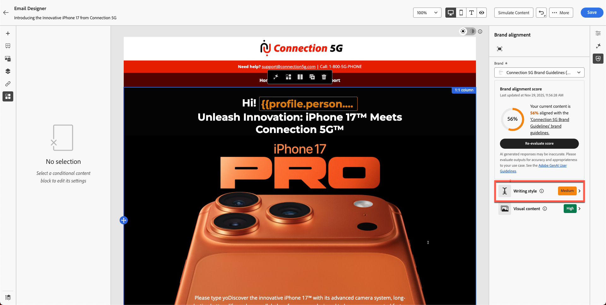
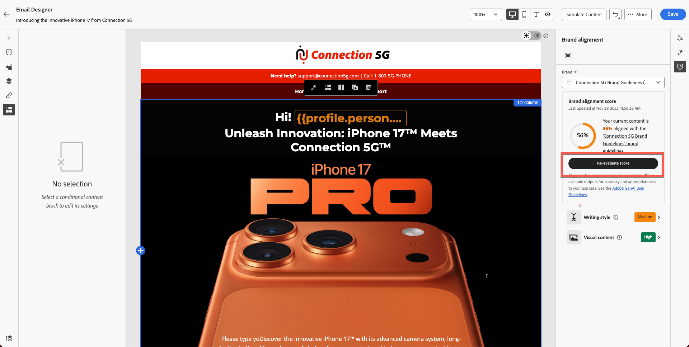

# Alineación de marca

**Objetivo:** Aprenda a utilizar la función de alineación de marca de Adobe Journey Optimizer para evaluar el contenido del correo electrónico, identificar infracciones de directrices y aplicar recomendaciones con tecnología de IA para mejorar el cumplimiento de la marca.

## Objetivos de aprendizaje

Al final de este módulo, deberá ser capaz de:

1. Acceda e interprete el panel Alineación de marca.
1. Evaluar el contenido del correo electrónico según las directrices de marca.
1. Identifique los problemas marcados por IA.
1. Aplique sugerencias para mejorar la alineación de la marca.
1. Volver a evaluar las puntuaciones para realizar un seguimiento de las mejoras.

## Introducción

Adobe Journey Optimizer incluye una puntuación de alineación de marca basada en IA **1 que comprueba el contenido con respecto a las directrices de marca publicadas para** Connection 5G **.**

Esto garantiza:

- El tono, el estilo y la mensajería coinciden con su marca.
- Se cumplen los requisitos legales
- Las imágenes siguen reglas visuales
- Los creadores de contenido son coherentes a escala

Este módulo le enseña a ejecutar la evaluación, interpretar los resultados y mejorar el contenido mediante IA.

## Abrir panel de alineación de marca

1. Abra el correo electrónico que creó en los módulos anteriores.
2. Busque la ficha **Alineación de marca** en el carril derecho o el icono **%** en la barra lateral.
3. Haga clic en para abrir el panel.

&#x200B;4. Asegúrese de que se aplica la marca correcta:
   - **Conexión 5G** (predeterminada).
&#x200B;5. Haga clic en **Evaluar puntuación**.

**Interprete la puntuación de marca y los comentarios:** Después de un momento, verá la puntuación de cumplimiento de marca para su contenido. Esta puntuación puede presentarse como una calificación (por ejemplo, alta, Medium o baja) o como un porcentaje, junto con un indicador de color (verde, amarillo, rojo) y el tiempo de evaluación. Una puntuación alta significa que el contenido se alinea estrechamente con las directrices de marca, mientras que una puntuación media o baja indica una alineación moderada o deficiente.

Revise los comentarios detallados proporcionados en el panel para cada categoría de directrices.

Los comentarios suelen estar organizados por categorías de directrices (como tono, estilo, imágenes, etc.), que muestran qué reglas se aprueban y cuáles pueden requerir atención.

Tome nota de cualquier mensaje o elemento destacado específico; por ejemplo, el panel podría decir que determinadas palabras o frases no coinciden con el tono prescrito o que una imagen no cumple con un estándar visual. Esta es su señal sobre lo que hay que mejorar.

>[!NOTE]
>
>Tenga en cuenta que la puntuación es diferente a la de la pantalla siguiente. Su objetivo es mejorar la puntuación utilizando las directrices de marca y la IA.

## Revisar la puntuación de alineación

Después de la evaluación, AJO muestra:

- Puntuación de alineación de marca
- Valoración (alta/Medium/baja)
- Indicador de color (verde/amarillo/rojo)
- Marca de tiempo
- Categorías de directrices (tono, estilo, imágenes, etc.)

Interprete los resultados para comprender hasta qué punto su correo electrónico coincide con las directrices de Connection 5G.

## Examinar comentarios detallados

1. Desplazarse por las categorías de guía.
1. Busque advertencias o indicadores rojos.
1. Haga clic en cada directriz marcada para abrir comentarios detallados sobre la IA.
1. Revise las sugerencias, como:
   - Discrepancia de tono
   - Fraseado incorrecto
   - Palabras prohibidas
   - Falta el uso de marca comercial
   - Infracciones de estilo de imagen

## Aplicar recomendaciones de IA

1. Haga clic en bloques de texto o imágenes marcados dentro del correo electrónico.
2. Utilice el párrafo que ha pegado en el ejercicio anterior, como se muestra a continuación.

&#x200B;3. Utilice las modificaciones sugeridas por AI. Haga clic en el icono como se muestra a continuación.

&#x200B;4. Haz clic en el botón **Corregir con IA** como se muestra a continuación.

&#x200B;5. Verá los cambios sugeridos resaltados en verde y el texto eliminado en rojo con tachado, como se muestra a continuación. También verá que la puntuación se ha actualizado (en este caso, es del 80 %). Haga clic en el botón **Aplicar** para que los cambios surtan efecto.

&#x200B;6. Los cambios se aplican con el nuevo texto.
&#x200B;7. Revise todas las áreas resaltadas y realice las actualizaciones necesarias para corregir el contenido, ya sea mediante IA o editándolo manualmente. Asegúrese de que todos los cambios necesarios se hayan completado antes de continuar.
&#x200B;8. Guardar cambios.

## Volver a evaluar la puntuación de la marca

1. Realice cambios en todas las ubicaciones para corregir el contenido mediante IA o manualmente.
2. Vuelva al panel Alineación de marca.
3. Haga clic en **Volver a evaluar puntuación**.
4. Compare la nueva puntuación con la anterior.

Por ejemplo:

- Puntuación original: **56%**
- Puntuación actualizada: **90%**

Esto indica que las actualizaciones alinearon correctamente el correo electrónico con los estándares de marca.

&#x200B;5. Haz clic en **Guardar** para finalizar el correo electrónico.

## Resumen

En este módulo, ha aprendido a:

- Evaluación de un correo electrónico con la puntuación de alineación de marca
- Interpretar comentarios de nivel de categoría
- Identificar problemas de escritura, tono y diseño
- Aplicar correcciones recomendadas por IA
- Mejore la coherencia de la marca en toda la comunicación

El contenido ya está validado y listo para probarse en el siguiente módulo: **Probar el correo electrónico**.
