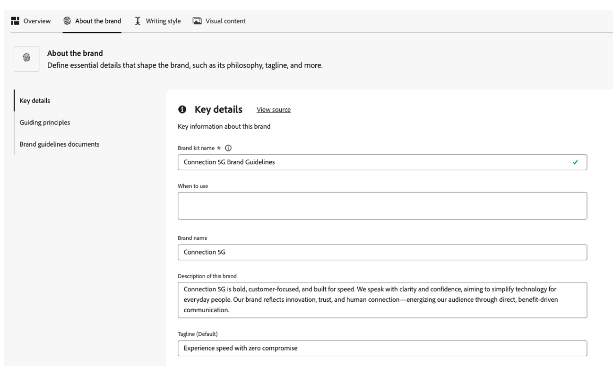
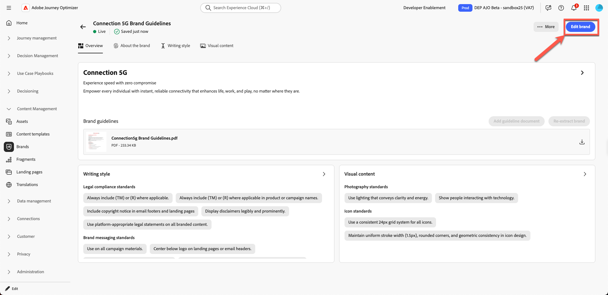
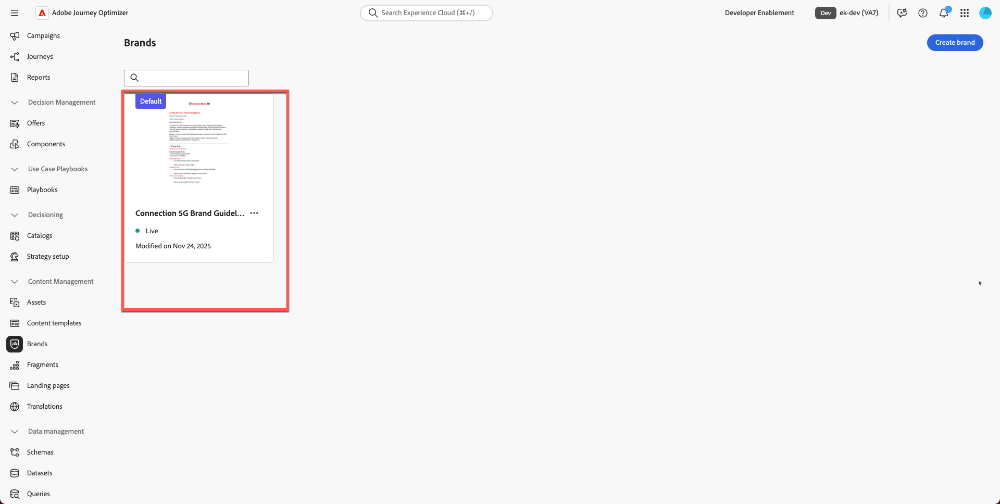

# Administración de marca

**Propósito:** Configure, perfeccione y publique las Directrices de marca de Connection 5G dentro de Adobe Journey Optimizer (AJO), de modo que todo el contenido y las funciones de IA permanezcan alineados con la marca.

## Objetivos de aprendizaje

Al final de este módulo, deberá ser capaz de:

- Cree una nueva marca en Adobe Journey Optimizer.
- Cargar y extraer información sobre directrices de marca desde un PDF.
- Revise y perfeccione los detalles de marca en las pestañas Acerca de la marca, Estilo de escritura y Contenido visual.
- Añada una regla de exclusión para evitar la copia de un botón de correo electrónico push.
- Publique la marca para que esté disponible para plantillas, fragmentos, el asistente de IA y la alineación de marca.

Descargar archivo: [toolkit.zip](assets/toolkit.zip)

>[!NOTE]
>
>Antes de iniciar los laboratorios prácticos, asegúrese de descargar el archivo del kit de herramientas (consulte a continuación toolkit.zip). Descomprima el archivo para acceder a las imágenes y los archivos auxiliares necesarios para los ejercicios. Mantenga estos recursos en algún lugar de fácil acceso, ya que hará referencia a ellos en todo el laboratorio.

## Introducción

En este módulo, creará la marca **Connection 5G** dentro de AJO con una guía de marca PDF preparada.

La función **Marcas** de Adobe Journey Optimizer le ayuda a definir y mantener una identidad consistente en todos los esfuerzos de marketing. Desde logotipos y colores hasta el tono de voz y el estilo de mensajería, la creación de una marca garantiza que cada mensaje de correo electrónico, campaña y contenido refleje una personalidad unificada.

Usaremos el patrón 1 de la conferencia (solo AJO) para este laboratorio. Tenga en cuenta que los recursos se almacenan usando **Assets Essentials**.

Empezará con el documento de Directrices de marca de Connection 5G, lo cargará, permitirá que AJO extraiga información clave y, a continuación, perfeccionará y publicará el resultado.

## Preparar las directrices de marca

1. Abra **Directrices de marca de Connection 5G** PDF desde la carpeta del kit de herramientas (asegúrese de descomprimirlo primero).

   

2. Revise el documento para comprender el contenido utilizado para la conexión 5G:
   - Tono de voz
   - Colores y estilo visual
   - Escritura de ejemplos de estilo y mensajería
   - Guía de imágenes
   - Notas legales y de cumplimiento

## Crear una nueva marca en AJO

1. En Adobe Journey Optimizer, vaya a la navegación izquierda y haga clic en **Marcas**.
2. Haga clic en **Crear marca**.

   

3. En el campo **Nombre**, escriba `Connection 5G Brand Guidelines`
4. En el área de carga, arrastre y suelte el archivo **Connection5g Brand Guidelines.pdf** (o haga clic en **Seleccionar archivos** y elíjalo en el equipo).

   

5. Haga clic en **Crear marca** para comenzar la extracción.

   Aparecerá una pantalla de progreso mientras AJO analiza el archivo. Esto puede tardar varios minutos en función del tamaño del documento.

   

6. Una vez finalizada la extracción:
   - En la parte superior aparece una barra de confirmación verde.
   - Se le redirigirá automáticamente a la pantalla de configuración de la marca.
   - Los estándares de creación visual y de contenido ahora se rellenan automáticamente en función del archivo de directrices de marca cargado.

   

7. Haga clic en el botón **Publicar** para publicar las directrices de marca.

   

8. Confirme pulsando el botón &quot;Publicar&quot; para confirmar.

   

   Aparece una barra de confirmación verde en la parte inferior de la página que indica que la marca se ha publicado correctamente.

9. Vuelva a hacer clic en la página principal de la marca y verá que su marca ya está activa (esto debería mostrarse con un punto verde con la etiqueta **&quot;Live&quot;**).

## Revisar las fichas de marca

Ahora revisará y comprenderá las tres pestañas clave que se han rellenado para la conexión 5G.

### Acerca de la marca

Esta pestaña define la identidad de la marca en un nivel superior. Por lo general, incluye:

- Nombre de marca
- Valores principales
- Principios rectores
- Propósito y promesas de la marca
- La sensación que la marca quiere crear

Todo lo demás en el sistema se construye a partir de esta base, por lo que es importante que esta pestaña refleje el verdadero ADN de la Conexión 5G.

Dedique un momento a examinar los campos extraídos y comprobar que coinciden con el PDF original.

### Estilo de escritura

La ficha **Estilo de escritura** define cómo se comunica la marca. Incluye:

- Directrices de tono
- Tareas y tareas pendientes
- Frases de ejemplo y mensajes clave
- Etiquetas y lemas
- Reglas legales, como cuándo incluir marcas comerciales

Puede añadir y perfeccionar reglas en lenguaje natural e incluso aplicarlas solo a canales específicos, como correo electrónico o SMS. Esto le proporciona un control flexible pero preciso sobre cómo el asistente de IA y los autores de contenido deben escribir.

### Contenido visual

La pestaña **Contenido visual** describe el aspecto que debería tener la marca. Abarca:

- Estándares fotográficos
- Estilo de ilustración
- Reglas de iconografía
- Tareas y tareas pendientes

Esto garantiza que todo, desde imágenes hasta iconos, se sienta coherente y alineado con los valores principales de la Conexión 5G.

## Añadir visión faltante y posicionamiento en el mercado

En el contenido extraído, algunos principios rectores pueden estar incompletos. Ahora complételas utilizando la redacción oficial de la PDF.

1. Haga clic en la marca que acaba de crear.

   

2. Haga clic en **Editar marca**. Aparecerá una pestaña de confirmación; vuelva a hacer clic en **Editar marca** para confirmar.

   

3. Vaya a la ficha **Acerca de la marca**.

   

4. Busque la sección de **Principios rectores**, **Visión** o descripción de alto nivel similar.

   

5. Añada el siguiente texto:

   **Visión:**

   >Habilite a cada individuo con conectividad instantánea y confiable que mejore la vida, el trabajo y el juego, sin importar dónde se encuentren.

   **Posición de mercado:**

   >Connection 5G ofrece un servicio móvil de alta velocidad diseñado para estilos de vida digitales, que destaca por su fiabilidad, sencillez e innovación preparadas para el futuro sin igual.

   

6. Haga clic en **Guardar**. (Si no ve el botón **Guardar**, haga clic primero en la ficha **Información general** y, a continuación, haga clic en **Guardar**).

>[!TIP]
>
>Ahora se ha asegurado de que el propósito, la visión y el posicionamiento en el mercado de la marca estén claramente representados en AJO.

## Añadir una regla de exclusión de botón de correo electrónico

A continuación, mejore la marca añadiendo una regla que garantice que los botones de correo electrónico nunca se escriban de forma agresiva.

1. Vaya a la ficha **Estilo de escritura**.

   

2. Asegúrese de que está en la sección **Estilo de comunicación de marca**.

   

3. En el área **No lo hagas**, haz clic en el icono **más** para agregar una regla nueva.

   

4. Configure la regla de la siguiente manera:
   - **Exclusión:** `Be pushy`

   >[!NOTE]
   >
   >Esto se agrega como una regla Don’t, lo que significa que la marca no desea CTAs agresivas

   **Canal:** Correo electrónico

   Botón **Elemento:**

5. Haga clic en **Agregar**.

   

6. Confirme que la nueva regla Don’t aparece como `Be pushy` en la lista.

   

7. Haga clic en **Guardar**.

Esta regla se aplica siempre que el asistente de IA o los autores trabajen en la copia de botones de correo electrónico, manteniendo las CTA alineadas con el tono de la Conexión 5G.

>[!NOTE]
>
>Es posible que vea otras reglas de &quot;no&quot; enumeradas que no coinciden exactamente con la captura de pantalla. Ignore esto tal como se espera que ocurra.

## Publicar las directrices de marca

Una vez que esté satisfecho con la configuración:

1. Vuelva a la ficha **Información general**. Haga clic en **Guardar**.
2. En la esquina superior derecha, haga clic en **Publicar**.

   

3. Aparecerá un cuadro de diálogo de confirmación que explica que está a punto de publicar las Directrices de marca actualizadas para la conexión 5G. Vuelva a hacer clic en **Publicar** para confirmar.

   

4. Espere a que aparezca la barra de confirmación verde.
5. Haga clic en **Atrás** para regresar a la lista de marcas.
6. Compruebe que aparece una tarjeta nueva para **Directrices de marca de Connection 5G** con un estado que indica que está activa y disponible.

Su marca ya está activa y lista para utilizarse en todo Adobe Journey Optimizer.

## Resumen

En este módulo:

- Se ha revisado la PDF de orientación de marca Conexión 5G.
- Se ha creado una nueva marca para la conexión 5G dentro de Adobe Journey Optimizer.
- Se ha cargado el archivo de directrices de marca y se ha permitido a AJO extraer información clave.
- Se han revisado y refinado las pestañas Acerca de la marca, Estilo de escritura y Contenido visual.
- Se ha añadido una regla de exclusión específica para que los botones de correo electrónico nunca sean push.
- Se ha publicado la marca para poder utilizar el Asistente de IA, la alineación de marca, las plantillas y los fragmentos.

Ahora tiene un perfil de marca **Connection 5G** totalmente configurado y publicado que se utilizará en el resto del laboratorio para mantener todo el contenido dentro de la marca.
