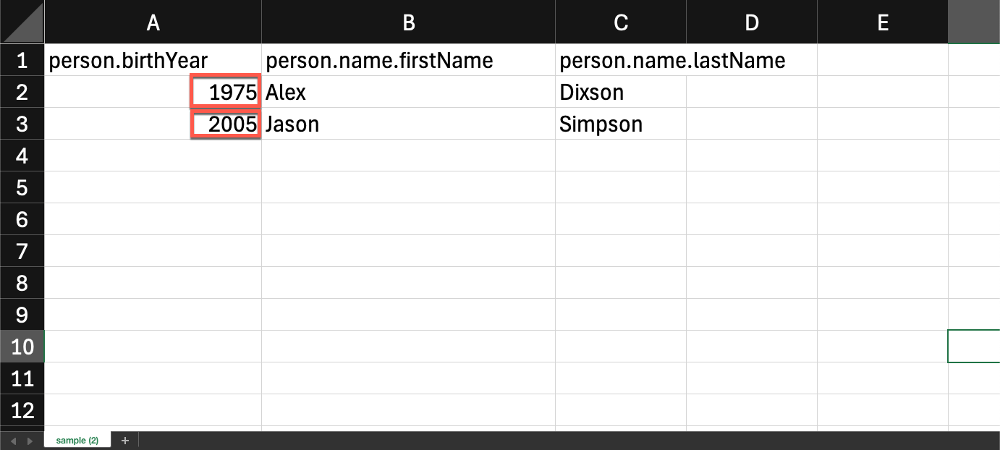

# Simulación de contenido

**Propósito:** Valide variantes de personalización, lógica condicional y contenido usando las herramientas de Adobe Journey Optimizer Simulation y Proof.

## Objetivos de aprendizaje

Al final de este módulo, deberá ser capaz de:

1. Cargue y utilice datos de perfil de prueba para la simulación.
1. Valide campos personalizados y lógica de variante.
1. Pruebe el comportamiento de reserva para los datos que faltan o no coinciden.

## Introducción

En este módulo final, probará su correo electrónico con **dos variantes condicionales** usando la herramienta de simulación en Adobe Journey Optimizer.
Esto le permite obtener una vista previa de cómo los distintos clientes experimentarán el mensaje personalizado, lo que garantiza la precisión antes de iniciar la campaña.

Utilizará el archivo de perfil de prueba de muestra **sample.csv** de su conjunto de herramientas.

## Abra la herramienta de simulación

1. Abra el correo electrónico completado.
1. Haga clic en **Simular contenido**.
1. Seleccione **Simular variación de contenido**.

Después de unos segundos, se abre un panel de simulación.

## Carga de los datos del perfil de prueba

1. Abra **sample.csv** desde la carpeta del kit de herramientas.
   - **Alex** → de más de 40 años
   - **Jason** → menor de 40 años
2. Haga clic en **Cargar datos de entrada**.

&#x200B;3. Elija **sample.csv** y haga clic en **Continuar**.

AJO procesa el archivo y prepara las vistas previas.

## Revisar representación de variante

AJO muestra ambas variantes una al lado de la otra en función de los perfiles cargados.

**Resultados esperados:**

- **Alex** → Ve **Variante 1** (Edad superior a 40)

Si se desplaza hacia arriba, también verá campos personalizados con el nombre ahora, como puede ver a continuación.

- **Jason** → Ve **Variante 2** (Edad inferior a 40)

 años

Con el nombre completo de Jason también. ¡Qué guay es eso!

## Validar comportamiento de reserva

**Inconvenientes y valores predeterminados:** Compruebe que su correo electrónico gestiona correctamente los datos que faltan o los escenarios en los que no coinciden. Por ejemplo, simule un perfil con un campo vacío de año de nacimiento o uno que no cumpla los requisitos de ninguna oferta segmentada. La vista previa debe mostrar un bloque de contenido predeterminado o un marcador de posición adecuado en lugar de contenido roto o vacío. Si la simulación muestra una sección vacía en la que el contenido debe estar vacío, eso indica que puede que necesite configurar una oferta de reserva o un texto predeterminado en el diseño.

## Resumen

En este módulo ha realizado correctamente lo siguiente:

- Simulación de contenido personalizado mediante perfiles de muestra
- Lógica de cambio de variante validada
- Los campos personalizados confirmados se rellenan correctamente

Ya está listo para el siguiente módulo: **Alineación de marca**,
donde evaluará su correo electrónico con las directrices de marca de Connection 5G mediante IA.
