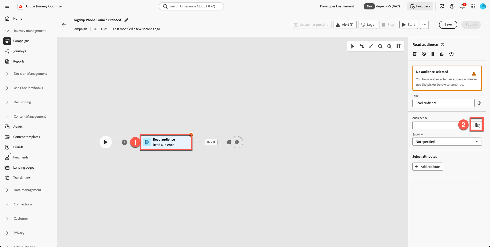
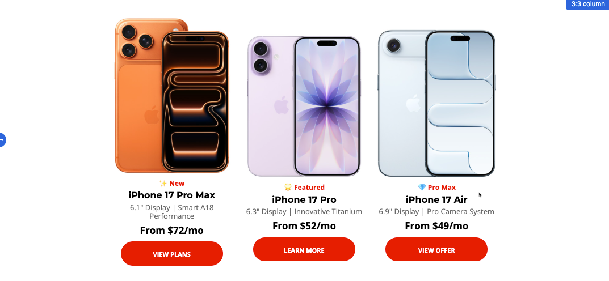

# Creación del correo electrónico

## Creación de contenido con plantillas

**Objetivo:** Aprenda a crear plantillas reutilizables en Adobe Journey Optimizer y, a continuación, aplíquelas en un correo electrónico real dentro de una campaña.

## Objetivos de aprendizaje

Al final de este módulo, deberá ser capaz de:

1. Cree una nueva campaña y utilice la nueva plantilla de marca.
1. Actualice las imágenes principales, las imágenes de producto, los botones y el estilo del diseño.

## Creación y actualización del correo electrónico en una campaña

### Objetivo

En este ejercicio, aprenderemos a aplicar la plantilla que ha creado a un correo electrónico dentro de un recorrido. En un escenario ideal, puede utilizar cualquier recorrido o campaña existente y reemplazar su contenido de correo electrónico con una plantilla estandarizada para garantizar la coherencia de la marca y una ejecución más rápida.

Este paso muestra cómo se pueden reutilizar las plantillas en todos los recorridos, lo que permite a los equipos actualizar los diseños sin volver a crear los correos electrónicos desde cero.

## Crear nueva campaña de correo electrónico

1. Vuelva a la pantalla principal y haga clic en **Administración de Recorridos → Campañas**.
2. Haz clic en **Crear campaña**

   

3. Seleccione &quot;**Orquestación - Marketing**&quot; y haga clic en **confirmar**

   

4. Asigne un nombre a la campaña `Flagship Phone Launch Branded`. Presione el botón **Guardar**.

    en el lanzamiento de Flagship Phone

5. Haga clic en el signo **+** y seleccione la actividad **Leer audiencia**

   

6. El siguiente paso es seleccionar el cuadro **&quot;Leer audiencia&quot;** y hacer clic en el **icono de la carpeta Audiencia**

   

7. Seleccione la audiencia **dep: interesado en iPhone 17** y haga clic en el botón &quot;**Agregar audiencia**&quot;

   

8. Seleccione Entidad - **dep-rel: Cuenta de cliente - customer\_id** (o cualquier, ya que no importa para esta parte)
9. Agregue la **actividad de correo electrónico** haciendo clic en **+ signo** y, a continuación, seleccione **Correo electrónico** de las actividades del canal.

   

10. Haz clic en **Editar correo electrónico**.

1. Haz clic en la pestaña **Acción** y selecciona **tu** configuración de correo electrónico. Su zona protegida puede mostrarla como un correo electrónico relacional. (Seleccione cualquiera)

   

1. Haz clic en **pestaña Contenido**

   

1. Haga clic en **Aplicar plantilla de contenido**

   

1. Seleccione la plantilla **&quot;Plantilla promocional&quot;** que creó y haga clic en **Confirmar**

   

1. Haz clic en **Editar cuerpo del correo electrónico**

   

1. Confirme que el nuevo encabezado, la imagen a pantalla completa, el pie de página y los bloques de contenido aparecen correctamente.

## Reemplazar imagen a pantalla completa e imágenes de producto

Cambiar las imágenes de héroe y teléfono. Debe cargar contenido en los recursos desde la carpeta del kit de herramientas. Actualmente, la imagen del titular a pantalla completa del producto es un marcador de posición.

1. Haga clic en la imagen del titular de héroe roto.

   

2. Elimine la URL de origen temporal.

   

3. Haz clic en **Importar medios**

   

4. Cargue `hero.png` de su kit de herramientas. (Puede arrastrar el archivo)

   

5. Haga clic en **Siguiente,** Seleccione **su carpeta para los recursos** y presione **importar**

   

6. Su plantilla de correo electrónico está saliendo bien. Aparece de la siguiente manera. Haga clic en **&quot;Guardar&quot;** para guardar el trabajo.

## Ejercicio opcional

### Reemplazar imágenes de productos

Continúe, actualice todas las imágenes de producto (imágenes proporcionadas en la carpeta del kit de herramientas) y añada un borde redondeado a su gusto. Su correo electrónico se ve mejor sin ningún vínculo roto, como se muestra a continuación. Repita el proceso para todas las tarjetas de producto.

## Resumen

En este módulo ha realizado correctamente lo siguiente:

- Se ha creado una nueva campaña con correo electrónico utilizando la plantilla con marca.
- Imágenes actualizadas de productos y héroes
- Estilo mejorado

Ya está listo para pasar al siguiente módulo: **asistente de IA y personalización de contenido**, donde utilizará IA para refinar el texto y generar imágenes automáticamente.
