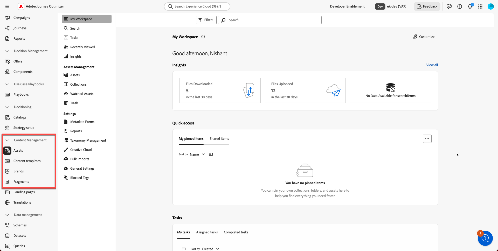

---
title: Información general
description: Obtenga información sobre marcas, directrices de marca, recorridos y plantillas, y aprenda a navegar por las herramientas de creación de contenido de Adobe Journey Optimizer.
doc-type: overview-page
solution: Experience Platform
exl-id: 70eaf77b-e407-4fbc-8338-ab47784e0721
---

# Información general

## Requisitos previos

>[!WARNING]
>
>Los siguientes laboratorios deben haber sido completados antes de comenzar este laboratorio

- **Almacenes de datos — Almacén relacional en acción** **—>** [Dimension de destino de perfil](../data-stores/relational-store-in-action/profile-target-dimension.md)
- **Almacenes de datos — Configurar canales de correo electrónico —>** [Configurar para relacionales](../data-stores/configure-email-channels/configure-for-relational.md)

Si no ha completado estos laboratorios, hágalo ahora antes de continuar.

## Resumen de laboratorio

En este vídeo aprenderá qué esperar en los tres actos de este laboratorio práctico: configurar la marca Connection 5G, crear fragmentos, plantillas y un correo electrónico asistido por IA, y validarlo mediante simulación y un envío de prueba.

>[!VIDEO](https://video.tv.adobe.com/v/3491145/)

## Objetivos de aprendizaje

Al final de este módulo, deberá ser capaz de:

1. Explique la importancia de la creación de contenido en Adobe Journey Optimizer.
1. Identificar y describir conceptos clave, como marcas, directrices de marca, Recorridos y plantillas.
1. Navegue por la interfaz de AJO para localizar las herramientas de creación de contenido relevantes para la ejecución por correo electrónico y recorrido.

## Por qué la creación de contenido importa en AJO

El contenido es el centro de la interacción de cada cliente. En Adobe Journey Optimizer, la creación de contenido de alta calidad y alineado con la marca permite:

- Una experiencia del cliente uniforme en todos los canales
- Ejecución de campaña más rápida mediante plantillas y fragmentos reutilizables
- Cumplimiento de los estándares de marca y los requisitos legales
- Personalización a escala para impulsar la participación y los resultados

## Conceptos clave

Este laboratorio presenta los elementos principales necesarios para crear y administrar el contenido de marca para Connection 5G.

### &#x200B;1. Marcas

Una marca en AJO representa una identidad única (por ejemplo, Connection 5G). Cada marca incluye:

- Identidad visual
- Estilo de escritura
- Reglas de tono y voz
- Assets y materiales creativos

### &#x200B;2. Directrices de marca

Las Directrices de marca definen:

- Estilo y tono de escritura
- Reglas de voz
- Requisitos legales
- Estándares visuales como color, imágenes e iconografía

### &#x200B;3. Recorridos

Los recorridos son flujos de trabajo automatizados que organizan las experiencias de los clientes en función de lo siguiente:

- Atributos de perfil
- Eventos o déclencheur
- Idoneidad y condiciones

### &#x200B;4. Plantillas

Las plantillas son estructuras reutilizables para canales, por ejemplo:

- Correo electrónico
- SMS
- Notificaciones push
- Mensajes en la aplicación

## Navegación y tutorial de interfaz

### Inicie sesión y acceda al panel

1. Abra Adobe Journey Optimizer en el explorador.
1. Inicie sesión con sus credenciales.
1. Aterrizas en el tablero principal.

### Busque el menú de navegación principal

Explorar:

- Marcas
- Contenido (correos electrónicos, plantillas, mensajes)
- Fragmentos
- Recorridos
- Recursos

### Acceso a herramientas de creación de contenido

Antes de empezar a crear tu marca, dedique un momento a explorar las **herramientas de creación de contenido** disponibles en Adobe Journey Optimizer, entre las que se incluyen:

- Recursos
- Plantillas de contenido
- Fragmentos

Haga clic en cada uno de ellos y familiarícese con la interfaz de usuario. Este laboratorio revisa cada sección en detalle.

## Resumen

Ahora ha aprendido lo siguiente:

- La importancia de la creación de contenido en AJO
- Definiciones de marcas, directrices de marca, Recorridos y plantillas
- Cómo navegar por la interfaz de AJO y localizar las herramientas clave de creación de contenido

Está listo para continuar con el siguiente módulo: **Administración de marcas**.
