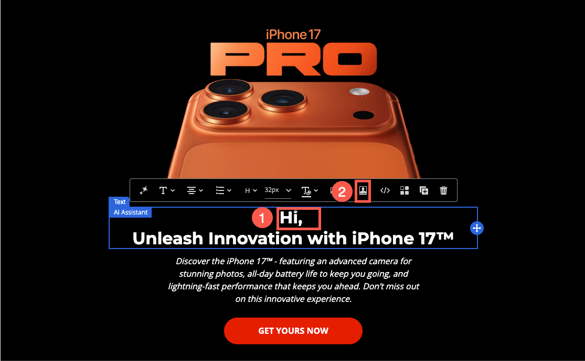
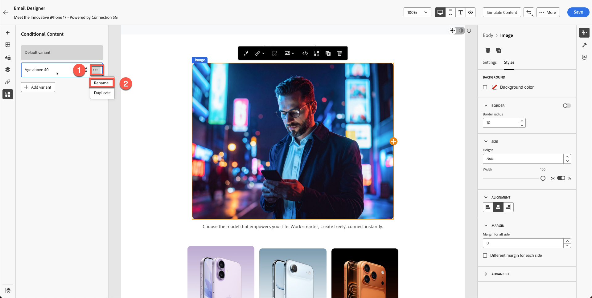
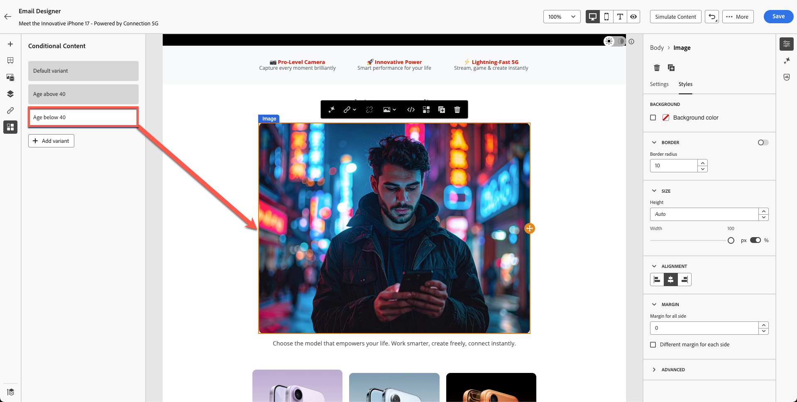

# Personalization y experimentación de contenido

**Propósito:** Aprenda a personalizar el contenido del correo electrónico mediante atributos de perfil, generar variantes de contenido dinámico y aplicar lógica condicional en Adobe Journey Optimizer.

## Objetivos de aprendizaje

Al final de este módulo, deberá ser capaz de:

1. Añada campos de personalización mediante atributos de perfil.
1. Utilice la sintaxis del Editor de personalización y Handlebars.
1. Cree variantes de contenido dinámico basadas en la lógica del perfil.
1. Cree reglas condicionales para bloques de contenido personalizados.
1. Prueba del cambio de variante en función de atributos como el año de nacimiento.

## Introducción

La personalización en Adobe Journey Optimizer permite experiencias uno a uno a escala.
En este módulo hará lo siguiente:

- Insertar texto personalizado (nombre y apellido)
- Generar variantes de contenido basadas en la edad
- Aplicación de lógica condicional mediante atributos de perfil
- Preparación de contenido para su simulación en el módulo 7

Personalization en Adobe Journey Optimizer le permite crear experiencias de cliente adaptadas e impactantes mediante la personalización dinámica de contenido en función de perfiles, comportamientos y datos contextuales individuales. Tanto si va a crear correos electrónicos, notificaciones u ofertas personalizadas, las herramientas y técnicas proporcionadas facilitan la conexión del mensaje correcto a la persona adecuada y en el momento adecuado. Descubra cómo el Editor de Personalization, la sintaxis de Handlebars y los datos de Adobe Experience Platform trabajan juntos para dar vida a sus ideas, explorar bloques de contenido reutilizables con fragmentos de expresión y sumergirse en funciones de ayuda avanzadas para desbloquear posibilidades más profundas. Cada tema desarrolla sus habilidades paso a paso, lo que garantiza que esté listo para diseñar recorridos personalizados con confianza.

## Añadir personalización básica

Esta parte del ejercicio simplifica la personalización. Añada el nombre y los apellidos al correo electrónico en función del perfil. Personalization se basa en los datos de perfil que administra el esquema Perfil individual de XDM que ha definido. El esquema Perfil individual de XDM es el único esquema que puede utilizar para personalizar el contenido en Journey Optimizer.

1. Abra el correo electrónico creado en módulos anteriores.
2. Agregue un bloque de texto encima del título a pantalla completa con el contenido: **Hola,**
3. Haga clic en el icono **Personalización**.

&#x200B;4. Busque **&#x200B;**&#x200B;**&#x200B;**.

&#x200B;5. Haga clic en **+** para agregarlo al área de expresiones.
&#x200B;6. Agregue un **espacio** después del campo **Nombre**.

&#x200B;7. Repita el proceso anterior pero esta vez busque y agregue **Apellidos**.

La sintaxis final muestra las variables de nombre y apellido claramente separadas.

&#x200B;8. Valide el fragmento. Tenga en cuenta que hay una opción para guardar el contenido como fragmento. Esta es una excelente oportunidad si utiliza el nombre completo para la creación de otro contenido de correo electrónico. Omita esto y vaya al paso siguiente.
&#x200B;9. Haga clic en **Guardar**

La vista tiene este aspecto. Las llaves constan de variables y cada individuo recibe un correo electrónico con su nombre.

En este punto, ya sabe cómo puede añadir personalización para perfiles individuales.

## Introducción al contenido dinámico

El contenido dinámico en Adobe Journey Optimizer le permite crear mensajes personalizados que se adaptan perfectamente a su audiencia. Con las reglas condicionales, puede adaptar los correos electrónicos, los SMS y las notificaciones push en función de atributos de perfil, pertenencia a audiencias o eventos en tiempo real. Tanto si está creando un mensaje de reserva para cuando no se cumplen unos criterios específicos como si está guardando reglas reutilizables para mantener la coherencia, el editor de personalización y Email Designer ofrecen herramientas intuitivas para dar vida a sus ideas.

Este es un caso de uso perfecto para añadir contenido condicional al correo electrónico y personalizarlo en función de la edad del usuario.

Vuelva a su esquema: tiene **&quot;person.birthYear&quot;** como año de nacimiento. Este atributo puede ser útil. Establezca como objetivo y configure una campaña basada en la edad.

Para este ejercicio, creará dos variantes basadas en la edad. Una variante se dirige a usuarios mayores de 40 años y la otra a usuarios menores de 40 años (tal vez a mediados de los años 20 y 30). Todo nacido antes del año 1986 se considera mayor de 40 años, mientras que todo nacido en 1986 o posterior se considera menor de 40 años.

**Lógica de edad**

Utilizará el atributo de perfil `person.birthYear`.

| Grupo de destino | Condición |
| ------------ | ----------------- |
| Más de 40 | birthYear \&lt; 1986 |
| Menos de 40 | birthYear >= 1986 |

## Crear dos variantes de imagen

¿Recuerdas este bloque que creamos en nuestro módulo anterior? Tu imagen es diferente de la mía.

Cree otra imagen para los menores de 40 años (recuerde que ha creado una imagen en Firefly de una persona de unos 40 años) y utilícela para este ejercicio.

1. Seleccione el bloque de imagen existente. (Haz clic en la imagen) y haz clic en **Bloque condicional**.
2. Haga clic en **Agregar variante**.

&#x200B;3. Cambie el nombre de la primera variante a **Age above 40**.

&#x200B;4. Cree una nueva variante haciendo clic en el botón **&quot;Agregar variante&quot;** y cambie su nombre a **Edad inferior a 40.**

&#x200B;5. Podría crear una imagen con Firefly si usa un símbolo del sistema como &quot;mediados de 20 años&quot;. Sin embargo, para ahorrar tiempo, ya tenemos una imagen en el kit de herramientas llamada &quot;**variant-age-below-40.jpg**.
&#x200B;6. Haga clic en la imagen e importe los medios.

&#x200B;7. Seleccione la imagen **variant-age-below-40.jpg**. Importe la carpeta haciendo clic en **Siguiente** y, finalmente, presione **Importar** en la carpeta (ya debería estar en la carpeta de forma predeterminada).

&#x200B;8. Intente alternar entre variantes y verá aplicada una imagen diferente.

Hasta ahora, ha creado el diseño, pero aún no ha aplicado la lógica. El siguiente paso aplica la lógica.

## Aplicar lógica condicional a las variantes

Ambas variantes están listas, pero aún no se ha aplicado la lógica condicional.

## Lógica para &quot;Edad superior a 40&quot;

1. Seleccione y coloque el puntero sobre la variante **Age above 40**.
2. Haga clic en el icono **Lógica condicional**.

&#x200B;3. Cree una nueva condición.

&#x200B;4. Busque **year** en la lista de atributos.
&#x200B;5. Arrastre **Birth Year** al lienzo.
&#x200B;6. Establecer condición en:
   - **birthYear \&lt; 1986**

&#x200B;7. Asigne un nombre a la condición: **Edad superior a 40**
&#x200B;8. Agregar una descripción: &quot;**Variante de imagen para personas mayores de 40**&quot;
&#x200B;9. Haga clic en **Agregar → Seleccionar**.

## Lógica para &quot;Menor de 40 años&quot;

1. Seleccione y coloque el puntero sobre la sección **Edad inferior a 40**.
2. Repita los pasos pero cambie la lógica a:
   - **birthYear >= 1986**

&#x200B;3. Asigne un nombre a la condición: **Edad inferior a 40**
&#x200B;4. Agregar descripción. &quot;**Variante de imagen para personas menores de 40**&quot;
&#x200B;5. Haga clic en **Agregar → Seleccionar**.

## Validar cambio de variante

Alterne entre ambas variantes para asegurarse de que:

- Aparecen las imágenes correctas
- La lógica se aplica correctamente
- No se muestra ninguna variante como &quot;Sin condición aplicada&quot;

Variante: **Edad superior a 40**

Variante: **Edad inferior a 40**

Haga clic en el botón &quot;**Guardar**&quot; para guardar el correo electrónico.

## Resumen

En este módulo, ha aprendido correctamente cómo:

- Añadir campos de personalización para la mensajería uno a uno
- Crear variantes de imagen dinámicas
- Aplicar reglas condicionales basadas en la edad

Ya está listo para que el siguiente módulo: **Simulación de contenido**, pruebe ambas variantes.
