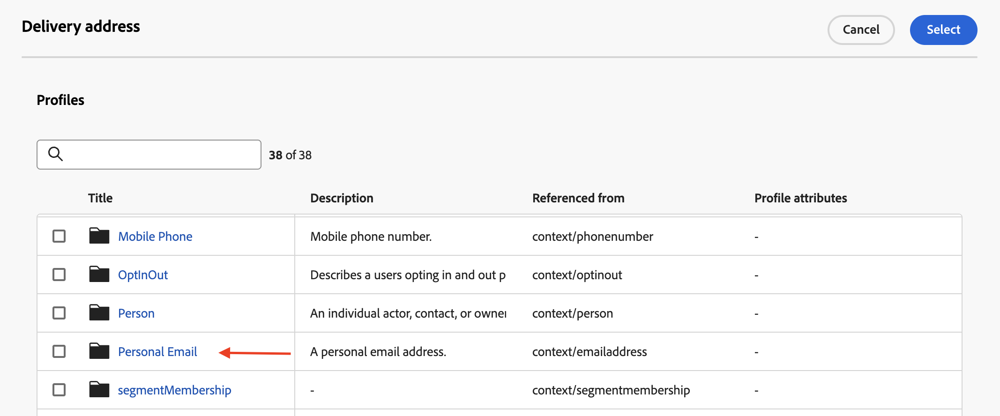
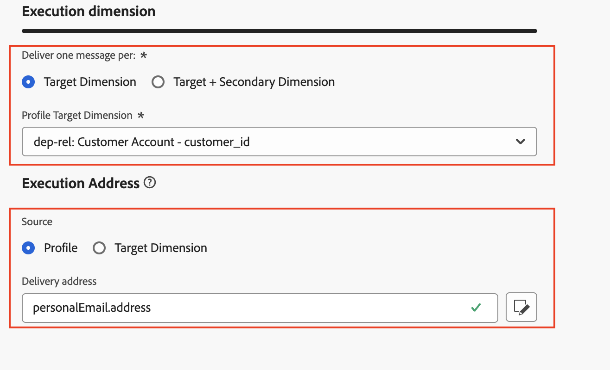

# Configurar para el perfil

## Objetivo

En el siguiente conjunto de pasos, se crea una configuración de canal de correo electrónico con Recorridos y campañas organizadas mediante el atributo de perfil de AEP `personalEmail.address`

## Crear configuración de canal

1. Vaya a **Configuraciones de canal** que se encuentran en el menú **Administración → Canales → Configuración general**
2. Haga clic en el botón **Crear configuración**

   

3. En el asistente Crear establezca los siguientes valores:
   - **Nombre:** `Profile-Email`
   - **Canal:** `Email`
   - **Acción de marketing:** `Email Targeting`

>[!NOTE]
>
>Al seleccionar Correo electrónico como canal, aparece una nueva sección **Configuración de correo electrónico**.

## Configurar tipo de correo electrónico

Definir **Tipo de correo electrónico** en **Marketing**

## Configurar subdominio

En el menú desplegable **Subdominio**, seleccione **email.dep-labs.com**

>[!NOTE]
>
>Si su ritmo es personalizado y no tiene un subdominio aprovisionado previamente, seleccione su propio subdominio delegado a Adobe aquí en lugar de `email.dep-labs.com`. Consulte [Configuración](../../setup.md) para saber cómo delegar una.

## Configurar detalles del grupo de IP

En el menú desplegable **grupo de IP**, seleccione **marketing**

## Configurar cancelación de suscripción a lista

1. Asegúrese de que la opción esté **habilitada** para cancelar la suscripción a una lista
1. En el área de preferencias de cancelación de suscripción a lista, asegúrese de que todas las casillas de verificación estén **marcadas**
1. En Administración de vínculos, asegúrese de que **Adobe managed** está seleccionado
1. Para el nivel de consentimiento, asegúrese de que esté establecido en **Canal**

## Configurar parámetros de encabezado

1. Defina los campos siguientes como se indica a continuación:
   - **Nombre desde:** `DEP Labs`
   - **Del prefijo de correo electrónico:** `dep`
   - **Responder al nombre:** `DEP Labs Support`
   - **Responder al correo electrónico:** `reply@email.dep-labs.com`
   - **Prefijo de correo electrónico con error:** `error`

## Configurar correo electrónico CCO

Deje este campo en blanco

>[!NOTE]
>
>Puede conservar una copia de los correos electrónicos enviados enviándolos a una bandeja de entrada CCO. Para copiar cada correo electrónico enviado a esta dirección de CCO, escriba la dirección de correo electrónico que desee. Tenga en cuenta que el dominio de la dirección CCO debe ser diferente de cualquier subdominio delegado a Adobe. Esta funcionalidad es opcional. *Cómo usar CCO para correos electrónicos*

## Configurar parámetros de reintento de correo electrónico

Déjelo con la configuración predeterminada de **Horas** establecida en **84**

## Configurar parámetros de seguimiento de URL

Mantener la configuración predeterminada

## Detalles de ejecución

1. Complete la sección **Detalles de ejecución**. En la ficha **Recorrido y acción** -> **Dimensión de ejecución**, seleccione **Perfil** como **Source** y haga clic en el icono Editar para **Dirección de entrega** en la sección **Dirección de ejecución**

   

2. Haga clic en la carpeta **Correo electrónico personal** para abrirla.

   

3. Haga clic en la **casilla de verificación** en el campo `Address` y, a continuación, haga clic en el botón **Seleccionar**

   

4. Para el **perfil**, `personalEmail.address` ahora está configurado como **dirección de envío** en la sección **dirección de ejecución**

   

5. Haga clic en la ficha Campaña orquestada y **marque** la casilla de verificación Habilitado.

   

6. En el encabezado Dimensión de ejecución, configure lo siguiente:
   - **Enviar un mensaje por:** `Target Dimension`
   - **Dimension de destino de perfil:** `dep-rel: Customer Account - customer_id`

   

7. En Dirección de ejecución, configure lo siguiente:
   - **Source:** `Profile`
   - **Dirección de envío:** `click on the Edit icon`

   

8. Busque la carpeta `Personal Email` y haga clic en ella para abrirla

   

9. Seleccione el campo `Address` dentro de la carpeta Correo electrónico personal y haga clic en **Seleccionar**

   

10. Para **Campaign orquestada**, **dep-rel: Customer Account - customer\_id** está configurado como **Dimension de destino de perfil** para **Execution dimension** con **Execution Address** que tiene un **Source** de **Perfil** y `personalEmail.address` como **Delivery address**

>[!NOTE]
>
>Para las campañas orquestadas, se dirige a la cuenta de cliente con un correo electrónico, por lo que solo necesita enviar *un mensaje por perfil*.  La dirección de ejecución que usa proviene del propio perfil (específicamente, lo que se almacena en el perfil de AEP bajo el atributo **personalEmail.address**)

## Revisar y guardar

1. Revise todos los detalles de nuevo para asegurarse de que coinciden.
1. Desplácese hacia arriba y haga clic en **Enviar**.

>[!NOTE]
>
>Se ha observado que el procesamiento de la configuración del canal de correo electrónico tarda hasta dos horas.
>
>Continúe con el siguiente ejercicio mientras espera a que se procese esta configuración de canal.

>[!TIP]
>
>🚀 Una vez que el estado de configuración del canal de correo electrónico es **Activo**, está listo y ahora se puede seleccionar directamente dentro de **Actividades de correo electrónico** dentro de Campañas orquestadas.

## Resumen

Ahora ha visto cómo crear una Configuración de canal de correo electrónico para utilizar el atributo de perfil de AEP tanto para campañas de Recorridos como para campañas orquestadas.
